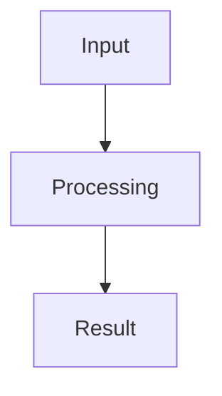

# Contributing

This repository is a maintained markdown knowledge base. Keep changes small, structured, and directly useful to Stream Deck plugin developers.

## Content Principles

1. Put each topic in one canonical file.
2. Prefer concise explanations followed by working code examples.
3. Include diagrams where they clarify lifecycle, architecture, data flow, or multi-step workflows.
4. Include an AI agent prompt readers can use with GitHub Copilot or Claude to explain, fix, test, or implement the concept.
5. Use Stream Deck SDK v2 and Node.js 24+ patterns unless a document explicitly covers legacy migration.
6. Keep examples safe by default: no hardcoded secrets, no logging credentials, no unbounded timers or listeners.
7. Preserve user-facing troubleshooting details when replacing older docs.

## Source-of-Truth Policy

**Keep content in this KB when it is**:
- Stream Deck-specific implementation guidance and best practices
- Patterns and templates developers can reuse directly
- Troubleshooting paths that connect several sources into one actionable fix
- Curated examples demonstrating plugin architecture, settings, UI, or packaging

**Reference external sources when the topic is**:
- Official SDK API contracts, manifest schema, CLI commands, or sample repositories
- SDPI component API details and component behavior
- OAuth provider configuration, scopes, dashboards, and token behavior
- Third-party tools (GitHub Actions, TypeScript, test runners, bundlers, analytics services)
- Legal, privacy, accessibility, export-control, GDPR, CCPA, and trademark rules
- Marketplace policies and platform-specific deployment details

## File Structure

- Use lowercase kebab-case file names, for example `settings-persistence.md`.
- Add new files under the most specific existing category in [knowledge-base/](knowledge-base/).
- Update [knowledge-base/INDEX.md](knowledge-base/INDEX.md) whenever files are added, moved, renamed, or removed.
- Do not add generated sites, vector stores, dependency folders, or build outputs.

## Markdown Style

- Start each document with a clear `#` heading, after optional YAML frontmatter.
- Use `##` sections for major topics and `###` for details.
- Use fenced code blocks with language identifiers when possible.
- Include runnable or adaptable code snippets for implementation guidance, not just prose descriptions.
- Prefer Mermaid diagrams for architecture, event flow, state transitions, and decision trees when a visual model makes the topic easier to learn.
- Keep diagrams close to the section they explain, and include a short sentence before or after the diagram that explains what the reader should notice.
- Include a short **Agent Prompt** section with at least one prompt for GitHub Copilot or Claude. Prefer prompts that ask the agent to explain, fix, test, or implement the article's concept using local project files.
- Prefer relative links to other markdown files.
- Keep link targets valid after moving files.
- Avoid placeholder sections such as "coming soon"; omit the section until it has useful content.

## Article Quality Contract

Every maintained knowledge-base article should include these reader aids:

1. **Practical example:** Include at least one working or adaptable example. For implementation articles, this should be TypeScript, HTML, manifest JSON, or shell commands. For policy, checklist, or reference articles, use the closest practical artifact: config, manifest fragment, CLI invocation, review checklist, or before/after snippet.
2. **Diagram when applicable:** Add a Mermaid diagram when the topic involves lifecycle, architecture, state transitions, message flow, decision paths, or multi-step workflows. If a diagram would be artificial, omit it.
3. **Agent prompt:** Include a prompt readers can paste into GitHub Copilot or Claude. The prompt should help them explain, fix, test, implement, or adapt the concept in their own Stream Deck plugin.

Recommended section pattern:

````markdown
## Code Example

[A focused snippet the reader can adapt.]

## Diagram



## Agent Prompt

```text
#file:src/actions/example.ts
Explain how this action implements [concept]. Then identify one bug,
write a failing test for it, and propose the smallest fix.
```
````

### Article Metadata

Add a YAML frontmatter block to maintained articles to track governance:

```yaml
---
category: core-concepts
title: [Article Title]
tags: [comma, separated, tags]
difficulty: beginner | intermediate | advanced
sdk-version: v2
source-of-truth: Local KB | Official Elgato docs | External provider
review-cadence: SDK release | Quarterly | On upstream change
status: Maintained | Legacy | External-source summary
---
```

**Guidance**:
- `category`: Folder path under knowledge-base/
- `title`: Human-readable title (matches # heading)
- `tags`: Keywords for search and filtering
- `difficulty`: Reader skill level needed
- `sdk-version`: SDK version(s) covered
- `source-of-truth`: Where authoritative details live
- `review-cadence`: When to audit this article
- `status`: Maintenance status

**Example**:
```yaml
---
category: development-workflow
title: Environment Setup
tags: [setup, nodejs, npm, streamdeck-cli]
difficulty: beginner
sdk-version: v2
source-of-truth: Local KB (Stream Deck specific); Official Node.js/npm docs
review-cadence: SDK release
status: Maintained
---
```

## Validation

Run this before committing:

```bash
npm test
```

The validator checks markdown headings, conflict markers, file names, and local markdown links.
