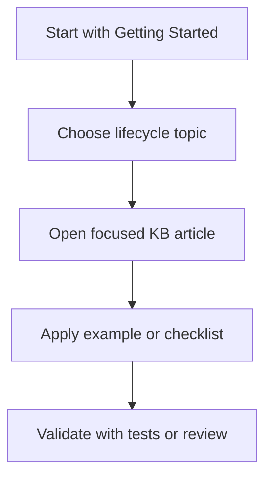

# Getting Started

This guide explains how to use this repository as a focused markdown knowledge base for Stream Deck plugin development.

## Prerequisites

- Git
- Node.js 24+ (SDK 2.1.0 baseline for new plugins; Node.js 20 for legacy SDK v2 compatibility)
- A markdown-capable editor such as VS Code
- Stream Deck 7.1 or newer

For new Stream Deck plugin authoring, this knowledge base treats SDK 2.1.0 as the mandatory baseline:
- `SDKVersion: 3`
- `Nodejs.Version: "24"`
- `Software.MinimumVersion: "7.1"` or newer

No API keys, local databases, hosted documentation server, or generated site build are required.

## Clone The Repository

```bash
git clone https://github.com/9h03n1x/rag-streamdeck-dev.git
cd rag-streamdeck-dev
npm test
```

`npm test` runs the markdown validator. It checks local markdown links, merge conflict markers, file names, and primary headings.

## Use As A Submodule

For Stream Deck plugin projects, add this repository as a low-noise documentation submodule:

```bash
git submodule add https://github.com/9h03n1x/rag-streamdeck-dev.git .streamdeck-kb
git submodule update --init --recursive
```

Recommended agent entry point:

```text
.streamdeck-kb/knowledge-base/INDEX.md
```

## Reading Path For New Plugin Developers

1. [core-concepts/architecture-overview.md](core-concepts/architecture-overview.md)
2. [development-workflow/environment-setup.md](development-workflow/environment-setup.md)
3. [core-concepts/action-development.md](core-concepts/action-development.md)
4. [examples/basic-counter-plugin.md](examples/basic-counter-plugin.md)
5. [ui-components/property-inspector-basics.md](ui-components/property-inspector-basics.md)
6. [core-concepts/settings-persistence.md](core-concepts/settings-persistence.md)
7. [development-workflow/debugging-guide.md](development-workflow/debugging-guide.md)
8. [troubleshooting/common-issues.md](troubleshooting/common-issues.md)

## Reading Path For Existing Plugin Projects

- Need an SDK lookup: [reference/api-reference.md](reference/api-reference.md)
- Need a manifest lookup: [reference/manifest-schema.md](reference/manifest-schema.md) and [code-templates/manifest-templates.md](code-templates/manifest-templates.md)
- Need Stream Deck + support: [core-concepts/stream-deck-plus-deep-dive.md](core-concepts/stream-deck-plus-deep-dive.md)
- Need migration help: [reference/sdk-v1-to-v2-migration.md](reference/sdk-v1-to-v2-migration.md)
- Need production hardening: [advanced-topics/performance-profiling.md](advanced-topics/performance-profiling.md), [advanced-topics/network-operations.md](advanced-topics/network-operations.md), and [security-and-compliance/security-requirements.md](security-and-compliance/security-requirements.md)

## Adding Documentation

1. Put the file in the most specific category under `knowledge-base/`.
2. Use lowercase kebab-case names for new files.
3. Link the new file from [INDEX.md](INDEX.md).
4. Run `npm test`.

See [../CONTRIBUTING.md](../CONTRIBUTING.md) for structure and style rules.

---

## Diagram

Use the top-level articles as entry points, then move into focused lifecycle articles as the question becomes more specific.



---

## Agent Prompt

Use this prompt with GitHub Copilot in VS Code or Claude Desktop after attaching the relevant plugin files.

```text
#file:knowledge-base/GETTING_STARTED.md
Use this article as the source of truth for my Stream Deck plugin.

Explain the key points from "Getting Started" in practical terms. Then inspect my local plugin files for the same concept, identify any gaps or risky assumptions, and propose a spec-first, test-driven implementation plan before changing code.
```
