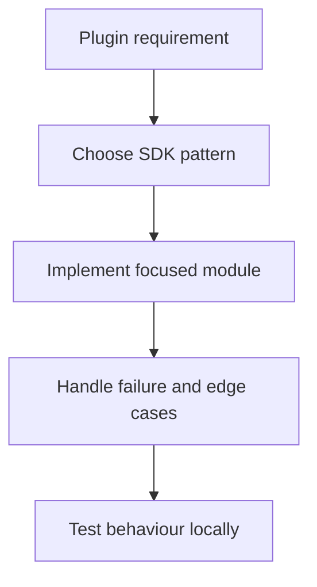

# Analytics and Telemetry

## Overview

Adding analytics to your plugin lets you understand which features are used, where users encounter errors, and how performance holds up in the real world. This guide covers privacy-respecting implementation patterns, opt-in consent, GDPR/CCPA compliance, error reporting, and self-hosted vs. third-party analytics options.

## Privacy-First Approach

### Principles

1. **Opt-in by default** — collect nothing until the user explicitly consents
2. **Collect minimum data** — only what you need to improve the product
3. **No PII** — never collect names, emails, IP addresses, or unique device identifiers
4. **Transparent** — document exactly what you collect in your privacy policy
5. **Delete on request** — respect user data deletion requests

### What to Collect

| Safe to Collect | Avoid |
|----------------|-------|
| Feature usage counts (which actions, how often) | User names or emails |
| Error messages and stack traces (sanitised) | Settings values (may contain credentials) |
| Plugin version, OS platform, Stream Deck model type | Full file paths |
| Session duration, action count per session | IP addresses |
| Crash reports (without PII) | Device serial numbers |

## User Consent

### Global Opt-In Setting

Store consent in Global Settings so it persists across sessions:

```typescript
interface GlobalSettings {
    analyticsEnabled?: boolean;
    // ...other settings
}

async function isAnalyticsEnabled(): Promise<boolean> {
    const settings = await streamDeck.settings.getGlobalSettings<GlobalSettings>();
    // Explicitly check for `true` — undefined means "not asked yet"
    return settings.analyticsEnabled === true;
}

async function setAnalyticsEnabled(enabled: boolean): Promise<void> {
    const settings = await streamDeck.settings.getGlobalSettings<GlobalSettings>();
    await streamDeck.settings.setGlobalSettings({ ...settings, analyticsEnabled: enabled });
    streamDeck.logger.info(`Analytics ${enabled ? "enabled" : "disabled"}`);
}
```

### Showing Consent in Property Inspector

```html
<!-- In your settings Property Inspector -->
<sdpi-item label="Help improve this plugin">
    <sdpi-checkbox id="analytics-consent" setting="analyticsEnabled">
        Share anonymous usage data
    </sdpi-checkbox>
    <p class="sdpi-item-child" style="font-size:10px; opacity:0.7">
        We collect only feature usage counts and error reports. No personal data.
        <a href="https://example.com/privacy" target="_blank">Privacy Policy</a>
    </p>
</sdpi-item>
```

## Analytics Service Implementation

### Minimal Analytics Client

```typescript
// analytics/analyticsClient.ts

export interface AnalyticsEvent {
    category: string;       // e.g. "action", "error", "session"
    action: string;         // e.g. "keyPress", "connectionFailed"
    label?: string;         // e.g. action UUID, error code
    value?: number;         // e.g. response time in ms
}

export class AnalyticsClient {
    private enabled = false;
    private queue: AnalyticsEvent[] = [];
    private readonly endpoint: string;
    private readonly pluginVersion: string;
    private readonly platform: string;

    constructor(endpoint: string, pluginVersion: string) {
        this.endpoint = endpoint;
        this.pluginVersion = pluginVersion;
        this.platform = process.platform; // "win32" | "darwin" | "linux"
    }

    async init(): Promise<void> {
        this.enabled = await isAnalyticsEnabled();
    }

    track(event: AnalyticsEvent): void {
        if (!this.enabled) return;
        this.queue.push(event);
        // Batch flush every 10 events or on timer
        if (this.queue.length >= 10) {
            this.flush();
        }
    }

    async flush(): Promise<void> {
        if (!this.enabled || this.queue.length === 0) return;
        const batch = this.queue.splice(0);
        try {
            await fetch(this.endpoint, {
                method: "POST",
                headers: { "Content-Type": "application/json" },
                body: JSON.stringify({
                    events: batch,
                    meta: {
                        pluginVersion: this.pluginVersion,
                        platform: this.platform,
                        timestamp: new Date().toISOString(),
                    },
                }),
            });
        } catch (err) {
            streamDeck.logger.debug("Analytics flush failed (non-critical):", err);
            // Re-queue events if transient failure (up to a limit)
            if (this.queue.length < 50) {
                this.queue.unshift(...batch);
            }
        }
    }
}

// Singleton
export const analytics = new AnalyticsClient(
    "https://analytics.example.com/collect",
    "2.0.0"
);
```

### Tracking Feature Usage

```typescript
// In your actions
@action({ UUID: "com.example.plugin.timer" })
export class TimerAction extends SingletonAction<Settings> {
    override async onKeyDown(ev: KeyDownEvent<Settings>): Promise<void> {
        analytics.track({
            category: "action",
            action: "timerStarted",
            label: ev.action.manifestId,
        });

        await this.startTimer(ev);
    }
}
```

### Session Tracking

```typescript
// Track session start and duration in main entry point
const sessionStart = Date.now();

streamDeck.actions.onWillAppear(() => {
    analytics.track({ category: "session", action: "actionVisible" });
});

process.on("SIGTERM", async () => {
    const durationSec = Math.round((Date.now() - sessionStart) / 1000);
    analytics.track({ category: "session", action: "end", value: durationSec });
    await analytics.flush(); // Ensure events sent before exit
});
```

## Error Reporting

### Structured Error Capture

```typescript
// errors/errorReporter.ts

export function reportError(error: unknown, context?: Record<string, string>): void {
    const message = error instanceof Error ? error.message : String(error);
    const stack = error instanceof Error ? sanitizeStack(error.stack) : undefined;

    streamDeck.logger.error("Error:", message, context);

    analytics.track({
        category: "error",
        action: "unhandled",
        label: sanitizeMessage(message),
    });

    // Optionally send to a dedicated error service
    sendToErrorService({ message, stack, context });
}

// Remove file paths and user-specific data from stack traces
function sanitizeStack(stack?: string): string | undefined {
    if (!stack) return undefined;
    return stack
        .split("\n")
        .map((line) => line.replace(/\(.*[/\\]([^/\\]+\.ts:\d+:\d+)\)/, "($1)"))
        .join("\n");
}

// Remove potential secrets from error messages
function sanitizeMessage(msg: string): string {
    return msg
        .replace(/[A-Za-z0-9+/]{30,}={0,2}/g, "[REDACTED]")  // base64
        .replace(/sk-[A-Za-z0-9]+/g, "[API_KEY]")              // API keys
        .replace(/Bearer [A-Za-z0-9._-]+/gi, "Bearer [TOKEN]"); // tokens
}
```

### Global Error Handler

```typescript
// Catch unhandled rejections
process.on("unhandledRejection", (reason) => {
    reportError(reason, { source: "unhandledRejection" });
});

// Wrap event handlers to capture errors
function withErrorReporting<T extends (...args: any[]) => any>(
    fn: T,
    context: string
): T {
    return (async (...args: Parameters<T>) => {
        try {
            return await fn(...args);
        } catch (err) {
            reportError(err, { handler: context });
            throw err;
        }
    }) as T;
}

// Usage
override onKeyDown = withErrorReporting(
    async (ev: KeyDownEvent<Settings>) => {
        // your handler
    },
    "MyAction.onKeyDown"
);
```

## Performance Monitoring

Track response times for API calls and critical operations:

```typescript
async function trackPerformance<T>(
    metricName: string,
    fn: () => Promise<T>
): Promise<T> {
    const start = performance.now();
    try {
        return await fn();
    } finally {
        const duration = Math.round(performance.now() - start);
        analytics.track({
            category: "performance",
            action: metricName,
            value: duration,
        });
        if (duration > 2000) {
            streamDeck.logger.warn(`Slow operation: ${metricName} took ${duration}ms`);
        }
    }
}

// Usage
const data = await trackPerformance("apiCall.fetchWeather", () =>
    fetchWeather(city, apiKey)
);
```

## Self-Hosted Analytics

### Using PostHog (Self-Hosted)

[PostHog](https://posthog.com) can be self-hosted and supports event tracking with full data ownership:

```typescript
import { PostHog } from "posthog-node";  // npm install posthog-node

const posthog = new PostHog("your-project-api-key", {
    host: "https://your-posthog-instance.com",
    flushAt: 10,
    flushInterval: 30_000,
});

// Use a random, non-reversible ID (not tied to any user identity)
const anonymousId = await getOrCreateAnonymousId();

function trackEvent(event: string, properties?: Record<string, any>) {
    if (!analyticsEnabled) return;
    posthog.capture({
        distinctId: anonymousId,
        event,
        properties: {
            ...properties,
            pluginVersion: "2.0.0",
            platform: process.platform,
        },
    });
}

// Shutdown: flush remaining events
process.on("SIGTERM", async () => {
    await posthog.shutdown();
});
```

### Using Plausible (Privacy-Focused)

[Plausible Analytics](https://plausible.io) is GDPR-compliant and cookieless. For plugin backend events, use their Events API:

```typescript
async function plausibleEvent(name: string, props?: Record<string, string>) {
    await fetch("https://plausible.io/api/event", {
        method: "POST",
        headers: {
            "Content-Type": "application/json",
            "User-Agent": `StreamDeckPlugin/${pluginVersion}`,
            "X-Forwarded-For": "127.0.0.1",  // Required but not stored
        },
        body: JSON.stringify({
            name,
            url: `app://streamdeck-plugin/`,
            domain: "your-plugin-domain.com",
            props,
        }),
    });
}
```

### Simple Custom Backend

For maximum privacy control, a minimal event collection server:

```typescript
// Simple endpoint (example: Cloudflare Worker or Express)
// POST /collect  { events: [...], meta: {...} }
// → Writes to your database, no PII stored
```

## GDPR Compliance Checklist

- [ ] **Consent**: Analytics is opt-in; disabled until user explicitly enables
- [ ] **Transparency**: Privacy policy URL accessible from the plugin settings
- [ ] **Data minimisation**: Only necessary data collected (no PII)
- [ ] **Right to erasure**: Document how users can request data deletion
- [ ] **Data retention**: Define and enforce retention periods (e.g., 90 days)
- [ ] **Processor agreement**: If using a third-party service, ensure they have a DPA
- [ ] **No cross-border transfer without safeguards**: Check where data is stored

## CCPA Compliance Checklist

- [ ] **Right to know**: Users can request what data is collected
- [ ] **Right to delete**: Users can request deletion of their data
- [ ] **Opt-out**: Provide a way to disable analytics (stream deck settings)
- [ ] **No sale of data**: Confirm your analytics provider does not sell data

## Anonymous ID Generation

Create a stable, random ID for the plugin installation that cannot be linked back to the user:

```typescript
import { randomUUID } from "crypto";

async function getOrCreateAnonymousId(): Promise<string> {
    const settings = await streamDeck.settings.getGlobalSettings<{ _anonId?: string }>();
    if (settings._anonId) return settings._anonId;

    const id = randomUUID();
    await streamDeck.settings.setGlobalSettings({ ...settings, _anonId: id });
    return id;
}
```

## Best Practices

1. **Default to off** — never collect data without consent
2. **Sanitise before sending** — strip potential secrets from error messages and stack traces
3. **Fail silently** — analytics should never crash or slow down your plugin
4. **Batch events** — send in batches of 10–20 rather than one-by-one
5. **Flush on shutdown** — ensure queued events are sent when the plugin exits
6. **Log analytics calls at debug level** — helpful during development
7. **Use a random anonymous ID** — do not use device serial numbers or user account IDs
8. **Provide a privacy policy URL** — link it from the PI settings page
9. **Document what you collect** — be explicit in `README.md` and marketplace listings
10. **Periodically review** — audit your collection quarterly and remove metrics you no longer use

---

**Related Documentation**:
- [Security Requirements](../security-and-compliance/security-requirements.md)
- [Plugin Secrets Management](../security-and-compliance/secrets-management.md)

---

## Diagram

Advanced topics usually connect a plugin event to external state, SDK APIs, and validation.



---

## Agent Prompt

Use this prompt with GitHub Copilot in VS Code or Claude Desktop after attaching the relevant plugin files.

```text
#file:knowledge-base/advanced-topics/analytics-and-telemetry.md
Use this article as the source of truth for my Stream Deck plugin.

Explain the key points from "Analytics and Telemetry" in practical terms. Then inspect my local plugin files for the same concept, identify any gaps or risky assumptions, and propose a spec-first, test-driven implementation plan before changing code.
```
