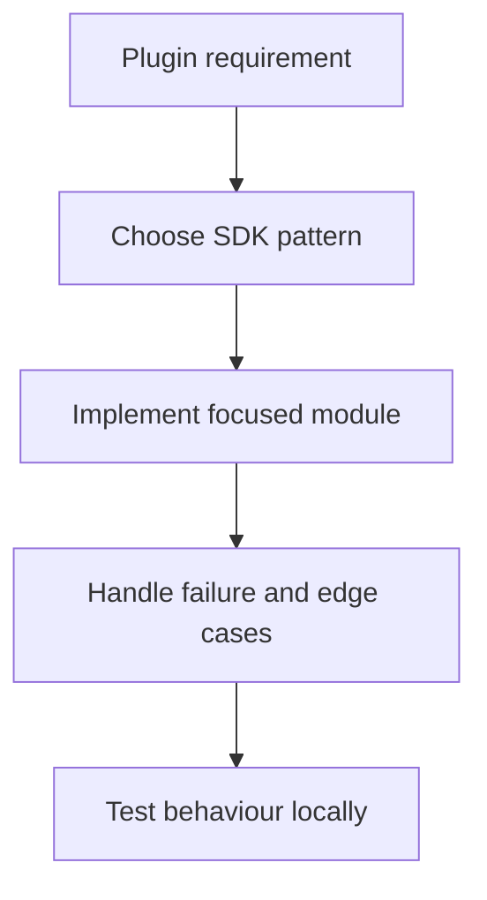

# Device-Specific Development

## Overview

The Stream Deck ecosystem spans multiple hardware devices, each with different capabilities, layouts, and interaction models. Writing device-aware plugins ensures the best experience across the full hardware range.

## Supported Devices

### Stream Deck Classic (MK.2)
- **Keys**: 15 (5 columns × 3 rows)
- **Icon size**: 72×72 px
- **Controller types**: Keypad only
- **DeviceType**: `DeviceType.StreamDeck` (0)

### Stream Deck Mini
- **Keys**: 6 (3 columns × 2 rows)
- **Icon size**: 80×80 px
- **Controller types**: Keypad only
- **DeviceType**: `DeviceType.StreamDeckMini` (1)

### Stream Deck XL
- **Keys**: 32 (8 columns × 4 rows)
- **Icon size**: 96×96 px
- **Controller types**: Keypad only
- **DeviceType**: `DeviceType.StreamDeckXL` (2)

### Stream Deck Mobile
- **Keys**: Configurable grid (user-defined)
- **Icon size**: Variable (adapts to screen resolution)
- **Controller types**: Keypad only
- **Platform**: iOS and Android app
- **DeviceType**: `DeviceType.StreamDeckMobile` (3)

### Stream Deck Pedal
- **Keys**: 3 foot pedals
- **No display**: No icons rendered on device
- **Controller types**: Keypad only (no visual feedback on hardware)
- **DeviceType**: `DeviceType.StreamDeckPedal` (5)

### Stream Deck + (Plus)
- **Keys**: 8 (4 columns × 2 rows) + 4 rotary encoders (dials)
- **Icon size**: 200×100 px (key area), 200×100 px (touchstrip area)
- **Controller types**: Keypad and Encoder
- **Touchstrip**: 800×100 px strip across the dial row
- **DeviceType**: `DeviceType.StreamDeckPlus` (7)
- See: [Stream Deck Plus Deep Dive](../core-concepts/stream-deck-plus-deep-dive.md)

### Stream Deck Neo
- **Keys**: 8 (4 columns × 2 rows)
- **Icon size**: 96×96 px
- **Info panel**: Small 256×64 px display strip at the top
- **Controller types**: Keypad only
- **Touch strip**: Touch-enabled info bar (not a full touchscreen)
- **DeviceType**: `DeviceType.StreamDeckNeo` (9)

### Stream Deck Studio
- **Keys**: 32 (8 columns × 4 rows)
- **Controller types**: Keypad only
- **DeviceType**: `DeviceType.StreamDeckStudio` (10)

### Virtual Stream Deck
- **Keys**: Virtual device layout
- **Controller types**: Keypad only
- **DeviceType**: `DeviceType.VirtualStreamDeck` (11)

### Galleon 100 SD
- **Keys**: Device-specific layout
- **Controller types**: Keypad only
- **DeviceType**: `DeviceType.Galleon100SD` (12)

### Stream Deck + XL
- **Keys and encoders**: Larger Stream Deck + style layout
- **Controller types**: Keypad and Encoder
- **DeviceType**: `DeviceType.StreamDeckPlusXL` (13)

## DeviceType Enum

```typescript
import { DeviceType } from "@elgato/streamdeck";

enum DeviceType {
    StreamDeck      = 0,   // Classic MK.2 (15 keys)
    StreamDeckMini  = 1,   // Mini (6 keys)
    StreamDeckXL    = 2,   // XL (32 keys)
    StreamDeckMobile = 3,  // Mobile app (iOS/Android)
    // 4 = Corsair G-keys (internal)
    StreamDeckPedal  = 5,  // Pedal (3 foot pedals)
    // 6 = Corsair Voyager (internal)
    StreamDeckPlus   = 7,  // Plus (8 keys + 4 dials)
    SCUFController   = 8,  // SCUF Controller
    StreamDeckNeo    = 9,  // Neo (8 keys + info panel)
    StreamDeckStudio = 10, // Studio
    VirtualStreamDeck = 11,
    Galleon100SD     = 12,
    StreamDeckPlusXL = 13,
}
```

## Device Detection

### Runtime Detection via Events

```typescript
import { streamDeck, DeviceType, WillAppearEvent } from "@elgato/streamdeck";

@action({ UUID: "com.example.plugin.myaction" })
export class MyAction extends SingletonAction<Settings> {
    override async onWillAppear(ev: WillAppearEvent<Settings>) {
        const device = ev.action.device;

        switch (device.type) {
            case DeviceType.StreamDeck:
                await this.setupForClassic(ev.action);
                break;
            case DeviceType.StreamDeckMini:
                await this.setupForMini(ev.action);
                break;
            case DeviceType.StreamDeckXL:
                await this.setupForXL(ev.action);
                break;
            case DeviceType.StreamDeckPlus:
                await this.setupForPlus(ev.action);
                break;
            case DeviceType.StreamDeckNeo:
                await this.setupForNeo(ev.action);
                break;
            case DeviceType.StreamDeckPedal:
                await this.setupForPedal(ev.action);
                break;
            case DeviceType.StreamDeckMobile:
                await this.setupForMobile(ev.action);
                break;
        }
    }
}
```

### Iterating Connected Devices

```typescript
// Enumerate all connected devices
streamDeck.devices.forEach((device) => {
    streamDeck.logger.info(`Connected: ${device.name} (type ${device.type})`);
    streamDeck.logger.info(`  Grid: ${device.size.columns}x${device.size.rows}`);
    streamDeck.logger.info(`  Connected: ${device.isConnected}`);
});

// React to device connect/disconnect
streamDeck.devices.onDeviceDidConnect((ev) => {
    const { device } = ev;
    streamDeck.logger.info(`Device connected: ${device.name}`);
});

streamDeck.devices.onDeviceDidDisconnect((ev) => {
    streamDeck.logger.info(`Device disconnected: ${ev.device.id}`);
});
```

### Device Capability Helpers

```typescript
function hasDisplay(deviceType: DeviceType): boolean {
    return deviceType !== DeviceType.StreamDeckPedal;
}

function supportsDials(deviceType: DeviceType): boolean {
    return deviceType === DeviceType.StreamDeckPlus;
}

function hasInfoPanel(deviceType: DeviceType): boolean {
    return deviceType === DeviceType.StreamDeckNeo;
}

function isMobile(deviceType: DeviceType): boolean {
    return deviceType === DeviceType.StreamDeckMobile;
}

function getIconSize(deviceType: DeviceType): { width: number; height: number } {
    switch (deviceType) {
        case DeviceType.StreamDeck:     return { width: 72, height: 72 };
        case DeviceType.StreamDeckMini: return { width: 80, height: 80 };
        case DeviceType.StreamDeckXL:   return { width: 96, height: 96 };
        case DeviceType.StreamDeckPlus: return { width: 200, height: 100 };
        case DeviceType.StreamDeckNeo:  return { width: 96, height: 96 };
        default:                         return { width: 72, height: 72 };
    }
}
```

## Device-Specific Features

### Stream Deck Neo — Info Panel

The Neo has a 256×64 px info panel (touch strip) at the top of the device. Use `setFeedback` with a Neo-compatible layout to populate it.

```typescript
// The info panel on the Neo uses the same feedback API as the Plus touchstrip
// but at a smaller resolution (256x64 px)
override async onWillAppear(ev: WillAppearEvent<Settings>) {
    if (ev.action.device.type === DeviceType.StreamDeckNeo) {
        // Set a layout for the info panel
        await ev.action.setFeedbackLayout("$B1");  // built-in bar layout
        await ev.action.setFeedback({
            title: "My Plugin",
            value: "Ready",
        });
    }
}
```

**Neo-specific considerations:**
- Info panel is always visible regardless of which key is selected
- The info panel is 256×64 px — use compact text and minimal graphics
- Touch events on the info panel fire `onTouchTap` with `hold: false`
- No encoder/dial support
- Key images are 96×96 px — same as XL

### Stream Deck Pedal

The Pedal has three foot pedals and **no display**. It is purely an input device.

```typescript
@action({ UUID: "com.example.plugin.pedal-action" })
export class PedalAction extends SingletonAction<Settings> {
    override async onKeyDown(ev: KeyDownEvent<Settings>) {
        // Pedal: left pedal = key 0, middle = key 1, right = key 2
        streamDeck.logger.info(`Pedal pressed: position ${ev.payload.coordinates?.column}`);

        // Since there's no display, provide audio or other non-visual feedback
        // (e.g., trigger an OS notification, update a key on another connected device)
        await this.triggerAction(ev.payload.settings);
    }

    override async onKeyUp(ev: KeyUpEvent<Settings>) {
        // Useful for hold-to-activate patterns with foot pedals
        await this.releaseAction(ev.payload.settings);
    }
}
```

**Pedal-specific considerations:**
- Calling `setTitle()` or `setImage()` has no visual effect on the device itself
- The Stream Deck software shows a UI representation, so images still display in the *app*
- `setImage()` updates the app UI even though nothing shows on the pedal hardware
- Foot pedals are ideal for push-to-talk, hold-for-action, toggle patterns
- Three pedals map to columns 0, 1, 2 in a single-row grid
- Long-press detection requires tracking `onKeyDown` + `onKeyUp` timing yourself

```typescript
// Long-press pattern for pedal
export class PedalHoldAction extends SingletonAction<Settings> {
    private pressTime: number | undefined;
    private readonly LONG_PRESS_MS = 500;

    override onKeyDown(ev: KeyDownEvent<Settings>): void {
        this.pressTime = Date.now();
    }

    override async onKeyUp(ev: KeyUpEvent<Settings>): Promise<void> {
        if (!this.pressTime) return;
        const held = Date.now() - this.pressTime;
        this.pressTime = undefined;

        if (held >= this.LONG_PRESS_MS) {
            await this.handleLongPress(ev);
        } else {
            await this.handleShortPress(ev);
        }
    }
}
```

### Stream Deck Mobile

Stream Deck Mobile is an iOS/Android app that emulates a Stream Deck device. It connects to the Stream Deck desktop software over Wi-Fi.

**Mobile-specific considerations:**
- Grid size is user-configurable — do not assume specific row/column counts
- Image rendering depends on the mobile screen's resolution and DPI
- Latency may be higher than a physical device (Wi-Fi vs USB)
- The mobile app may disconnect and reconnect frequently
- Battery-conscious: avoid high-frequency `setImage()` calls
- Touch interactions use `onKeyDown` / `onKeyUp` the same as physical keys

```typescript
override async onWillAppear(ev: WillAppearEvent<Settings>) {
    if (ev.action.device.type === DeviceType.StreamDeckMobile) {
        // Simpler, lower-frequency updates for mobile
        await ev.action.setTitle(this.getShortTitle(ev.payload.settings));
    } else {
        await ev.action.setTitle(this.getFullTitle(ev.payload.settings));
    }
}
```

## Responsive Icon Design

### Generating Device-Appropriate Images

Use the Canvas API or SVG-to-PNG conversion to generate correctly sized icons at runtime:

```typescript
import { createCanvas } from "canvas";

function renderIcon(text: string, deviceType: DeviceType): string {
    const { width, height } = getIconSize(deviceType);
    const canvas = createCanvas(width, height);
    const ctx = canvas.getContext("2d");

    // Background
    ctx.fillStyle = "#1a1a2e";
    ctx.fillRect(0, 0, width, height);

    // Adjust font size relative to icon size
    const fontSize = Math.floor(height * 0.25);
    ctx.font = `bold ${fontSize}px sans-serif`;
    ctx.fillStyle = "#ffffff";
    ctx.textAlign = "center";
    ctx.textBaseline = "middle";
    ctx.fillText(text, width / 2, height / 2);

    return canvas.toDataURL("image/png").replace(/^data:image\/png;base64,/, "");
}
```

### Icon Asset Recommendations

| Device | Key Size | Recommended Export |
|--------|----------|--------------------|
| Classic | 72×72 | PNG 72×72 @1x, or SVG |
| Mini | 80×80 | PNG 80×80 @1x, or SVG |
| XL | 96×96 | PNG 96×96 @1x, or SVG |
| Neo | 96×96 | PNG 96×96 @1x, or SVG |
| Plus (keys) | 200×100 | PNG 200×100, landscape layout |
| Pedal | n/a | App only, 72×72 for software UI |

**Best practices for icons:**
- Use SVG source assets and generate PNGs at the required size
- Avoid text smaller than 12px at any icon size
- Test at 72×72 (smallest) to ensure legibility at all sizes
- Use high contrast — Stream Deck displays are viewed from distance
- Prefer simple, bold shapes over detailed artwork

## Adaptive Layout Strategies

### Manifest `controllers` Declaration

Declare which controller types your action supports in `manifest.json`:

```json
{
    "Actions": [{
        "UUID": "com.example.plugin.myaction",
        "Name": "My Action",
        "Controllers": ["Keypad"],
        "States": [{ "Image": "images/action" }]
    }]
}
```

For actions that support both keys and dials:
```json
{
    "Controllers": ["Keypad", "Encoder"],
    "Encoder": {
        "layout": "$B1",
        "TriggerDescription": {
            "Rotate": "Adjust value",
            "Push": "Reset"
        }
    }
}
```

### Handling Actions That Only Appear on Supported Devices

Actions declared with `"Controllers": ["Encoder"]` only appear on the Stream Deck +. Actions with `"Controllers": ["Keypad"]` appear on all devices except they will be hidden on the Plus's encoder row.

## Fallback Strategies

### Graceful Degradation for Missing Features

```typescript
override async onWillAppear(ev: WillAppearEvent<Settings>) {
    const { device } = ev.action;

    // Only set feedback if device supports encoder/touchstrip
    if (device.type === DeviceType.StreamDeckPlus ||
        device.type === DeviceType.StreamDeckNeo) {
        await ev.action.setFeedback({ title: "Ready" });
    }

    // Visual feedback only on devices with displays
    if (device.type !== DeviceType.StreamDeckPedal) {
        await ev.action.setImage(this.renderIcon(ev.payload.settings, device.type));
    }
}
```

### Handling Unknown Future Devices

```typescript
function getDeviceName(type: DeviceType): string {
    const names: Partial<Record<DeviceType, string>> = {
        [DeviceType.StreamDeck]:      "Stream Deck",
        [DeviceType.StreamDeckMini]:  "Stream Deck Mini",
        [DeviceType.StreamDeckXL]:    "Stream Deck XL",
        [DeviceType.StreamDeckMobile]:"Stream Deck Mobile",
        [DeviceType.StreamDeckPedal]: "Stream Deck Pedal",
        [DeviceType.StreamDeckPlus]:  "Stream Deck +",
        [DeviceType.StreamDeckNeo]:   "Stream Deck Neo",
        [DeviceType.StreamDeckStudio]: "Stream Deck Studio",
        [DeviceType.VirtualStreamDeck]: "Virtual Stream Deck",
        [DeviceType.Galleon100SD]:    "Galleon 100 SD",
        [DeviceType.StreamDeckPlusXL]: "Stream Deck + XL",
    };
    return names[type] ?? `Unknown Device (${type})`;
}
```

## Multi-Device Testing

### Testing Strategy

1. **Use the Stream Deck simulator** in the Stream Deck application for basic testing
2. **Test on physical hardware** for accurate icon rendering and interaction feel
3. **Automated testing**: Mock the device in unit tests using the device type constants

```typescript
// Unit test: mock different device types
describe("icon rendering", () => {
    const deviceTypes = [
        DeviceType.StreamDeck,
        DeviceType.StreamDeckMini,
        DeviceType.StreamDeckXL,
        DeviceType.StreamDeckNeo,
        DeviceType.StreamDeckPedal,
    ];

    deviceTypes.forEach((type) => {
        it(`renders correctly for device type ${type}`, () => {
            const icon = renderIcon("Test", type);
            expect(icon).toBeTruthy();
            expect(typeof icon).toBe("string");
        });
    });
});
```

### CI/CD Device Coverage

Add device-type coverage to your test matrix:

```yaml
# .github/workflows/test.yml
strategy:
  matrix:
    device-type: [0, 1, 2, 5, 7, 8]  # All DeviceType values
```

## Best Practices

1. **Never hard-code icon sizes** — always derive from `DeviceType` at runtime
2. **Test the pedal case** — if your action calls `setImage()`, ensure it won't cause errors on the pedal (it won't, but be aware there's no visual effect)
3. **Keep Mobile-friendly**: avoid frequent `setImage()` calls on mobile connections (Wi-Fi latency)
4. **Use the `Controllers` manifest field** to restrict actions to appropriate device types
5. **Design icons at 96×96** as the baseline and scale down — not the other way around
6. **The Neo info panel is shared** — all actions on the device share it, so only write to it from the currently active/focused action
7. **Pedal actions benefit from hold detection** — foot pedals are naturally suited to hold patterns (push-to-talk, etc.)
8. **Handle `onDeviceDidConnect`** if your plugin needs to react to hot-plugging during a session

---

**Related Documentation**:
- [Stream Deck Plus Deep Dive](../core-concepts/stream-deck-plus-deep-dive.md)
- [API Reference](../reference/api-reference.md)
- [Manifest Templates](../code-templates/manifest-templates.md)

---

## Diagram

Advanced topics usually connect a plugin event to external state, SDK APIs, and validation.



---

## Agent Prompt

Use this prompt with GitHub Copilot in VS Code or Claude Desktop after attaching the relevant plugin files.

```text
#file:knowledge-base/advanced-topics/device-specific-development.md
Use this article as the source of truth for my Stream Deck plugin.

Explain the key points from "Device-Specific Development" in practical terms. Then inspect my local plugin files for the same concept, identify any gaps or risky assumptions, and propose a spec-first, test-driven implementation plan before changing code.
```
