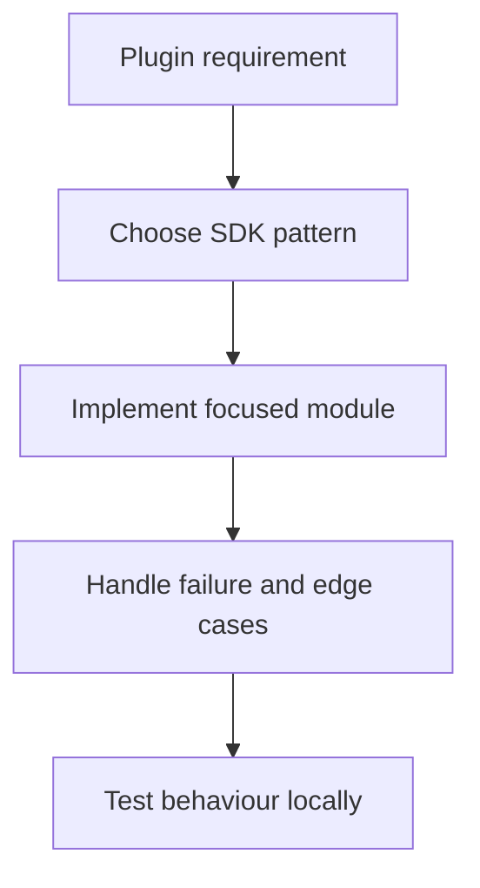

# Network Operations Best Practices

## Overview

Stream Deck plugins frequently call external APIs to fetch data, push events, or maintain real-time connections. This guide covers HTTP patterns, WebSocket clients, error handling, caching, offline support, and rate limiting — all within the constraints of a Node.js plugin process.

## HTTP Requests

### Basic Fetch Pattern

Node.js 20+ includes the native `fetch` API. No additional library is required.

```typescript
async function fetchWeather(city: string, apiKey: string): Promise<WeatherData> {
    const url = `https://api.openweathermap.org/data/2.5/weather?q=${encodeURIComponent(city)}&appid=${apiKey}`;
    const response = await fetch(url);

    if (!response.ok) {
        throw new Error(`HTTP ${response.status}: ${response.statusText}`);
    }

    return response.json() as Promise<WeatherData>;
}
```

### Adding Timeouts

Native `fetch` does not time out by default. Use `AbortController`:

```typescript
async function fetchWithTimeout<T>(
    url: string,
    options: RequestInit = {},
    timeoutMs = 5000
): Promise<T> {
    const controller = new AbortController();
    const timer = setTimeout(() => controller.abort(), timeoutMs);

    try {
        const response = await fetch(url, { ...options, signal: controller.signal });
        if (!response.ok) throw new Error(`HTTP ${response.status}`);
        return response.json() as Promise<T>;
    } finally {
        clearTimeout(timer);
    }
}
```

### Exponential Backoff Retry

```typescript
async function fetchWithRetry<T>(
    url: string,
    options: RequestInit = {},
    maxAttempts = 3,
    baseDelayMs = 500
): Promise<T> {
    let lastError: Error | undefined;

    for (let attempt = 0; attempt < maxAttempts; attempt++) {
        try {
            return await fetchWithTimeout<T>(url, options);
        } catch (err) {
            lastError = err as Error;
            // Don't retry on 4xx client errors (except 429)
            if (err instanceof Error && err.message.match(/^HTTP (4\d\d)/)) {
                if (!err.message.includes("429")) throw err;
            }
            if (attempt < maxAttempts - 1) {
                const delay = baseDelayMs * Math.pow(2, attempt);
                const jitter = Math.random() * delay * 0.1;
                await sleep(delay + jitter);
            }
        }
    }

    throw lastError;
}

function sleep(ms: number): Promise<void> {
    return new Promise((resolve) => setTimeout(resolve, ms));
}
```

### Request Queuing and Concurrency Control

Avoid hammering APIs with too many simultaneous requests:

```typescript
class RequestQueue {
    private queue: (() => Promise<void>)[] = [];
    private running = 0;
    private readonly concurrency: number;

    constructor(concurrency = 3) {
        this.concurrency = concurrency;
    }

    async enqueue<T>(fn: () => Promise<T>): Promise<T> {
        return new Promise<T>((resolve, reject) => {
            this.queue.push(async () => {
                try {
                    resolve(await fn());
                } catch (err) {
                    reject(err);
                }
            });
            this.drain();
        });
    }

    private drain() {
        while (this.running < this.concurrency && this.queue.length > 0) {
            const task = this.queue.shift()!;
            this.running++;
            task().finally(() => {
                this.running--;
                this.drain();
            });
        }
    }
}

// Usage
const apiQueue = new RequestQueue(2);  // max 2 concurrent requests

const results = await Promise.all(
    items.map((item) => apiQueue.enqueue(() => fetchData(item)))
);
```

## Circuit Breaker Pattern

A circuit breaker stops calling a failing service until it recovers, preventing cascading failures.

```typescript
enum CircuitState {
    Closed,   // Normal operation
    Open,     // Failing — reject immediately
    HalfOpen, // Testing if service recovered
}

class CircuitBreaker {
    private state = CircuitState.Closed;
    private failures = 0;
    private lastFailureTime = 0;

    constructor(
        private readonly threshold = 5,
        private readonly resetTimeoutMs = 30_000
    ) {}

    async execute<T>(fn: () => Promise<T>): Promise<T> {
        if (this.state === CircuitState.Open) {
            if (Date.now() - this.lastFailureTime > this.resetTimeoutMs) {
                this.state = CircuitState.HalfOpen;
            } else {
                throw new Error("Circuit breaker is open — service unavailable");
            }
        }

        try {
            const result = await fn();
            this.onSuccess();
            return result;
        } catch (err) {
            this.onFailure();
            throw err;
        }
    }

    private onSuccess() {
        this.failures = 0;
        this.state = CircuitState.Closed;
    }

    private onFailure() {
        this.failures++;
        this.lastFailureTime = Date.now();
        if (this.failures >= this.threshold) {
            this.state = CircuitState.Open;
            streamDeck.logger.warn(`Circuit breaker opened after ${this.failures} failures`);
        }
    }

    get isOpen() { return this.state === CircuitState.Open; }
}
```

## Client-Side Rate Limiting

Respect API rate limits by throttling requests on the client side:

```typescript
class RateLimiter {
    private tokens: number;
    private lastRefill: number;

    constructor(
        private readonly maxTokens: number,
        private readonly refillIntervalMs: number
    ) {
        this.tokens = maxTokens;
        this.lastRefill = Date.now();
    }

    async acquire(): Promise<void> {
        this.refill();

        if (this.tokens > 0) {
            this.tokens--;
            return;
        }

        // Wait until next refill
        const wait = this.refillIntervalMs - (Date.now() - this.lastRefill);
        await sleep(wait);
        this.refill();
        this.tokens--;
    }

    private refill() {
        const now = Date.now();
        if (now - this.lastRefill >= this.refillIntervalMs) {
            this.tokens = this.maxTokens;
            this.lastRefill = now;
        }
    }
}

// Usage: 10 requests per second
const limiter = new RateLimiter(10, 1000);

async function rateLimitedFetch(url: string) {
    await limiter.acquire();
    return fetch(url);
}
```

## In-Memory Caching

Avoid redundant API calls by caching responses:

```typescript
interface CacheEntry<T> {
    value: T;
    expiresAt: number;
}

class MemoryCache<T> {
    private cache = new Map<string, CacheEntry<T>>();

    set(key: string, value: T, ttlMs: number): void {
        this.cache.set(key, {
            value,
            expiresAt: Date.now() + ttlMs,
        });
    }

    get(key: string): T | undefined {
        const entry = this.cache.get(key);
        if (!entry) return undefined;
        if (Date.now() > entry.expiresAt) {
            this.cache.delete(key);
            return undefined;
        }
        return entry.value;
    }

    invalidate(key: string): void {
        this.cache.delete(key);
    }

    clear(): void {
        this.cache.clear();
    }
}

// Usage with automatic cache-aside pattern
const weatherCache = new MemoryCache<WeatherData>();
const CACHE_TTL = 5 * 60 * 1000; // 5 minutes

async function getWeather(city: string): Promise<WeatherData> {
    const cached = weatherCache.get(city);
    if (cached) return cached;

    const data = await fetchWeather(city, apiKey);
    weatherCache.set(city, data, CACHE_TTL);
    return data;
}
```

## WebSocket Clients (External Services)

### Connecting with Auto-Reconnect

```typescript
import WebSocket from "ws";

class ReconnectingWebSocket {
    private ws?: WebSocket;
    private reconnectTimer?: NodeJS.Timeout;
    private shouldReconnect = true;
    private attempt = 0;

    constructor(
        private readonly url: string,
        private readonly onMessage: (data: string) => void,
        private readonly maxDelay = 30_000
    ) {}

    connect() {
        this.ws = new WebSocket(this.url);

        this.ws.on("open", () => {
            this.attempt = 0;
            streamDeck.logger.info(`WebSocket connected: ${this.url}`);
        });

        this.ws.on("message", (data) => {
            this.onMessage(data.toString());
        });

        this.ws.on("close", () => {
            if (this.shouldReconnect) {
                const delay = Math.min(1000 * Math.pow(2, this.attempt), this.maxDelay);
                this.attempt++;
                streamDeck.logger.warn(`WebSocket closed. Reconnecting in ${delay}ms`);
                this.reconnectTimer = setTimeout(() => this.connect(), delay);
            }
        });

        this.ws.on("error", (err) => {
            streamDeck.logger.error("WebSocket error:", err.message);
        });
    }

    send(data: string) {
        if (this.ws?.readyState === WebSocket.OPEN) {
            this.ws.send(data);
        }
    }

    disconnect() {
        this.shouldReconnect = false;
        clearTimeout(this.reconnectTimer);
        this.ws?.close();
    }
}
```

### Heartbeat / Keep-Alive

```typescript
class HeartbeatWebSocket extends ReconnectingWebSocket {
    private heartbeatTimer?: NodeJS.Timeout;
    private readonly HEARTBEAT_INTERVAL = 30_000;

    connect() {
        super.connect();
        this.startHeartbeat();
    }

    private startHeartbeat() {
        this.heartbeatTimer = setInterval(() => {
            this.send(JSON.stringify({ type: "ping" }));
        }, this.HEARTBEAT_INTERVAL);
    }

    disconnect() {
        clearInterval(this.heartbeatTimer);
        super.disconnect();
    }
}
```

## Server-Sent Events (SSE)

SSE is useful for receiving a stream of events from a server without maintaining a full WebSocket:

```typescript
import { EventSource } from "eventsource";  // npm install eventsource

class SSEClient {
    private source?: EventSource;

    connect(url: string, onEvent: (event: MessageEvent) => void) {
        this.source = new EventSource(url);

        this.source.onmessage = onEvent;

        this.source.onerror = (err) => {
            streamDeck.logger.error("SSE error:", err);
            // EventSource auto-reconnects — no manual handling needed
        };
    }

    disconnect() {
        this.source?.close();
    }
}
```

## Offline Support

### Detecting Network Availability

Node.js does not have a built-in online/offline event. Use DNS resolution as a lightweight check:

```typescript
import dns from "dns/promises";

async function isOnline(testHost = "8.8.8.8"): Promise<boolean> {
    try {
        await dns.lookup(testHost);
        return true;
    } catch {
        return false;
    }
}
```

### Offline Queue with Sync on Reconnect

```typescript
class OfflineQueue<T> {
    private pending: T[] = [];
    private online = true;

    constructor(
        private readonly processItem: (item: T) => Promise<void>,
        checkIntervalMs = 10_000
    ) {
        setInterval(async () => {
            const wasOnline = this.online;
            this.online = await isOnline();
            if (!wasOnline && this.online) {
                streamDeck.logger.info("Network restored — draining queue");
                await this.flush();
            }
        }, checkIntervalMs);
    }

    async submit(item: T): Promise<void> {
        if (this.online) {
            try {
                await this.processItem(item);
            } catch {
                this.online = false;
                this.pending.push(item);
            }
        } else {
            this.pending.push(item);
        }
    }

    private async flush() {
        const items = [...this.pending];
        this.pending = [];
        for (const item of items) {
            try {
                await this.processItem(item);
            } catch {
                this.pending.push(item);
                break;
            }
        }
    }
}
```

## Authentication

### Secure API Key Storage

Store API keys in Global Settings, never in the code:

```typescript
interface GlobalSettings {
    apiKey?: string;
}

// Save key from Property Inspector
await streamDeck.settings.setGlobalSettings<GlobalSettings>({ apiKey: userInput });

// Retrieve key in plugin
const settings = await streamDeck.settings.getGlobalSettings<GlobalSettings>();
const apiKey = settings.apiKey;
if (!apiKey) {
    streamDeck.logger.error("No API key configured");
    return;
}
```

### JWT Token Refresh

```typescript
class AuthTokenManager {
    private accessToken?: string;
    private refreshToken?: string;
    private expiresAt = 0;

    async getAccessToken(): Promise<string> {
        if (Date.now() < this.expiresAt - 60_000) {
            return this.accessToken!;
        }
        return this.refresh();
    }

    private async refresh(): Promise<string> {
        const response = await fetch("https://auth.example.com/token", {
            method: "POST",
            headers: { "Content-Type": "application/json" },
            body: JSON.stringify({ refresh_token: this.refreshToken }),
        });

        const data = await response.json();
        this.accessToken = data.access_token;
        this.expiresAt = Date.now() + data.expires_in * 1000;
        return this.accessToken!;
    }
}
```

## Progress Tracking

For long-running operations (file downloads, batch uploads), update the key image with progress:

```typescript
async function downloadWithProgress(
    url: string,
    action: Action
): Promise<Buffer> {
    const response = await fetch(url);
    const total = Number(response.headers.get("content-length")) || 0;
    const chunks: Uint8Array[] = [];
    let received = 0;

    const reader = response.body!.getReader();
    while (true) {
        const { done, value } = await reader.read();
        if (done) break;
        chunks.push(value);
        received += value.length;
        const pct = total > 0 ? Math.round((received / total) * 100) : -1;
        await action.setTitle(pct >= 0 ? `${pct}%` : "...");
    }

    await action.setTitle("Done");
    return Buffer.concat(chunks);
}
```

## Best Practices Checklist

- [ ] All `fetch` calls have a timeout via `AbortController`
- [ ] Retry logic uses exponential backoff with jitter
- [ ] 4xx errors (except 429) are not retried
- [ ] Circuit breaker wraps unreliable external services
- [ ] API keys stored in Global Settings, not hardcoded
- [ ] Responses are cached with appropriate TTLs
- [ ] Concurrent requests are bounded (use `RequestQueue`)
- [ ] External WebSocket clients have auto-reconnect
- [ ] Plugin handles offline gracefully (queue or degrade)
- [ ] Rate limits are respected client-side
- [ ] No sensitive data logged (no full URLs with secrets)

---

**Related Documentation**:
- [OAuth Implementation](oauth-implementation.md)
- [Security Requirements](../security-and-compliance/security-requirements.md)
- [Plugin Secrets Management](../security-and-compliance/secrets-management.md)

---

## Diagram

Advanced topics usually connect a plugin event to external state, SDK APIs, and validation.



---

## Agent Prompt

Use this prompt with GitHub Copilot in VS Code or Claude Desktop after attaching the relevant plugin files.

```text
#file:knowledge-base/advanced-topics/network-operations.md
Use this article as the source of truth for my Stream Deck plugin.

Explain the key points from "Network Operations Best Practices" in practical terms. Then inspect my local plugin files for the same concept, identify any gaps or risky assumptions, and propose a spec-first, test-driven implementation plan before changing code.
```
