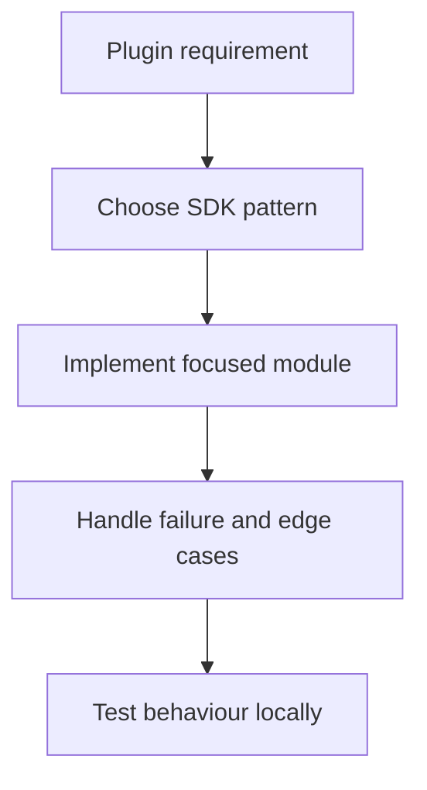

# OAuth Implementation Guide

Complete guide to implementing OAuth 2.0 authentication in Stream Deck plugins. This article covers core patterns for token management, secure callback handling, and error recovery. For provider-specific setup, see [oauth-provider-setup.md](oauth-provider-setup.md).

**Key principles**:
- Use PKCE (Proof Key for Code Exchange) for enhanced security
- Store user tokens in Global Settings (secure storage)
- Never hardcode private secrets in plugin code
- Implement token refresh before expiration
- Handle timeouts and user cancellation gracefully

## Architecture

### Components

1. **Plugin (Node.js backend)** - Manages OAuth flow, token storage, API requests
2. **Property Inspector (UI)** - Shows connection status, provides "Connect" button
3. **Local callback server** - Receives authorization callback
4. **Global Settings** - Securely stores user access/refresh tokens

### Data Flow

```
User clicks "Connect"
    ↓
Plugin starts local HTTP server
    ↓
Plugin opens authorization URL in browser
    ↓
User authorizes and grants permission
    ↓
Service redirects to http://localhost:3000/callback
    ↓
Plugin receives authorization code
    ↓
Plugin exchanges code for tokens
    ↓
Plugin stores tokens in Global Settings
    ↓
Plugin uses tokens for authenticated API calls
```

### Security Model

```
┌──────────────────────────────────────┐
│  Plugin Code (Local, Inspectable)    │
│  ✓ Client ID (public, safe)          │
│  ✗ Private secrets                   │
│  ✓ Authorization callback            │
└──────────────────────────────────────┘
              ↓
┌──────────────────────────────────────┐
│  Global Settings (Encrypted)         │
│  ✓ User's access token (per user)    │
│  ✓ User's refresh token              │
│  ✓ Token expiration time             │
└──────────────────────────────────────┘
```

**Critical**: Plugin code runs locally on user's machine and is inspectable. Use PKCE, marketplace-managed secrets, or a backend token exchange for private values.

## Implementation Pattern

### Configuration

```typescript
// OAuth configuration - Client ID is public; secret optional
const OAUTH_CONFIG = {
    clientId: "your-client-id-here",
    clientSecret: "optional-for-some-providers", // Avoid bundling if possible
    authorizationUrl: "https://provider.com/oauth/authorize",
    tokenUrl: "https://provider.com/oauth/token",
    redirectUri: "http://localhost:3000/callback",
    scope: "read write"
};

// Token storage key in Global Settings
const SETTINGS_KEY = "oauth_tokens";

interface OAuthTokens {
    accessToken: string;
    refreshToken: string;
    expiresAt: number; // Unix timestamp in milliseconds
    tokenType: string; // Usually "Bearer"
}
```

### Complete OAuth Flow

```typescript
import streamDeck from "@elgato/streamdeck";
import { open } from "open";
import http from "http";
import crypto from "crypto";

/**
 * Main OAuth flow: Authorization → Token Exchange → Storage
 */
export async function startOAuthFlow(): Promise<boolean> {
    try {
        // Generate PKCE parameters for security
        const codeVerifier = crypto.randomBytes(32).toString('base64url');
        const codeChallenge = crypto
            .createHash('sha256')
            .update(codeVerifier)
            .digest('base64url');
        
        // Generate state for CSRF protection
        const state = crypto.randomBytes(16).toString('hex');
        
        // Build authorization URL
        const authUrl = new URL(OAUTH_CONFIG.authorizationUrl);
        authUrl.searchParams.set('client_id', OAUTH_CONFIG.clientId);
        authUrl.searchParams.set('redirect_uri', OAUTH_CONFIG.redirectUri);
        authUrl.searchParams.set('response_type', 'code');
        authUrl.searchParams.set('scope', OAUTH_CONFIG.scope);
        authUrl.searchParams.set('state', state);
        authUrl.searchParams.set('code_challenge', codeChallenge);
        authUrl.searchParams.set('code_challenge_method', 'S256');
        
        // Start listening for callback (5 minute timeout)
        const callbackPromise = startCallbackServer(3000, 300000);
        
        // Open browser for user to authorize
        await open(authUrl.toString());
        
        // Wait for callback
        const result = await callbackPromise;
        
        // Handle errors
        if (result.error) {
            if (result.error === 'access_denied') {
                streamDeck.logger.info('User denied authorization');
            } else {
                streamDeck.logger.error('Authorization failed:', result.error);
            }
            return false;
        }
        
        // Verify state matches (CSRF protection)
        if (result.state !== state) {
            streamDeck.logger.error('CSRF detected: state mismatch');
            return false;
        }
        
        // Exchange code for tokens
        if (result.code) {
            const tokens = await exchangeCodeForTokens(result.code, codeVerifier);
            await saveTokens(tokens);
            streamDeck.logger.info('OAuth authentication successful');
            return true;
        }
        
        return false;
    } catch (error) {
        streamDeck.logger.error('OAuth flow failed:', error);
        return false;
    }
}

/**
 * Exchange authorization code for tokens
 */
async function exchangeCodeForTokens(
    code: string,
    codeVerifier: string
): Promise<OAuthTokens> {
    const params = new URLSearchParams({
        grant_type: 'authorization_code',
        code: code,
        redirect_uri: OAUTH_CONFIG.redirectUri,
        client_id: OAUTH_CONFIG.clientId,
        code_verifier: codeVerifier
    });
    
    // Add client secret if required
    if (OAUTH_CONFIG.clientSecret) {
        params.set('client_secret', OAUTH_CONFIG.clientSecret);
    }
    
    const response = await fetch(OAUTH_CONFIG.tokenUrl, {
        method: 'POST',
        headers: {
            'Content-Type': 'application/x-www-form-urlencoded',
            'Accept': 'application/json'
        },
        body: params.toString()
    });
    
    if (!response.ok) {
        const errorText = await response.text();
        throw new Error(`Token exchange failed: ${response.status} ${errorText}`);
    }
    
    const data = await response.json();
    
    return {
        accessToken: data.access_token,
        refreshToken: data.refresh_token || '',
        expiresAt: Date.now() + (data.expires_in * 1000),
        tokenType: data.token_type || 'Bearer'
    };
}
```

## Token Storage and Retrieval

### Secure Storage in Global Settings

```typescript
/**
 * Save tokens to Global Settings (encrypted storage)
 */
async function saveTokens(tokens: OAuthTokens): Promise<void> {
    await streamDeck.settings.setGlobalSettings({
        [SETTINGS_KEY]: tokens
    });
}

/**
 * Retrieve tokens from Global Settings
 */
async function getTokens(): Promise<OAuthTokens | null> {
    const globalSettings = await streamDeck.settings.getGlobalSettings();
    return (globalSettings[SETTINGS_KEY] as OAuthTokens) || null;
}

/**
 * Clear tokens (logout)
 */
async function clearTokens(): Promise<void> {
    await streamDeck.settings.setGlobalSettings({
        [SETTINGS_KEY]: null
    });
}
```

## Token Refresh

### Automatic Refresh Before Expiration

```typescript
/**
 * Get valid token, refreshing if necessary
 */
async function getValidAccessToken(): Promise<string | null> {
    const tokens = await getTokens();
    
    if (!tokens) {
        return null;
    }
    
    // Refresh if expiring within 5 minutes
    const bufferTime = 5 * 60 * 1000;
    const isExpiring = tokens.expiresAt - Date.now() < bufferTime;
    
    if (isExpiring) {
        try {
            const newTokens = await refreshAccessToken(tokens.refreshToken);
            await saveTokens(newTokens);
            return newTokens.accessToken;
        } catch (error) {
            streamDeck.logger.error('Token refresh failed:', error);
            await clearTokens();
            return null;
        }
    }
    
    return tokens.accessToken;
}

/**
 * Refresh token using refresh token
 */
async function refreshAccessToken(refreshToken: string): Promise<OAuthTokens> {
    const params = new URLSearchParams({
        grant_type: 'refresh_token',
        refresh_token: refreshToken,
        client_id: OAUTH_CONFIG.clientId
    });
    
    if (OAUTH_CONFIG.clientSecret) {
        params.set('client_secret', OAUTH_CONFIG.clientSecret);
    }
    
    const response = await fetch(OAUTH_CONFIG.tokenUrl, {
        method: 'POST',
        headers: {
            'Content-Type': 'application/x-www-form-urlencoded',
            'Accept': 'application/json'
        },
        body: params.toString()
    });
    
    if (!response.ok) {
        throw new Error(`Token refresh failed: ${response.status}`);
    }
    
    const data = await response.json();
    
    return {
        accessToken: data.access_token,
        refreshToken: data.refresh_token || refreshToken,
        expiresAt: Date.now() + (data.expires_in * 1000),
        tokenType: data.token_type || 'Bearer'
    };
}
```

## Making Authenticated Requests

### API Requests with Automatic Token Refresh

```typescript
/**
 * Make authenticated API request with token refresh on 401
 */
async function authenticatedFetch(
    url: string,
    options: RequestInit = {}
): Promise<Response> {
    const accessToken = await getValidAccessToken();
    
    if (!accessToken) {
        throw new Error('Not authenticated - user needs to connect');
    }
    
    const headers = new Headers(options.headers);
    headers.set('Authorization', `Bearer ${accessToken}`);
    
    let response = await fetch(url, {
        ...options,
        headers
    });
    
    // If token rejected, try refreshing once
    if (response.status === 401) {
        const tokens = await getTokens();
        if (tokens?.refreshToken) {
            try {
                const newTokens = await refreshAccessToken(tokens.refreshToken);
                await saveTokens(newTokens);
                
                headers.set('Authorization', `Bearer ${newTokens.accessToken}`);
                response = await fetch(url, { ...options, headers });
            } catch (error) {
                await clearTokens();
                throw new Error('Authentication failed - user needs to reconnect');
            }
        }
    }
    
    return response;
}

/**
 * Usage in action
 */
class MyApiAction extends Action {
    override async onKeyDown(ev: KeyDownEvent): Promise<void> {
        try {
            const response = await authenticatedFetch('https://api.example.com/data');
            const data = await response.json();
            await ev.action.setTitle(JSON.stringify(data));
        } catch (error) {
            if (error instanceof Error && error.message.includes('Not authenticated')) {
                await ev.action.showAlert(); // Notify user to connect
            }
            streamDeck.logger.error('API request failed:', error);
        }
    }
}
```

## Local Callback Server

### HTTP Server for Authorization Callback

```typescript
interface CallbackResult {
    code?: string;
    state?: string;
    error?: string;
    errorDescription?: string;
}

/**
 * Start temporary HTTP server to receive OAuth callback
 */
function startCallbackServer(
    port: number = 3000,
    timeout: number = 300000 // 5 minutes
): Promise<CallbackResult> {
    return new Promise((resolve, reject) => {
        const server = http.createServer((req, res) => {
            const url = new URL(req.url || '/', `http://localhost:${port}`);
            
            if (url.pathname !== '/callback') {
                res.writeHead(404);
                res.end('Not Found');
                return;
            }
            
            // Extract callback parameters
            const code = url.searchParams.get('code');
            const state = url.searchParams.get('state');
            const error = url.searchParams.get('error');
            const errorDescription = url.searchParams.get('error_description');
            
            // Send response page
            res.writeHead(200, { 'Content-Type': 'text/html; charset=utf-8' });
            
            if (error) {
                res.end(getErrorPage(error, errorDescription));
                resolve({ error, errorDescription });
            } else if (code) {
                res.end(getSuccessPage());
                resolve({ code, state: state || undefined });
            } else {
                res.end(getErrorPage('invalid_request', 'Missing code parameter'));
                resolve({ error: 'invalid_request' });
            }
            
            // Close server after response
            setTimeout(() => server.close(), 100);
        });
        
        server.on('error', reject);
        
        // Listen on localhost only (security)
        server.listen(port, '127.0.0.1', () => {
            streamDeck.logger.info(`OAuth callback server listening on port ${port}`);
        });
        
        // Timeout to prevent hanging
        setTimeout(() => {
            server.close();
            reject(new Error('OAuth callback timeout - authorization took too long'));
        }, timeout);
    });
}

function getSuccessPage(): string {
    return `
        <!DOCTYPE html>
        <html>
        <head>
            <meta charset="UTF-8">
            <title>Authorization Successful</title>
            <style>
                body { font-family: -apple-system, BlinkMacSystemFont, 'Segoe UI', sans-serif;
                    display: flex; justify-content: center; align-items: center;
                    height: 100vh; margin: 0; background: #1a1a1a; color: #fff; }
                .container { text-align: center; padding: 40px; }
                .checkmark { font-size: 64px; color: #4caf50; }
                h1 { margin: 20px 0; font-size: 24px; }
            </style>
        </head>
        <body>
            <div class="container">
                <div class="checkmark">✓</div>
                <h1>Authorization Successful!</h1>
                <p>You can close this window.</p>
            </div>
            <script>setTimeout(() => window.close(), 2000);</script>
        </body>
        </html>
    `;
}

function getErrorPage(error: string, description?: string): string {
    return `
        <!DOCTYPE html>
        <html>
        <head>
            <meta charset="UTF-8">
            <title>Authorization Failed</title>
            <style>
                body { font-family: -apple-system, BlinkMacSystemFont, 'Segoe UI', sans-serif;
                    display: flex; justify-content: center; align-items: center;
                    height: 100vh; margin: 0; background: #1a1a1a; color: #fff; }
                .container { text-align: center; padding: 40px; }
                .error-icon { font-size: 64px; color: #f44336; }
                h1 { margin: 20px 0; font-size: 24px; }
            </style>
        </head>
        <body>
            <div class="container">
                <div class="error-icon">✕</div>
                <h1>Authorization Failed</h1>
                <p>${description || error}</p>
                <p>You can close this window and try again.</p>
            </div>
        </body>
        </html>
    `;
}
```

## Error Handling

### Common OAuth Errors

| Error | Cause | Recovery |
|-------|-------|----------|
| `access_denied` | User declined authorization | Expected; show UI to retry |
| `invalid_scope` | Requested scope not recognized | Check provider scope format |
| `invalid_client` | Client ID/secret invalid | Verify configuration |
| `invalid_grant` | Code/refresh token invalid | Clear stored tokens; reconnect |
| `server_error` | Provider server issue | Retry with backoff |

### Graceful Error Handling

```typescript
async function handleAuthorizationError(
    error: string,
    description?: string
): Promise<void> {
    switch (error) {
        case 'access_denied':
            streamDeck.logger.info('User declined authorization');
            // Expected - let user retry
            break;
        case 'invalid_client':
        case 'invalid_scope':
            streamDeck.logger.error('Configuration error:', description);
            // Plugin configuration issue
            break;
        case 'invalid_grant':
            streamDeck.logger.warn('Tokens invalid, clearing');
            await clearTokens();
            // User needs to reconnect
            break;
        default:
            streamDeck.logger.error('OAuth error:', error, description);
    }
}
```

### Network Retry with Exponential Backoff

```typescript
async function retryWithBackoff<T>(
    fn: () => Promise<T>,
    maxRetries: number = 3,
    initialDelay: number = 1000
): Promise<T> {
    let lastError: Error;
    
    for (let attempt = 0; attempt < maxRetries; attempt++) {
        try {
            return await fn();
        } catch (error) {
            lastError = error as Error;
            
            // Don't retry on auth errors
            if (error instanceof Error) {
                if (error.message.includes('401') || 
                    error.message.includes('invalid_grant')) {
                    throw error;
                }
            }
            
            const delay = initialDelay * Math.pow(2, attempt);
            streamDeck.logger.warn(
                `Attempt ${attempt + 1}/${maxRetries} failed, retrying in ${delay}ms...`
            );
            
            await new Promise(resolve => setTimeout(resolve, delay));
        }
    }
    
    throw lastError!;
}
```

## Testing

### Mock Tokens for Development

```typescript
const TEST_MODE = process.env.NODE_ENV === 'development';

async function getValidAccessToken(): Promise<string | null> {
    if (TEST_MODE) {
        streamDeck.logger.info('Using test token');
        return 'test-token-123';
    }
    
    return await getRealAccessToken();
}
```

## Provider-Specific Setup

For provider-specific configuration details, see [oauth-provider-setup.md](oauth-provider-setup.md), which includes setup instructions and code examples for:

- Google OAuth
- Spotify OAuth
- Twitch OAuth
- GitHub OAuth
- Discord OAuth
- General provider checklist

## Security Checklist

- [ ] Using PKCE (code_challenge/code_verifier)
- [ ] Using state parameter for CSRF protection
- [ ] Storing tokens in Global Settings, not hardcoding
- [ ] Implementing token expiration check (5-minute buffer)
- [ ] Refreshing tokens before they expire
- [ ] Clearing tokens on 401 responses
- [ ] Callback server listens on localhost only
- [ ] Private secrets not bundled in plugin (use marketplace secrets or backend)
- [ ] Implementing timeouts on callback server
- [ ] Logging without exposing tokens or secrets

---

## Diagram

Advanced topics usually connect a plugin event to external state, SDK APIs, and validation.



---

## Agent Prompt

Use this prompt with GitHub Copilot in VS Code or Claude Desktop after attaching the relevant plugin files.

```text
#file:knowledge-base/advanced-topics/oauth-implementation.md
Use this article as the source of truth for my Stream Deck plugin.

Explain the key points from "OAuth Implementation Guide" in practical terms. Then inspect my local plugin files for the same concept, identify any gaps or risky assumptions, and propose a spec-first, test-driven implementation plan before changing code.
```
