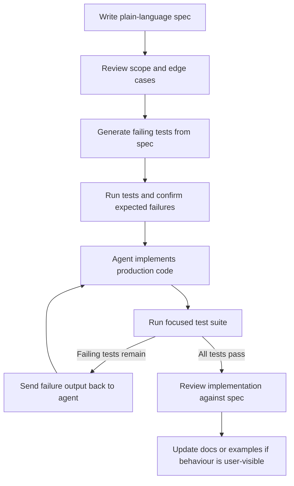
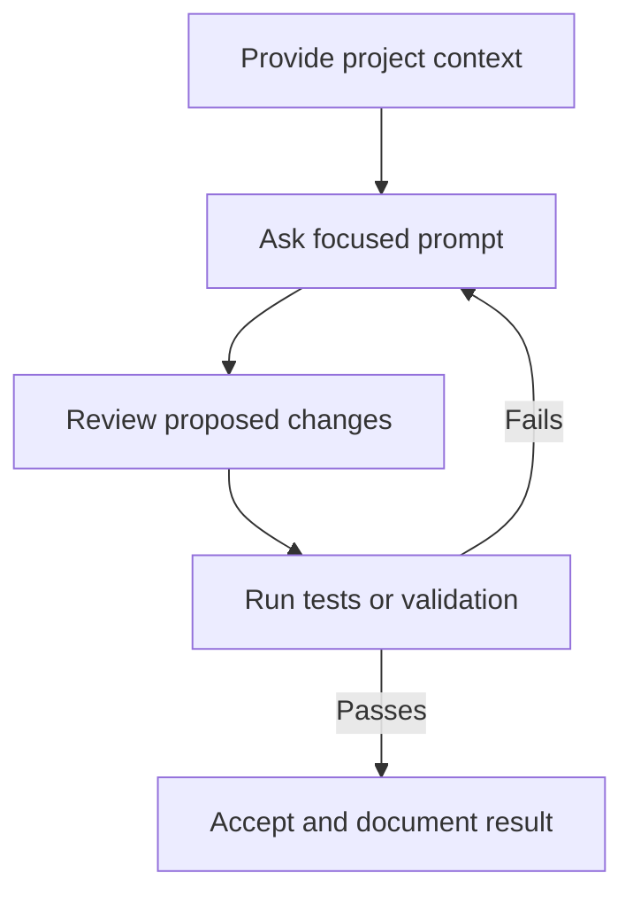

# Spec-Driven Agent Development for Stream Deck Plugins

When you hand an AI agent a vague instruction like "build me a timer action", the result is untestable by design — you get whatever the agent guessed you wanted. A spec-driven approach fixes this by separating three phases that must happen in strict order:

1. **Write the spec** — describe behaviour in plain language, no code.
2. **Write the tests** — translate the spec into failing test cases, still no implementation.
3. **Implement with the agent** — the agent writes code against the failing tests until every test is green.

The tests act as a contract. The agent cannot hallucinate a different interpretation of the spec because the tests already encode the correct one.

---

## Workflow Diagram

The loop is intentionally strict: prose requirements come first, tests encode those requirements second, and implementation is allowed only after the test suite has a clear failure signal.



---

## Why This Order Matters

| Phase | Who decides | Output |
|---|---|---|
| Spec | You | Precise behaviour in prose |
| Tests | You (with agent assistance) | Failing test suite encoding that behaviour |
| Implementation | Agent | Code that satisfies the test suite |

Skipping Phase 1 means your tests may be incomplete. Skipping Phase 2 means the agent has no verifiable target and will drift. Starting with implementation (the most common mistake) means you are testing the agent's assumptions, not yours.

---

## Phase 1: Writing the Spec

A spec describes **what** the action does, not **how**. It covers:

- The action's purpose and user-facing behaviour
- Settings the user can configure
- Every event the action handles and the expected response
- Edge cases and error states
- What the key title/image should show at each state

### Spec template

Create `specs/[action-name].spec.md` in your plugin repository.

```markdown
# Spec: [Action Name]

## Purpose

[One paragraph describing what the action does and why a user would want it.]

## Settings

| Setting | Type | Default | Description |
|---|---|---|---|
| [settingName] | string / number / boolean | [default] | [what it controls] |

## Behaviour

### On key press

- [Describe what happens when the key is pressed. Be precise.]
- [Describe any state change.]
- [Describe what the key title or image should show after the press.]

### On key press (when already in state X)

- [Describe edge case behaviour.]

### On settings change

- [Describe what happens when the user changes a setting in the Property Inspector.]
- [Describe any immediate visual update.]

### On plugin start

- [Describe the initial state when the plugin loads or Stream Deck starts.]

## Error Handling

- [What happens if a required setting is missing?]
- [What happens if an external call fails?]

## Out of Scope

- [Explicitly list things this action does NOT do. This prevents scope creep.]
```

### Stream Deck example spec

```markdown
# Spec: Focus Timer Action

## Purpose

A countdown timer action the user starts and stops with a single key press.
The key shows the remaining time while the timer runs and shows "Done" when
the timer reaches zero. The user can configure the duration in minutes.

## Settings

| Setting | Type | Default | Description |
|---|---|---|---|
| durationMinutes | number | 25 | Timer length in minutes (1–99) |
| showSeconds | boolean | true | When true, key title shows MM:SS; when false, shows minutes remaining |

## Behaviour

### On key press (timer is stopped)

- Start the countdown from durationMinutes.
- Update the key title every second.
- Title format when showSeconds is true: "MM:SS" (e.g., "24:59").
- Title format when showSeconds is false: minutes remaining as integer (e.g., "24").

### On key press (timer is running)

- Stop the timer.
- Reset the remaining time to the full durationMinutes value.
- Set the key title to the formatted full duration (not "00:00").

### When timer reaches zero

- Stop the timer.
- Set the key title to "Done".
- Do not automatically restart.

### On settings change

- If the timer is stopped, update the key title to reflect the new duration.
- If the timer is running, do not interrupt it; apply the new duration on the next start.

### On plugin start / Stream Deck restart

- Restore key title to the formatted full duration (timer starts stopped).
- Do not auto-start any timer.

## Error Handling

- If durationMinutes is less than 1 or greater than 99, clamp to the valid range.
- If durationMinutes is not a number, use the default value of 25.

## Out of Scope

- Multiple simultaneous timers per action instance (use separate keys).
- Audio or notification alerts when the timer ends.
- Pausing without resetting.
```

---

## Phase 2: Writing the Tests

Once the spec is locked, translate it into a Jest test file **before any implementation exists**. Every `it()` block maps to a behaviour bullet from the spec.

Run the tests immediately after writing them to confirm they all fail for the right reason (no implementation yet, not a test syntax error).

```bash
npx jest --testPathPattern=focus-timer --verbose
# Expected: all tests fail with "Cannot find module" or similar — that is correct.
```

### Test file structure

```typescript
// tests/actions/focus-timer.test.ts
import { FocusTimerAction, FocusTimerSettings } from "../../src/actions/focus-timer";

// --- Mock the Stream Deck SDK ---
const mockSetTitle = jest.fn();
const mockGetSettings = jest.fn();
const mockSetSettings = jest.fn();

const mockAction = {
    setTitle: mockSetTitle,
    getSettings: mockGetSettings,
    setSettings: mockSetSettings,
};

const mockEvent = (overrides: Partial<FocusTimerSettings> = {}) => ({
    action: mockAction,
    payload: {
        settings: {
            durationMinutes: 25,
            showSeconds: true,
            ...overrides,
        },
    },
});

// --- Tests ---

describe("FocusTimerAction", () => {
    let action: FocusTimerAction;

    beforeEach(() => {
        jest.clearAllMocks();
        jest.useFakeTimers();
        action = new FocusTimerAction();
    });

    afterEach(() => {
        jest.useRealTimers();
    });

    // SPEC: On plugin start — restore key title to full duration, timer stopped
    describe("initial state", () => {
        it("sets key title to full duration on settings received", async () => {
            await action.onDidReceiveSettings(mockEvent() as any);
            expect(mockSetTitle).toHaveBeenCalledWith("25:00");
        });

        it("uses minutes-only format when showSeconds is false", async () => {
            await action.onDidReceiveSettings(mockEvent({ showSeconds: false }) as any);
            expect(mockSetTitle).toHaveBeenCalledWith("25");
        });
    });

    // SPEC: On key press (timer is stopped) — start countdown
    describe("onKeyDown when timer is stopped", () => {
        it("starts the countdown", async () => {
            await action.onDidReceiveSettings(mockEvent() as any);
            await action.onKeyDown(mockEvent() as any);
            jest.advanceTimersByTime(1000);
            expect(mockSetTitle).toHaveBeenCalledWith("24:59");
        });

        it("updates title every second", async () => {
            await action.onDidReceiveSettings(mockEvent() as any);
            await action.onKeyDown(mockEvent() as any);
            jest.advanceTimersByTime(3000);
            expect(mockSetTitle).toHaveBeenLastCalledWith("24:57");
        });

        it("shows minutes-only when showSeconds is false", async () => {
            await action.onDidReceiveSettings(mockEvent({ showSeconds: false }) as any);
            await action.onKeyDown(mockEvent({ showSeconds: false }) as any);
            jest.advanceTimersByTime(59000);
            expect(mockSetTitle).toHaveBeenLastCalledWith("24");
        });
    });

    // SPEC: On key press (timer is running) — stop and reset
    describe("onKeyDown when timer is running", () => {
        it("stops the timer and resets title to full duration", async () => {
            await action.onDidReceiveSettings(mockEvent() as any);
            await action.onKeyDown(mockEvent() as any);    // start
            jest.advanceTimersByTime(5000);
            await action.onKeyDown(mockEvent() as any);    // stop
            expect(mockSetTitle).toHaveBeenLastCalledWith("25:00");
        });

        it("does not tick after being stopped", async () => {
            await action.onDidReceiveSettings(mockEvent() as any);
            await action.onKeyDown(mockEvent() as any);
            jest.advanceTimersByTime(2000);
            mockSetTitle.mockClear();
            await action.onKeyDown(mockEvent() as any);    // stop
            jest.advanceTimersByTime(5000);
            expect(mockSetTitle).toHaveBeenCalledTimes(1); // only the reset call
        });
    });

    // SPEC: When timer reaches zero — show "Done"
    describe("when timer reaches zero", () => {
        it("shows Done and does not auto-restart", async () => {
            await action.onDidReceiveSettings(mockEvent({ durationMinutes: 1 }) as any);
            await action.onKeyDown(mockEvent({ durationMinutes: 1 }) as any);
            jest.advanceTimersByTime(60000);
            expect(mockSetTitle).toHaveBeenLastCalledWith("Done");
            mockSetTitle.mockClear();
            jest.advanceTimersByTime(5000);
            expect(mockSetTitle).not.toHaveBeenCalled();
        });
    });

    // SPEC: Error handling — clamp invalid durationMinutes
    describe("settings validation", () => {
        it("clamps durationMinutes below 1 to 1", async () => {
            await action.onDidReceiveSettings(mockEvent({ durationMinutes: 0 }) as any);
            expect(mockSetTitle).toHaveBeenCalledWith("01:00");
        });

        it("clamps durationMinutes above 99 to 99", async () => {
            await action.onDidReceiveSettings(mockEvent({ durationMinutes: 150 }) as any);
            expect(mockSetTitle).toHaveBeenCalledWith("99:00");
        });

        it("uses default 25 minutes when durationMinutes is not a number", async () => {
            await action.onDidReceiveSettings(
                mockEvent({ durationMinutes: NaN }) as any
            );
            expect(mockSetTitle).toHaveBeenCalledWith("25:00");
        });
    });
});
```

---

## Phase 3: Agent Implementation

With the spec written and the failing tests in place, you hand both to the agent. The agent's only success criterion is a fully green test run.

### What to give the agent

1. The spec file (`specs/focus-timer.spec.md`)
2. The test file (`tests/actions/focus-timer.test.ts`)
3. The current test output (all failing)
4. A clear instruction that it must not modify the test file

### Prompt for Copilot agent mode

Switch the Chat panel to **Agent** mode, then send:

```
#file:specs/focus-timer.spec.md
#file:tests/actions/focus-timer.test.ts

Implement src/actions/focus-timer.ts so that all tests in the test file pass.

Constraints:
- SDK 2.1.0: extend SingletonAction from @elgato/streamdeck
- Node.js 24
- TypeScript strict mode
- Do not modify tests/actions/focus-timer.test.ts
- Run `npx jest --testPathPattern=focus-timer` after each attempt and continue
  iterating until the output shows 0 failures

Start by reading the spec to understand the intended behaviour, then read the
test file to understand the contract, then implement the action.
```

### Prompt for Claude Desktop (with MCP)

```
Read specs/focus-timer.spec.md and tests/actions/focus-timer.test.ts.

Implement src/actions/focus-timer.ts so that every test in the test file passes.

Rules:
1. Do not change the test file.
2. Use SDK 2.1.0 (SingletonAction from @elgato/streamdeck), Node.js 24, TypeScript strict.
3. After proposing the implementation, show me the test cases and explain
   why each one should now pass based on the code you wrote.
```

---

## Iterating to Green

The agent will propose an implementation. Run the tests yourself:

```bash
npx jest --testPathPattern=focus-timer --verbose
```

If tests are still failing, share the output with the agent:

```
#terminalLastCommand
3 tests are still failing. Read the output and fix the implementation.
Do not modify the test file.
```

Repeat until the output shows:

```
PASS  tests/actions/focus-timer.test.ts
  FocusTimerAction
    initial state
      ✓ sets key title to full duration on settings received
      ✓ uses minutes-only format when showSeconds is false
    ...

Test Suites: 1 passed, 1 total
Tests:       12 passed, 12 total
```

---

## Keeping the Spec and Tests in Sync

When requirements change, update the spec first, add or modify the failing tests second, then ask the agent to make the new tests pass. Never update implementation code directly in response to a requirement change — always drive through the spec and tests.

```
The spec for FocusTimerAction has a new requirement: pressing and holding
the key for more than 2 seconds should pause the timer without resetting it.

1. I have updated specs/focus-timer.spec.md with the new behaviour.
2. Add the failing test cases for this behaviour to the existing test file.
3. Then update the implementation to make all tests pass.
```

---

## Prompt File: `spec-to-tests.prompt.md`

Drop this file in `.github/prompts/` to automate Phase 2 for any spec you write.

```markdown
---
mode: ask
---

Read the attached spec file and generate a Jest test file for it.

#file:[PATH_TO_SPEC]

Requirements:
- One describe block per behaviour section in the spec
- One it() block per bullet point, named after the exact behaviour described
- Mock the Stream Deck SDK action handle (setTitle, getSettings, setSettings)
- Use jest.useFakeTimers() for any time-dependent behaviour
- Tests must import from the not-yet-existing implementation path so they fail
  immediately with a module-not-found error (this is expected and correct)
- Do not implement any production code — only the test file
- Add a comment above each describe block referencing the spec section it covers

Output the full test file content.
```

---

## Prompt File: `implement-from-tests.prompt.md`

Drop this file in `.github/prompts/` to automate Phase 3.

```markdown
---
mode: agent
---

#file:[PATH_TO_SPEC]
#file:[PATH_TO_TEST_FILE]

Implement the production code so that all tests in the test file pass.

Constraints:
- SDK 2.1.0: extend SingletonAction from @elgato/streamdeck
- Node.js 24, TypeScript strict mode
- Do not modify the test file
- Run the test suite after each edit: `npx jest --testPathPattern=[TEST_PATTERN]`
- Continue iterating until the test output shows 0 failures
- When all tests pass, report the final test output
```

---

## Related Articles

- [copilot-agents-and-prompts.md](copilot-agents-and-prompts.md) — all Copilot agents, slash commands, and prompt templates
- [copilot-vscode-getting-started.md](copilot-vscode-getting-started.md) — agent mode setup in VS Code
- [../development-workflow/testing-strategies.md](../development-workflow/testing-strategies.md) — Jest setup, SDK mocking patterns, and coverage configuration
- [../core-concepts/action-development.md](../core-concepts/action-development.md) — SingletonAction lifecycle and event handling

---

## Diagram

AI-agent workflows work best when project context and verification stay explicit.



---

## Agent Prompt

Use this prompt with GitHub Copilot in VS Code or Claude Desktop after attaching the relevant plugin files.

```text
#file:knowledge-base/ai-tools/agent-spec-driven-development.md
Use this article to improve my AI-assisted Stream Deck development workflow.

Explain the key points from "Spec-Driven Agent Development for Stream Deck Plugins" in practical terms. Then inspect my local plugin files for the same concept, identify any gaps or risky assumptions, and propose a spec-first, test-driven implementation plan before changing code.
```
