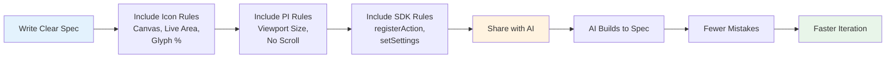

# Specifying a Stream Deck Plugin for Claude Code and GitHub Copilot

When you ask an AI assistant to build a Stream Deck plugin, the quality of your specification determines the quality of the result. Without clear constraints, both Claude Code and GitHub Copilot will make the same consistent mistakes: icons too small, property inspector oversized, settings not persisted, SDK called in the wrong order.

This guide covers how to write a plugin specification that keeps AI assistants on track from start to finish.

---

## The Problem: Why Specs Matter

Stream Deck plugins have hidden constraints that are not obvious from reading the official SDK docs:

- **Icon sizing**: A developer might think a 40×40 px glyph is "reasonable," not realizing it's too small to read on a physical button. AI tends to make this mistake every time without explicit constraints.
- **Property Inspector fit**: The PI has no scrollbar. All UI must fit in a fixed viewport. AI often builds forms that are 50 lines tall and discovers they don't fit after the fact.
- **Touch display behavior**: Stream Deck + has a touch area that requires different feedback handling. This is not obvious from the API docs alone.
- **Settings persistence**: AI might store user preferences in memory instead of calling `setSettings()`, then be surprised when settings disappear after a plugin restart.
- **State management**: Managing action instances across multiple buttons, or handling edge cases like rapid button presses, is not covered in beginner tutorials.

A good spec prevents these mistakes by naming them explicitly.

---

## What a Plugin Spec Should Include

### 1. Plugin Identity and Purpose

Start with the fundamentals. Be specific about what the plugin does and who uses it.

```markdown
## Plugin: Focus Timer

**UUID**: com.example.focustimer
**Description**: Pomodoro-style focus session timer with visual countdown on the key, settings for work/break duration, and desktop notifications.
**Target audience**: Remote workers, students, productivity enthusiasts
**Target devices**: Stream Deck original, Mini, XL (not Stream Deck +)
```

This prevents the AI from adding features that are out of scope (e.g., OAuth, advanced state management, localization) before the basic plugin works.

### 2. Actions

List every action in the plugin and what it does. Include:
- Action UUID
- What the button does when pressed
- What visual feedback it provides
- What settings the user can configure

```markdown
## Actions

### Start Timer
- **UUID**: com.example.focustimer.start
- **Function**: Begin a work session countdown
- **Visual feedback**: Display remaining minutes:seconds in a large, easy-to-read format on the key (e.g., "25:00")
- **Settings**:
  - Work duration (minutes): default 25
  - Break duration (minutes): default 5
- **State changes**:
  - At-rest: shows "START" text on a light background
  - Active: shows countdown in white text on a dark background
  - Completed: shows "BREAK" text, flashes once

### Stop Timer
- **UUID**: com.example.focustimer.stop
- **Function**: Pause the current session
- **Visual feedback**: Clears the countdown and resets the key to default appearance
- **Settings**: None
```

This prevents the AI from building actions that don't match your intent, or adding actions you didn't ask for.

### 3. Icon Specification

This is where most mistakes happen. Be explicit about canvas size, safe area, glyph sizing, and state variants.

```markdown
## Icon Specification

### Canvas and Safe Area
- Master canvas: **144×144 px** (hi-DPI)
- Live area: **120×120 px**, centered (12 px margin on all sides)
- Glyph fill: **60–70% of live area** (approximately 72–84 px)
  - **Do NOT make glyphs smaller than 60%** — they will be unreadable on the physical button
  - **Do NOT make glyphs larger than 70%** — they will look cramped

### Visual Style
- Format: SVG (preferred) or 144×144 px PNG
- Background: solid color, no gradients or shadows
- Glyph: bold, filled silhouette; minimum stroke width 8–10 px
- Colors: maximum 2 active colors (background + glyph, with 1 optional accent)
- Contrast ratio: minimum 4.5:1 (WCAG AA)

### State Variants

| Action | At-Rest | Active | Completed |
|---|---|---|---|
| Start Timer | "START" text, 40×40 px, light background (#f5f5f5) | "25:00" countdown, centered, large digits, dark background (#1a1a1a) | Flashing "BREAK" text, same size as active |
| Stop Timer | "STOP" text, 40×40 px, light background | Greyed-out version of Start Timer state | Not applicable |

**State difference rule**: State variants must differ by **shape or position**, never by color alone. For example: "At-rest is outlined, active is filled" or "At-rest is centered, active is offset to one side."

### Design Example
The Start Timer icon:
- At-rest: uppercase "START" (or a play symbol), white text on #1a1a1a background
- Active: large white digits (e.g., "25:00"), centered, on dark background, bold monospace font for alignment
- Both states are distinct in grayscale and readable at 72×72 px display size
```

Including specific color values, sizing percentages, and state rules prevents the AI from guessing.

### 4. Property Inspector Constraints

The Property Inspector must fit without scrollbars. Be explicit about layout and sizing.

```markdown
## Property Inspector

### Viewport
- Viewport height: 480 px (fixed, no scroll)
- Viewport width: 280 px (typical Stream Deck window)
- **All UI must fit within this space without scrollbars**

### Settings Form Layout
- Title: "Focus Timer Settings" (top)
- Settings fields:
  - Work duration (minutes): number input, range 1–120, default 25
  - Break duration (minutes): number input, range 1–10, default 5
  - Notification sound: dropdown, options [None, Ping, Chime, Alert], default Ping
  - Enable desktop notifications: checkbox, default true
- Action buttons: [Reset to defaults] [Save], bottom-right

### Design Rule
Test the PI at 480 px height on a real Stream Deck (or Stream Deck app) **before considering it done**. If any content is cut off or requires scrolling, redesign.

### Prohibited
- No scrollable lists or overflow areas
- No tabs or multi-page layouts (PI is too small)
- No custom fonts or unusual styling (test on macOS and Windows)
```

This prevents the AI from building a 600 px tall form and then being surprised it doesn't fit.

### 5. SDK Constraints

State the non-negotiable SDK rules clearly.

```markdown
## SDK Constraints (Non-Negotiable)

1. **SDK version**: @elgato/streamdeck >= 2.1.0
2. **Language**: TypeScript (never plain JavaScript)
3. **Plugin lifecycle**:
   - `registerAction()` must be called BEFORE `connect()`
   - Reversing this order causes actions to fail silently
4. **Settings persistence**:
   - Use `action.setSettings()` to save user preferences
   - Never store settings in local variables or memory
   - Settings must survive a plugin restart
5. **Error handling**:
   - Wrap all external API calls in try/catch blocks
   - Log errors to console
   - Never let exceptions bubble uncaught
6. **Dependencies**: No npm packages beyond TypeScript, esbuild, and @elgato/streamdeck
   - Avoid large dependencies (keeps bundle size small)
   - Avoid packages with native bindings (macOS/Windows incompatibility risk)
```

Including these prevents the AI from using the SDK in ways that work initially but fail later.

### 6. Development Constraints

Include commands, file structure, and deployment rules.

```markdown
## Development Constraints

### File Structure
```
com.example.focustimer.sdPlugin/
├── manifest.json
├── src/
│   ├── actions/
│   │   └── startTimer.ts
│   │   └── stopTimer.ts
│   ├── propertyInspector/
│   │   ├── pi.html
│   │   └── pi.js
│   └── index.ts (entry point)
├── icons/
│   └── (generated or provided)
└── dist/ (compiled output)
```

### Build and Deploy Commands
- `npm run build` – compile and bundle
- `streamdeck link com.example.focustimer.sdPlugin` – install for development
- `streamdeck restart com.example.focustimer` – reload after code changes
- `streamdeck validate com.example.focustimer.sdPlugin` – check for manifest and icon errors
- `npm test` – run unit tests (if applicable)

### What Not to Do
- Do not add actions without updating manifest.json
- Do not store settings in local variables
- Do not call `setFeedback()` before `setFeedbackLayout()` (if targeting Stream Deck +)
- Do not design icons smaller than 60% of the safe area
- Do not build a PI form taller than 480 px
- Do not use plain JavaScript; use TypeScript throughout
```

### 7. Testing and Validation

Include what success looks like.

```markdown
## Testing and Validation

### Before First Build
- [ ] All action UUIDs are unique and match the manifest
- [ ] All icons are 144×144 px or larger
- [ ] All icon state variants are designed and saved

### Before First Plugin Restart
- [ ] Plugin compiles without errors (`npm run build` passes)
- [ ] No TypeScript errors in the editor

### Before First User Test
- [ ] All actions appear in Stream Deck after plugin installation
- [ ] All buttons are pressable and respond
- [ ] Property Inspector opens and shows all settings
- [ ] Settings form fits without scrollbars
- [ ] Icons display at legible size on the physical buttons

### Before Marketplace Submission
- [ ] `streamdeck validate` passes cleanly
- [ ] All settings persist after plugin restart
- [ ] No unhandled errors in developer tools console
- [ ] All state variants (muted, active, etc.) work as specified
- [ ] Tested on all target devices (original, Mini, XL, etc.)
```

---

## Writing a Good Spec: Examples

### Example 1: Weak Spec (Too Vague)

```markdown
## Plugin Spec: Timer

This is a timer plugin. It counts down from a specified time and shows the remaining time on the Stream Deck button. Users can set the duration and it should send a notification when done.
```

**Problems:**
- No UUID or target devices specified
- No icon specification (AI will make icons too small)
- No property inspector layout (AI will build a form that doesn't fit)
- "Notification" is vague (desktop? audio? visual?)
- No mention of how to persist settings

### Example 2: Strong Spec (Clear and Explicit)

```markdown
## Plugin Spec: Focus Timer

**UUID**: com.example.focustimer
**Target devices**: Stream Deck original, Mini, XL
**Purpose**: Pomodoro timer for focus sessions with visual countdown and notifications

### Actions
- **Start Timer** (com.example.focustimer.start): Begins a countdown; displays remaining time as MM:SS on the key
- **Stop Timer** (com.example.focustimer.stop): Pauses the current session; resets the key

### Icon Specification
- Canvas: 144×144 px
- Live area: 120×120 px (12 px margin)
- Glyph fill: 60–70% of live area
- States:
  - At-rest: "START" text, 40×40 px, dark background
  - Active: large countdown digits (e.g., "25:00"), centered, white on dark, monospace font
  - Difference: text content and size, not color

### Property Inspector
- Viewport: 480 px × 280 px, no scrollbars
- Settings:
  - Work duration: number input, 1–120 minutes, default 25
  - Break duration: number input, 1–10 minutes, default 5
  - Notification: dropdown [None, Ping, Chime, Alert], default Ping
- Test: all fields must fit on a real Stream Deck window without scroll

### SDK Constraints
- @elgato/streamdeck >= 2.1.0
- TypeScript required
- registerAction() before connect()
- Use setSettings() for persistence
- Wrap all API calls in try/catch

### Testing Checklist
- [ ] Plugin installs without errors
- [ ] All actions are visible on buttons
- [ ] PI settings fit without scroll
- [ ] Settings persist after plugin restart
- [ ] Icons are legible at 72×72 px display size
- [ ] All state variants work as specified
```

**Improvements:**
- Explicit UUIDs and device targets
- Detailed icon rules with sizing percentages
- Specific PI viewport dimensions
- SDK constraints stated as non-negotiable
- Clear testing checklist

---

## Prompts for Claude Code and GitHub Copilot

Once you have a spec, share it with the AI assistant and reference it often.

### Claude Code

```text
I'm building a Stream Deck plugin. Here's my full specification:

[paste your spec here]

Please read this spec carefully and ask clarifying questions about any constraint before you start coding. Then build the plugin in phases:

1. **Phase 1**: Scaffold the project structure, manifest.json, and action registration
2. **Phase 2**: Build the icon SVGs according to the spec (canvas 144×144 px, glyph 60–70% of live area)
3. **Phase 3**: Implement the Property Inspector form (must fit in 480×280 px without scroll)
4. **Phase 4**: Implement action logic with settings persistence (use setSettings(), not local variables)
5. **Phase 5**: Validate with `streamdeck validate` and test on a real Stream Deck

Before each phase, explain what you're building and why it matches the spec.
```

### GitHub Copilot

Use your spec as the foundation for a `.github/copilot-instructions.md` file:

```markdown
# Stream Deck Plugin: Focus Timer

## Specification Summary
[Copy your spec here]

## Key Constraints for Copilot
- Icons: 144×144 px canvas, 120×120 px live area, 60–70% glyph fill
- Property Inspector: must fit in 480×280 px without scrollbars
- SDK: registerAction() BEFORE connect(), use setSettings() for persistence
- No exceptions; all external calls wrapped in try/catch

## Reference Files
- Icon spec: knowledge-base/ui-components/icon-design-specification.md
- SDK reference: docs.elgato.com/streamdeck/sdk
```

Then use the `/doc` slash command in Copilot Chat:

```
/doc .github/copilot-instructions.md

I'm building the Start Timer action. It should display a countdown MM:SS format on the key. Refer to the specification and explain how you'll handle settings persistence.
```

---

## Common Spec Mistakes to Avoid

| Mistake | Why It Breaks | Fix |
|---|---|---|
| "Icon should be small so it doesn't overwhelm the key" | AI interprets "small" as 20–30 px; unreadable at 72 px display size | Specify: "60–70% of 120 px live area = 72–84 px effective" |
| "Add a settings page" (no viewport size specified) | AI builds a form with 10 inputs, doesn't fit in 480 px | Specify: "PI viewport is 480×280 px fixed; all content must fit without scroll" |
| "Store the user's preference" (no mention of setSettings) | AI uses a global variable; settings disappear on plugin restart | Specify: "Use action.setSettings() to persist user preferences" |
| "Make it work on Stream Deck and Stream Deck +" | AI builds for both but doesn't test touch feedback or dial feedback | Specify: "Target devices: original, Mini, XL only" or "For + only, test touch feedback with setFeedbackLayout()" |
| "The plugin should be fast" | AI assumes memory and CPU are unlimited | Specify: "Keep bundle size < 500 KB; avoid large npm dependencies" |

---

## Spec Template

Use this template for your next Stream Deck plugin spec:

```markdown
# Plugin Spec: [Plugin Name]

## Identity
- **UUID**: com.yourcompany.pluginname
- **Purpose**: [one-sentence description]
- **Target devices**: [Stream Deck model(s)]
- **Target SDK**: @elgato/streamdeck >= 2.1.0

## Actions
- **[Action Name]** ([UUID]): [What it does] → [Visual feedback] → [Settings if any]

## Icons
- Canvas: 144×144 px
- Live area: 120×120 px (12 px margin)
- Glyph fill: 60–70% of live area (~72–84 px)
- Format: SVG with flat fills, no effects
- States: [list each state and how it differs]

## Property Inspector
- Viewport: 480×280 px, no scroll
- Settings: [list each input and its constraints]

## SDK Constraints
- registerAction() before connect()
- Use setSettings() for persistence
- Wrap external calls in try/catch
- No unhandled exceptions

## Validation Checklist
- [ ] Plugin installs without errors
- [ ] All actions visible and responsive
- [ ] PI fits without scrollbars
- [ ] Icons legible at 72×72 px
- [ ] Settings persist after restart
- [ ] `streamdeck validate` passes
```

---

## Code Example

A minimal but complete spec for a "Mute Microphone" plugin:

```markdown
# Plugin Spec: Mute Mic

**UUID**: com.example.muteic
**Purpose**: Toggle system microphone mute with visual feedback
**Target**: Stream Deck original, Mini, XL

## Actions
- **Mute/Unmute**: Toggles mic state; displays icon state on the key

## Icons
Canvas: 144×144 px, live area: 120×120 px, glyph 60–70% fill
- At-rest: Mic icon, filled white, centered
- Muted: Mic icon with diagonal red slash through it

**Rule**: Both states must be distinct in grayscale (muted = slash shape, not just color)

## Property Inspector
- Viewport: 480×280 px
- Settings: Notification sound (dropdown) [None/Ping/Alert]

## SDK
- registerAction() before connect()
- Use setSettings() to save notification preference
- Wrap system API calls in try/catch

## Test
- [ ] Icon displays at 72×72 px without blur
- [ ] Muted and active states visually distinct
- [ ] Settings persist after restart
```

---

## Diagram



---

## Agent Prompt

When starting a new Stream Deck plugin project with Claude Code or GitHub Copilot:

```text
I'm building a Stream Deck plugin and want to get the specification right before we start coding.

Here's what I'm building:
[describe your plugin idea in 2-3 sentences]

Help me write a complete specification by asking me questions about:
1. Target devices (original, Mini, XL, +, Neo, or combination?)
2. Number of actions and what each one does
3. What settings users should be able to configure
4. Visual feedback: what should display on the button?
5. Property Inspector: what form controls do we need?

Then I'll share the completed spec, and you'll follow it precisely as you build the plugin.
```

This ensures the AI understands constraints before writing code.
