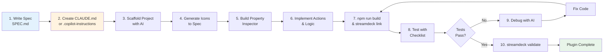

# Tutorial: Building a Stream Deck Plugin with AI (Claude Code and GitHub Copilot)

This tutorial walks you through building a complete Stream Deck plugin using Claude Code or GitHub Copilot alongside this knowledge base. You'll start with a clear specification, reference the KB at every step, and end with a working plugin ready for testing.

We'll build a **Focus Timer** plugin as an example: a Pomodoro-style timer that displays a countdown on the Stream Deck button and sends a notification when done.

---

## Prerequisites

- **Stream Deck software** (7.1+) installed on macOS or Windows
- **Node.js 24+** (or Node 20 for SDK v2 projects)
- **Stream Deck CLI** (`streamdeck` command available)
- **Claude Code** (via Claude Desktop or a browser) OR **GitHub Copilot in VS Code**
- **This knowledge base** (cloned or available locally)

Before starting, verify your setup:

```bash
node --version        # >= 18.0.0
npm --version         # >= 9.0.0
streamdeck --version  # CLI available
```

---

## Step 1: Write a Clear Plugin Specification

The entire build process depends on a clear spec. You'll refer to this spec in every conversation with Claude or Copilot.

Use the specification guide: [plugin-specification-for-ai.md](plugin-specification-for-ai.md)

### Focus Timer Specification (Our Example)

```markdown
# Plugin Spec: Focus Timer

## Identity
- **UUID**: com.example.focustimer
- **Purpose**: Pomodoro-style focus session timer with countdown display and notifications
- **Target devices**: Stream Deck original, Mini, XL
- **Target SDK**: @elgato/streamdeck >= 2.1.0

## Actions

### Start Focus Session
- **UUID**: com.example.focustimer.start
- **Function**: Begins a work session countdown
- **Visual feedback**: Display remaining time as MM:SS on the key (e.g., "25:00")
- **Settings**:
  - Work duration (minutes): 1–120, default 25
  - Break duration (minutes): 1–10, default 5
  - Notification sound: [None, Ping, Chime, Alert], default Ping
- **State variants**:
  - At-rest: "START" text, light background
  - Active: Large countdown digits (MM:SS), dark background, white text
  - Completed: "BREAK" text, flashing

### Stop Focus Session
- **UUID**: com.example.focustimer.stop
- **Function**: Pause the current session
- **Visual feedback**: Resets the key to default appearance

## Icon Specification
- Canvas: 144×144 px
- Live area: 120×120 px (12 px margin)
- Glyph fill: 60–70% of live area (~72–84 px)
- Format: SVG with flat fills only
- Colors: dark background (#1a1a1a), white text/glyph (#ffffff)

**Start Timer states:**
- At-rest: "START" text (monospace), centered, 40×40 px
- Active: Large digits (MM:SS), centered, 72×48 px, monospace font
- Completed: "BREAK" text, same size as "START", with subtle pulsing animation

**Stop Timer states:**
- At-rest: "STOP" text, centered, 40×40 px
- Active: Greyed-out version of Start Timer active state
- (No completed state)

## Property Inspector
- Viewport: 480×280 px, **no scrollbars**
- Settings:
  - Work duration: number input, 1–120 minutes, default 25
  - Break duration: number input, 1–10 minutes, default 5
  - Notification sound: dropdown, default "Ping"
  - Enable notifications: checkbox, default true

**Design rule**: All fields must fit in viewport without scroll. Test on real Stream Deck window.

## SDK Constraints (Non-Negotiable)
- @elgato/streamdeck >= 2.1.0
- TypeScript required (never plain JavaScript)
- Call `registerAction()` BEFORE `connect()`
- Use `action.setSettings()` for persistence
- Wrap all external calls in try/catch

## Development Commands
- Build: `npm run build`
- Link: `streamdeck link com.example.focustimer.sdPlugin`
- Restart: `streamdeck restart com.example.focustimer`
- Validate: `streamdeck validate com.example.focustimer.sdPlugin`

## Validation Checklist
- [ ] Plugin installs without errors
- [ ] All actions visible on buttons
- [ ] PI settings fit without scroll
- [ ] Icons legible at 72×72 px
- [ ] Settings persist after plugin restart
- [ ] All state variants work as specified
```

**Save this spec** as `SPEC.md` in your project root. You'll reference it constantly.

---

## Step 2: Create CLAUDE.md or Update .github/copilot-instructions.md

This file ensures the AI stays aligned with your constraints across all conversation turns.

### For Claude Code Users

Create `CLAUDE.md` in your project root. Template: [code-templates/claude-md-template.md](../code-templates/claude-md-template.md)

**Minimal CLAUDE.md for Focus Timer:**

```markdown
# Claude Code Instructions — Focus Timer Plugin

## Context
- **Plugin**: Focus Timer (com.example.focustimer)
- **SDK**: @elgato/streamdeck >= 2.1.0, TypeScript
- **Target**: Stream Deck original, Mini, XL
- **Build**: npm run build

## Critical SDK Rules
1. registerAction() BEFORE connect()
2. Use setSettings() for persistence (never local variables)
3. Wrap all external calls in try/catch

## Icon Rules
- Canvas: 144×144 px, live area: 120×120 px (12 px margin)
- Glyph fill: 60–70% of live area (~72–84 px)
- SVG format, flat fills only
- States differ by shape/text, never color alone

## Property Inspector
- Viewport: 480×280 px, NO scrollbars
- Fields: work duration, break duration, notification sound, enable notifications

## Manifest
- UUID matches .sdPlugin folder name exactly
- Version format: X.X.X.X (four parts)

## Commands
- npm run build
- streamdeck link com.example.focustimer.sdPlugin
- streamdeck restart com.example.focustimer
- streamdeck validate com.example.focustimer.sdPlugin

## Don't
- Never store settings in variables
- Never make icons smaller than 60% of live area
- Never build a PI form taller than 480 px
- Never call setFeedback() before setFeedbackLayout()
```

### For GitHub Copilot Users

Update or create `.github/copilot-instructions.md`:

```markdown
# Stream Deck Plugin: Focus Timer

## Specification
[Include your full spec here]

## Key Constraints for Copilot
- Icons: 144×144 px canvas, 120×120 px live area, 60–70% glyph fill
- Property Inspector: 480×280 px viewport, no scrollbars
- SDK: registerAction() BEFORE connect(); use setSettings() for persistence
- No exceptions: wrap all external calls in try/catch

## Reference
- Icon spec: knowledge-base/ui-components/icon-design-specification.md
- SDK docs: docs.elgato.com/streamdeck/sdk
- QB: knowledge-base/QUICK_REFERENCE.md
```

---

## Step 3: Scaffold the Project with AI

Now you're ready to ask Claude or Copilot to scaffold the project structure.

### Claude Code Prompt

```text
I'm building a Stream Deck plugin called Focus Timer. Read my CLAUDE.md file carefully, then create the project scaffold.

Here's my spec:
[paste your full spec]

Before you start, confirm you understand:
1. The plugin UUID matches the .sdPlugin folder name
2. Icon canvas is 144×144 px with 120×120 px live area
3. Property Inspector must fit in 480×280 px without scrollbars
4. registerAction() is called before connect()
5. All settings use setSettings(), not local variables

Then create:
1. Folder structure (.sdPlugin with manifest.json, src/, icons/)
2. manifest.json with correct UUID, version X.X.X.X, and both actions
3. TypeScript configuration (tsconfig.json)
4. package.json with esbuild build script
5. src/index.ts with action registration and connect()

Don't generate icon SVGs yet; we'll do that in Step 4.
```

### GitHub Copilot Prompt

Use the `/new` slash command:

```
/new project structure for a Stream Deck plugin

Create:
1. Folder structure: .sdPlugin folder with manifest.json, src/, dist/, icons/
2. manifest.json for Focus Timer (UUID: com.example.focustimer, version 0.0.1.0)
3. package.json with @elgato/streamdeck and esbuild
4. tsconfig.json for TypeScript compilation
5. src/index.ts with registerAction() before connect()

Reference: .github/copilot-instructions.md and knowledge-base/reference/manifest-schema.md
```

### Expected Output

You should get:

```
com.example.focustimer.sdPlugin/
├── manifest.json
├── package.json
├── tsconfig.json
├── src/
│   ├── index.ts
│   ├── actions/
│   │   ├── StartTimer.ts
│   │   └── StopTimer.ts
│   └── propertyInspector/
│       ├── pi.html
│       └── pi.js
├── icons/
│   ├── actions/
│   │   ├── start-timer.svg
│   │   └── stop-timer.svg
│   └── plugin/
│       └── plugin.svg
└── dist/ (compiled output)
```

---

## Step 4: Design and Generate Icons

Icons are the most common mistake point. Use the specification and reference the icon guide.

### Claude Code Prompt for Icons

```text
I need you to generate SVG icons for my Focus Timer plugin. Read the icon design specification carefully:
knowledge-base/ui-components/icon-design-specification.md

My icon spec:
- Canvas: 144×144 px
- Live area: 120×120 px (12 px margin)
- Glyph fill: 60–70% of live area (~72–84 px)
- Format: SVG with flat fills, no gradients or shadows

Start Timer Icon:
- At-rest state: "START" text, monospace font, ~40×40 px, white on dark background
- Active state: Large digits (MM:SS), monospace, ~72×48 px, centered, white on dark
- Both states must be distinct in grayscale

Stop Timer Icon:
- At-rest state: "STOP" text, ~40×40 px, white on dark
- Active state: Greyed-out version (opacity 0.5) of Start Timer active state

Use the SVG base template from the spec. Generate each state as a separate SVG file.
```

### GitHub Copilot Prompt

```
/doc knowledge-base/ui-components/icon-design-specification.md

Generate SVG icons for Focus Timer:
1. Start Timer (4 files: at-rest, active, completed, inactive)
2. Stop Timer (2 files: at-rest, active)

Canvas: 144×144 px, live area: 120×120 px, glyph: 60–70% fill
Format: SVG with flat fills, no effects
```

### Expected Icons

**startTimer-at-rest.svg**:
```svg
<svg xmlns="http://www.w3.org/2000/svg" viewBox="0 0 144 144" width="144" height="144">
  <rect width="144" height="144" rx="16" fill="#1a1a1a"/>
  <text x="72" y="80" font-family="monospace" font-size="28" font-weight="bold" 
        text-anchor="middle" fill="#ffffff">START</text>
</svg>
```

**startTimer-active.svg**:
```svg
<svg xmlns="http://www.w3.org/2000/svg" viewBox="0 0 144 144" width="144" height="144">
  <rect width="144" height="144" rx="16" fill="#1a1a1a"/>
  <text x="72" y="85" font-family="monospace" font-size="48" font-weight="bold" 
        text-anchor="middle" fill="#ffffff">25:00</text>
</svg>
```

---

## Step 5: Implement the Property Inspector

The PI is a critical constraint: it must fit in 480×280 px without scrollbars.

### Claude Code Prompt

```text
I need to build the Property Inspector for Focus Timer. The viewport is fixed at 480×280 px and cannot scroll.

Here's my spec:
[paste PI section of your spec]

Reference: knowledge-base/ui-components/property-inspector-basics.md

Build:
1. src/propertyInspector/pi.html with SDPI components
2. src/propertyInspector/pi.js with message handling
3. Message structure: send settings to the plugin, receive settings from the plugin

Settings:
- Work duration (number input, 1–120, default 25)
- Break duration (number input, 1–10, default 5)
- Notification sound (dropdown: None, Ping, Chime, Alert)
- Enable notifications (checkbox)

Important: All fields must fit in 480×280 px without scroll. Use a vertical layout and test visually.
```

### Expected Output

**pi.html** (simplified):
```html
<!DOCTYPE html>
<html>
<head>
    <meta charset="utf-8" />
    <link rel="stylesheet" href="https://cdn.jsdelivr.net/npm/sdpi-components@latest/dist/sdpi.css">
</head>
<body style="overflow: hidden;">
    <sdpi-wrapper>
        <sdpi-item>
            <label>Work Duration (min)</label>
            <input type="number" id="workDuration" min="1" max="120" value="25">
        </sdpi-item>
        <sdpi-item>
            <label>Break Duration (min)</label>
            <input type="number" id="breakDuration" min="1" max="10" value="5">
        </sdpi-item>
        <sdpi-item>
            <label>Notification Sound</label>
            <select id="notificationSound">
                <option value="none">None</option>
                <option value="ping" selected>Ping</option>
                <option value="chime">Chime</option>
                <option value="alert">Alert</option>
            </select>
        </sdpi-item>
        <sdpi-item>
            <label>Enable Notifications</label>
            <input type="checkbox" id="enableNotifications" checked>
        </sdpi-item>
    </sdpi-wrapper>
    <script src="pi.js"></script>
</body>
</html>
```

**pi.js** (simplified):
```javascript
const form = {
    workDuration: 25,
    breakDuration: 5,
    notificationSound: "ping",
    enableNotifications: true
};

document.getElementById('workDuration').addEventListener('change', (e) => {
    form.workDuration = parseInt(e.target.value);
    updateSettings();
});

function updateSettings() {
    // Send settings to plugin via websocket
}
```

**Reference**: [ui-components/property-inspector-basics.md](../ui-components/property-inspector-basics.md)

---

## Step 6: Implement Action Logic

Now implement the action classes that handle timer logic.

### Claude Code Prompt

```text
I need to implement the Focus Timer action logic. Read these KB articles carefully:
- knowledge-base/core-concepts/action-development.md
- knowledge-base/core-concepts/settings-persistence.md

Build:
1. src/actions/StartTimer.ts — handle button press, start countdown, update PI, persist settings
2. src/actions/StopTimer.ts — handle button press, pause timer, reset key

Important constraints:
- Use @elgato/streamdeck SDK (not WebSocket directly)
- Call registerAction() in src/index.ts BEFORE connect()
- Use action.setSettings() for persistence
- Wrap all external calls in try/catch
- Update button image with countdown every second (e.g., "25:00", "24:59", etc.)

The timer should:
1. Read work and break duration from settings
2. Count down by 1 second every tick
3. Update the key image with new countdown
4. Send a notification when complete (using system APIs or stream-deck feedback)
5. Switch to break countdown or return to at-rest
6. Save completion time to settings for debugging
```

### Expected Output

**src/actions/StartTimer.ts** (simplified):
```typescript
import { action, SingletonAction } from "@elgato/streamdeck";

@action({ UUID: "com.example.focustimer.start" })
export class StartTimer extends SingletonAction {
    private countdownInterval: NodeJS.Timeout | null = null;
    private remaining: number = 0;

    override onKeyDown(): void {
        this.startCountdown();
    }

    private startCountdown(): void {
        const settings = this.settings as any;
        this.remaining = (settings.workDuration || 25) * 60;

        this.countdownInterval = setInterval(() => {
            this.remaining--;
            this.updateDisplay();

            if (this.remaining <= 0) {
                this.onTimerComplete();
            }
        }, 1000);
    }

    private updateDisplay(): void {
        const minutes = Math.floor(this.remaining / 60);
        const seconds = this.remaining % 60;
        const display = `${minutes.toString().padStart(2, '0')}:${seconds.toString().padStart(2, '0')}`;
        // Update button image with display text
    }

    private onTimerComplete(): void {
        if (this.countdownInterval) {
            clearInterval(this.countdownInterval);
        }
        // Send notification and switch to break countdown
    }

    override onSendToPlugin(payload: any): void {
        this.setSettings(payload);
    }
}
```

**Reference**: [core-concepts/action-development.md](../core-concepts/action-development.md), [core-concepts/settings-persistence.md](../core-concepts/settings-persistence.md)

---

## Step 7: Build and Test the Plugin

Now build the plugin and test it locally.

### Build the Plugin

```bash
cd com.example.focustimer.sdPlugin
npm install
npm run build
```

### Link for Development

```bash
streamdeck link com.example.focustimer.sdPlugin
```

This installs the plugin in Stream Deck for testing.

### Restart the Plugin

After code changes:

```bash
streamdeck restart com.example.focustimer
```

### Test Checklist

Use this checklist from the spec:

- [ ] Plugin compiles without errors (`npm run build` passes)
- [ ] Plugin appears in Stream Deck after install
- [ ] Both actions (Start, Stop) are visible on buttons
- [ ] Icons display at legible size on physical buttons
- [ ] Pressing Start Timer begins countdown
- [ ] Countdown updates every second on the button
- [ ] Pressing Stop Timer pauses the countdown
- [ ] Property Inspector opens and shows all settings
- [ ] All settings fields fit without scrollbars
- [ ] Changing a setting in PI updates plugin behavior
- [ ] Settings persist after plugin restart
- [ ] Timer completes and shows notification
- [ ] No errors in Stream Deck developer tools console

---

## Step 8: Iterate and Debug

If tests fail, use Claude or Copilot to diagnose and fix.

### Claude Code Prompt for Debugging

```text
I'm testing my Focus Timer plugin and encountered an issue:

[Describe the problem: e.g., "The countdown doesn't update on the button" or "Settings don't persist after restart"]

Here's what I've verified:
[List what you've checked]

Read these KB articles and help me diagnose:
- knowledge-base/development-workflow/debugging-guide.md
- knowledge-base/troubleshooting/common-issues.md

Possible causes:
[List hypotheses]

My code:
[Paste the relevant section]

What's the most likely root cause, and how do I fix it?
```

### Common Issues and Fixes

| Issue | Likely Cause | Fix |
|---|---|---|
| Actions don't appear on buttons | registerAction() called after connect() | Reorder: registerAction() BEFORE connect() |
| Settings don't survive plugin restart | Using local variables instead of setSettings() | Use action.setSettings(payload) and read from this.settings |
| Countdown doesn't update on button | setImage() or setState() not called in interval | Call this.setImage() with new countdown text every tick |
| PI doesn't fit without scroll | Form too tall | Reduce padding, use smaller inputs, or remove optional fields |
| Icons look too small on button | Glyph too small relative to live area | Increase glyph size to 60–70% of 120 px live area |

**Reference**: [troubleshooting/common-issues.md](../troubleshooting/common-issues.md)

---

## Step 9: Validate and Polish

Before considering the plugin complete:

```bash
streamdeck validate com.example.focustimer.sdPlugin
```

This checks:
- Plugin UUID matches .sdPlugin folder name
- All icon files are present and correct size
- manifest.json is valid
- No missing required fields

Fix any errors reported.

---

## Code Example: Complete Focus Timer Implementation

Here's a minimal but complete implementation of the Focus Timer:

**src/index.ts:**
```typescript
import { SingletonAction, action, connect, registerAction } from "@elgato/streamdeck";

@action({ UUID: "com.example.focustimer.start" })
class StartTimer extends SingletonAction {
    private interval: NodeJS.Timeout | null = null;
    private remaining = 0;

    onKeyDown(): void {
        const settings = this.settings as any;
        this.remaining = (settings.workDuration || 25) * 60;
        this.startCountdown();
    }

    private startCountdown(): void {
        this.interval = setInterval(() => {
            this.remaining--;
            const m = Math.floor(this.remaining / 60).toString().padStart(2, '0');
            const s = (this.remaining % 60).toString().padStart(2, '0');
            // Update button with ${m}:${s}
            if (this.remaining <= 0) clearInterval(this.interval!);
        }, 1000);
    }
}

registerAction(StartTimer);
connect();
```

---

## Diagram



---

## Agent Prompt

When starting a new Stream Deck plugin project with Claude Code or GitHub Copilot:

```text
I'm building a Stream Deck plugin and want to use this knowledge base and a clear specification to stay on track.

Step 1: Help me write a complete plugin specification covering:
- Plugin name, UUID, purpose
- All actions (what each button does)
- Icon design (canvas size, glyph sizing, state variants)
- Property Inspector layout (must fit 480×280 px without scroll)
- SDK constraints (registerAction before connect, setSettings for persistence, error handling)
- Development workflow (build, link, restart, validate commands)

Step 2: Once I provide the spec, I'll create a CLAUDE.md (or .copilot-instructions.md) file to keep you aligned across all future conversations.

Step 3: Then we'll scaffold the project, generate icons, build the UI, implement logic, test, and iterate until the plugin works.

Are you ready to start?
```

Then follow the 9-step process in this tutorial, referencing the KB at each stage.

---

## Quick Reference: Key KB Articles

Use these articles throughout the build process:

| Stage | Article |
|---|---|
| Specification | [plugin-specification-for-ai.md](plugin-specification-for-ai.md) |
| Icons | [ui-components/icon-design-specification.md](../ui-components/icon-design-specification.md) |
| Project Setup | [development-workflow/environment-setup.md](../development-workflow/environment-setup.md) |
| Manifest | [reference/manifest-schema.md](../reference/manifest-schema.md) |
| SDK Basics | [core-concepts/action-development.md](../core-concepts/action-development.md) |
| Settings | [core-concepts/settings-persistence.md](../core-concepts/settings-persistence.md) |
| Property Inspector | [ui-components/property-inspector-basics.md](../ui-components/property-inspector-basics.md) |
| Build & Deploy | [development-workflow/build-and-deploy.md](../development-workflow/build-and-deploy.md) |
| Debugging | [development-workflow/debugging-guide.md](../development-workflow/debugging-guide.md) |
| Troubleshooting | [troubleshooting/common-issues.md](../troubleshooting/common-issues.md) |
| Quick Lookup | [QUICK_REFERENCE.md](../QUICK_REFERENCE.md) |
