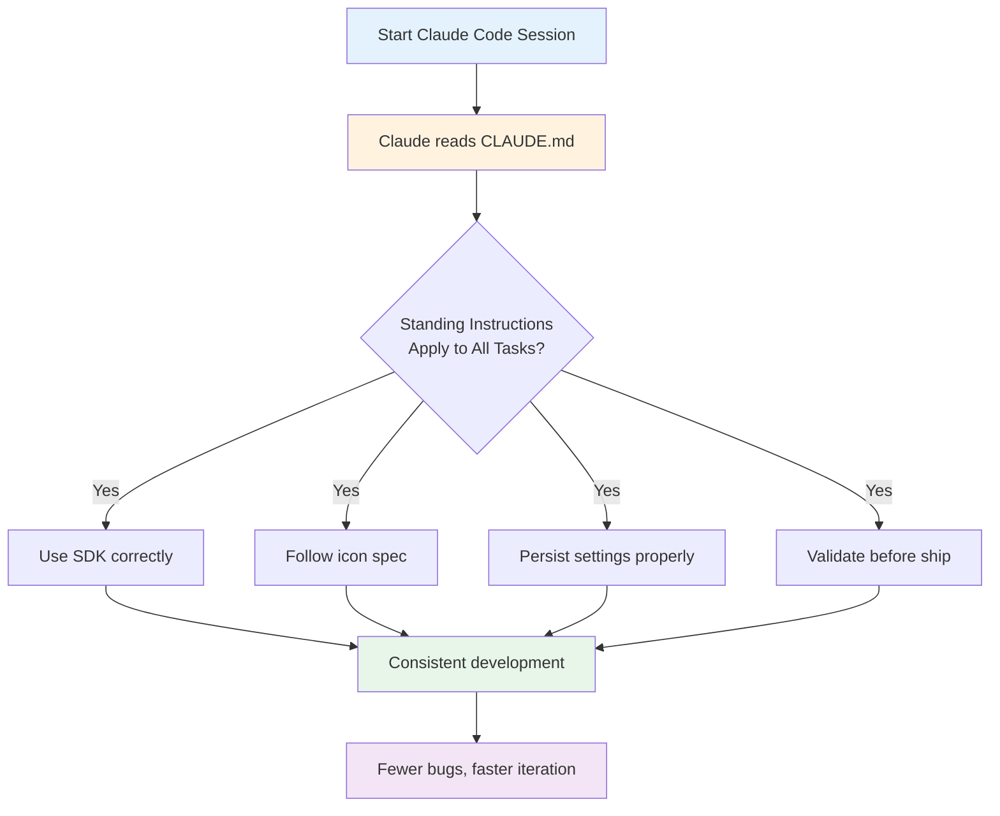

# CLAUDE.md Template for Stream Deck Plugin Projects

Use this template to create a `CLAUDE.md` file in your Stream Deck plugin project root. Claude Code reads this file automatically at the start of every session and treats it as standing instructions. This prevents repeat mistakes and keeps AI-assisted development consistent across sessions.

Copy this file to the root of your plugin project as `CLAUDE.md` and customize the sections for your specific plugin.

---

## CLAUDE.md Template

```markdown
# Claude Code Standing Instructions for [Plugin Name]

## Project Context

- **Plugin Name**: [e.g., "Focus Timer"]
- **UUID**: [e.g., "com.example.focustimer"]
- **Purpose**: [e.g., "Manage Pomodoro-style focus sessions with time tracking and notifications"]
- **Target Devices**: Stream Deck [original/MK.2/Mini/XL/+/Neo] (check all that apply)
- **Target SDK**: @elgato/streamdeck >= 2.1.0
- **Language**: TypeScript
- **Build Tool**: esbuild (npm run build)

## SDK Constraints (Non-Negotiable)

1. **Always use the official SDK**: `@elgato/streamdeck`. Do not write to the WebSocket API directly.
2. **Plugin lifecycle order**:
   - `registerAction()` must be called **before** `connect()`
   - Reversing this order causes actions to fail silently
3. **Settings persistence**:
   - Use `action.setSettings()` to save user preferences
   - Never store settings in local variables or global state
   - Settings must survive a plugin restart
4. **Error handling**:
   - Wrap all external API calls in try/catch blocks
   - Log errors to console; never let exceptions bubble uncaught
   - Stream Deck plugins run as background processes; unhandled errors kill the process without feedback
5. **Stream Deck + specific** (if targeting +):
   - For touch display feedback, call `setFeedbackLayout()` **before** `setFeedback()`
   - Calling these out of order produces no output and no error

## Manifest Rules

- **UUID in manifest.json** must exactly match the `.sdPlugin` folder name
  - Mismatch = plugin will not appear in Stream Deck
- **Version format**: Must be X.X.X.X (four parts)
  - Single or double-part versions (e.g., "1.0") fail validation
- **Icons**: All required icons must be present before bundling (action icons, category icon, plugin icon)
- **Actions**: Every action in manifest.json must have:
  - UUID unique within the plugin
  - Property Inspector reference (if settings exist)
  - At least one icon variant

## Icon Design Rules

See `knowledge-base/ui-components/icon-design-specification.md` for complete specifications.

**Quick rules** (AI often gets these wrong):
- **Canvas**: 144×144 px master, 120×120 px live area (12 px padding)
- **Glyph fill**: 60–70% of live area (roughly 72–84 px)
- **Format**: SVG with flat fills only; no gradients, shadows, or filters
- **Colors**: 2 active colors max (background + glyph + 1 optional accent)
- **States**: Differ by shape, never by color alone
- **Contrast**: Minimum 4.5:1 (WCAG AA)
- **Strokes**: Minimum 8–10 px width for readability

Example: Muted state = diagonal slash through glyph. Active state = filled glyph. Both states remain distinct in grayscale.

## Property Inspector Rules

- **Must fit without scrollbars** in the Stream Deck settings panel
- Test early: right-click an action in Stream Deck and verify all UI is visible
- Use SDPI components (`<sdpi-item>`, `<sdpi-range>`, etc.) from sdpi-components.dev
- Remember: constrained viewport, no scroll

## Common Development Commands

```bash
# Build the plugin
npm run build

# Link plugin for development (run once)
streamdeck link com.example.focustimer.sdPlugin

# Enable developer tools
streamdeck dev

# Restart the plugin after code changes (preferred over full Stream Deck restart)
streamdeck restart com.example.focustimer

# Validate manifest and icon requirements
streamdeck validate com.example.focustimer.sdPlugin

# Package for distribution
streamdeck pack com.example.focustimer.sdPlugin --output dist/
```

## Testing Checklist

Before each session, verify:
- [ ] Code compiles without errors (`npm run build`)
- [ ] Plugin appears in Stream Deck after restart
- [ ] All actions are visible and functional
- [ ] Settings persist after plugin restart (change a setting, restart, confirm it survived)
- [ ] No console errors in Stream Deck developer tools
- [ ] Property Inspector fits without scrollbars

## What Not to Do

- Do not add actions to manifest.json without updating action registration code
- Do not change plugin UUID without updating the `.sdPlugin` folder name
- Do not store settings in local variables
- Do not call `setFeedback()` before `setFeedbackLayout()` (Stream Deck + only)
- Do not use `registerAction()` after `connect()` is called
- Do not include gradients, shadows, or filters in icon SVGs
- Do not design icons smaller than 60% of live area
- Do not submit to Marketplace without running `streamdeck validate`

## Dependencies & Versions

- `@elgato/streamdeck`: ^2.1.0
- `typescript`: ^5.0.0
- `esbuild`: ^0.19.0
- `node`: >= 18.0.0

Update these if issues arise, but do not use experimental or beta versions.

## Deployment

When ready to ship:
1. Run `streamdeck validate com.example.focustimer.sdPlugin` and fix all errors
2. Confirm all icons are present and correct
3. Update version in `manifest.json` and `package.json` to X.X.X.X format
4. Run `npm run build` one final time
5. Create README.md with installation and usage instructions
6. Package: `streamdeck pack com.example.focustimer.sdPlugin --output dist/`
7. Test the `.streamdeckPlugin` file on a clean system
8. Publish to Elgato Marketplace, GitHub Releases, or direct download

## Resources

- SDK Docs: https://docs.elgato.com/streamdeck/sdk
- SDPI Components: https://sdpi-components.dev/
- Marketplace: https://console.elgato.com
- KB: This project's `knowledge-base/` folder (submodule or local copy)
```

---

## How to Use This Template

1. **Copy the template block** into a new file named `CLAUDE.md` in your plugin project root
2. **Fill in project-specific sections**:
   - Plugin Name, UUID, Purpose
   - Target devices and SDK version
   - Custom commands for your project structure
   - Any project-specific constraints
3. **Keep it under 200 lines**: Longer files reduce adherence. Remove or consolidate sections that are not relevant to every task
4. **Update as needed**: Revise CLAUDE.md if you discover new rules or constraints during development

Claude Code will read this file at the start of each session and apply the rules consistently.

---

## Code Example

Here's a minimal `CLAUDE.md` for a simple plugin:

```markdown
# CLAUDE.md — Focus Timer Plugin

## Context
Plugin: Focus Timer (com.example.focustimer)
SDK: @elgato/streamdeck >= 2.1.0
Build: npm run build
Target: Stream Deck original, Mini, XL

## Critical Rules
1. registerAction() BEFORE connect()
2. Use setSettings() for persistence
3. Plugin UUID matches .sdPlugin folder name
4. Icons: 144×144 px canvas, 120×120 px live area, 60-70% glyph fill

## Commands
- npm run build
- streamdeck restart com.example.focustimer
- streamdeck validate com.example.focustimer.sdPlugin

## Do Not
- Store settings in local variables
- Use icons smaller than 60% of live area
- Change UUID without renaming .sdPlugin folder
```

---

## Diagram



---

## Agent Prompt

**For Claude Code developers:**
Create a `CLAUDE.md` file in your Stream Deck plugin root with:
- Project name, UUID, purpose
- SDK and Node version requirements
- Icon design constraints (144×144 canvas, 60–70% glyph fill, flat SVG only)
- SDK order rules (registerAction before connect, setSettings for persistence)
- Common build and deploy commands
- Testing checklist
- What not to do section

This file will be read automatically at session start and enforced across all future work.

**For AI code assistants reading this:**
If a Stream Deck plugin project has a `CLAUDE.md` file in the root, read and apply it as standing instructions for all tasks in that project. Treat these as non-negotiable constraints, not stylistic suggestions. If constraints conflict, ask for clarification before proceeding.
