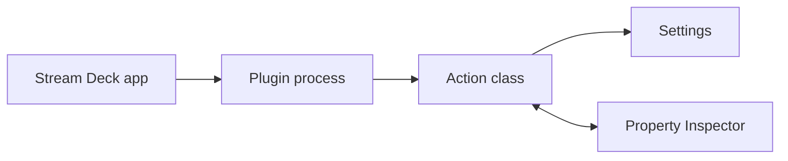

# Action Development

## Overview

Actions are the core functionality of Stream Deck plugins. They represent interactive elements (keys, dials, pedals) that users can configure and trigger.

**For your first action**, you need:
1. A class that extends `SingletonAction` or `MultiAction`
2. Event handlers for key press (`onKeyDown`) and lifecycle (`onWillAppear`, `onWillDisappear`)
3. Settings to store user configuration
4. Registration in your plugin's main entry point

This article covers the happy path; see [../advanced-topics/advanced-property-inspector.md](../advanced-topics/advanced-property-inspector.md) for validation, dynamic UI, and complex state patterns.

## Action Types (Controllers)

### Key Actions
- Standard Stream Deck keys (buttons)
- Pedals
- G-Keys

### Dial Actions  
- Dials with touchscreen (Stream Deck +)
- Rotation and press events
- Touch display feedback

## Action Class Structure

```typescript
import { action, SingletonAction, KeyDownEvent } from "@elgato/streamdeck";

@action({ UUID: "com.company.plugin.actionname" })
export class MyAction extends SingletonAction<Settings> {
    // Event handlers
    override async onKeyDown(ev: KeyDownEvent<Settings>) {
        // Handle key press
    }
    
    override async onWillAppear(ev: WillAppearEvent<Settings>) {
        // Initialize when action appears
    }
    
    override async onWillDisappear(ev: WillDisappearEvent<Settings>) {
        // Cleanup when action disappears  
    }
}

type Settings = {
    // Your settings type
};
```

## Action Registration

```typescript
import streamDeck from "@elgato/streamdeck";
import { MyAction } from "./actions/my-action";

// Register action
streamDeck.actions.registerAction(new MyAction());

// Connect (always last)
streamDeck.connect();
```

## Action Identifiers

Action UUIDs must:
- Be in reverse-DNS format
- Start with plugin UUID as prefix
- Contain only lowercase alphanumeric, hyphens, periods
- Never change after publication

Example: `com.elgato.hello-world.counter`

## Event Lifecycle

```
onWillAppear → User Interaction Events → onWillDisappear
```

### Common Events

**onWillAppear**: Action becomes visible
**onKeyDown**: Key/dial pressed  
**onKeyUp**: Key/dial released
**onDialRotate**: Dial rotated (Stream Deck +)
**onDidReceiveSettings**: Settings updated
**onPropertyInspectorDidAppear**: UI opened
**onSendToPlugin**: Message from property inspector

## Settings Access

```typescript
override async onKeyDown(ev: KeyDownEvent<Settings>) {
    // Read settings from event
    const { count = 0 } = ev.payload.settings;
    
    // Update settings
    await ev.action.setSettings({ count: count + 1 });
}
```

## Keep Display and Interaction in Sync

When an action both **displays** a selected item and **acts** on key press (open URL, trigger API call), use a single selector function for both paths.

```typescript
type Target = { id: string; url?: string };

function resolveTarget(settings: Settings, items: Item[]): Target | null {
    const offset = normalizeOffset(settings.offset);
    const candidates = items
        .filter((item) => item.end > Date.now())
        .sort((a, b) => a.start - b.start);

    return candidates[offset] ?? null;
}

// Render path
const targetForDisplay = resolveTarget(settings, items);

// Interaction path
const targetForPress = resolveTarget(settings, items);
```

**Why this matters**:
- Prevents "title shows current item, press opens previous item" bugs
- Keeps offset/filter behavior identical across UI and interactions
- Reduces regressions when adding fallback logic or new data sources

**Checklist**:
1. Use identical data source for render + press (same cache/filter set)
2. Apply the same offset and exclusion settings in both paths
3. Log selected item ID in render and press handlers during debugging
4. Add regression test asserting displayed ID equals acted-on ID

## Visual Feedback

```typescript
// Set title
await ev.action.setTitle("Hello");

// Set image  
await ev.action.setImage("data:image/png;base64,...");

// Show alert (error indicator)
await ev.action.showAlert();

// Show checkmark (success)
await ev.action.showOk();

// Set state (for multi-state actions)
await ev.action.setState(1);
```

## Accessing Visible Actions

```typescript
// In action class
override async onKeyDown(ev: KeyDownEvent) {
    // Access all instances of this action
    this.actions.forEach(action => {
        action.setTitle("Updated");
    });
}

// From plugin level
streamDeck.actions.forEach(action => {
    // Access all visible actions  
});
```

## Controller-Specific Logic

```typescript
override async onWillAppear(ev: WillAppearEvent) {
    if (ev.action.isKey()) {
        // Key-specific logic
    } else if (ev.action.isDial()) {
        // Dial-specific logic
    }
}
```

## Error Handling

```typescript
override async onKeyDown(ev: KeyDownEvent) {
    try {
        await this.performAction();
        await ev.action.showOk();
    } catch (error) {
        streamDeck.logger.error(error.message);
        await ev.action.showAlert();
    }
}
```

## Multi-State Actions

```json
{
  "States": [
    {
      "Image": "imgs/state-off",
      "Name": "Off"  
    },
    {
      "Image": "imgs/state-on",
      "Name": "On"
    }
  ]
}
```

```typescript
override async onKeyDown(ev: KeyDownEvent) {
    const newState = ev.payload.state === 0 ? 1 : 0;
    await ev.action.setState(newState);
}
```

## Best Practices

1. **Type Settings**: Always define settings type
2. **Validate Input**: Check settings values
3. **Handle Errors**: Use try-catch blocks
4. **Clean Resources**: In onWillDisappear
5. **Use Async**: All I/O operations
6. **Context Awareness**: Check controller type
7. **User Feedback**: Show alerts/success indicators

---

## Diagram

Core concepts sit in the runtime path between Stream Deck, the plugin process, actions, settings, and Property Inspector UI.



---

## Agent Prompt

Use this prompt with GitHub Copilot in VS Code or Claude Desktop after attaching the relevant plugin files.

```text
#file:knowledge-base/core-concepts/action-development.md
Use this article as the source of truth for my Stream Deck plugin.

Explain the key points from "Action Development" in practical terms. Then inspect my local plugin files for the same concept, identify any gaps or risky assumptions, and propose a spec-first, test-driven implementation plan before changing code.
```
