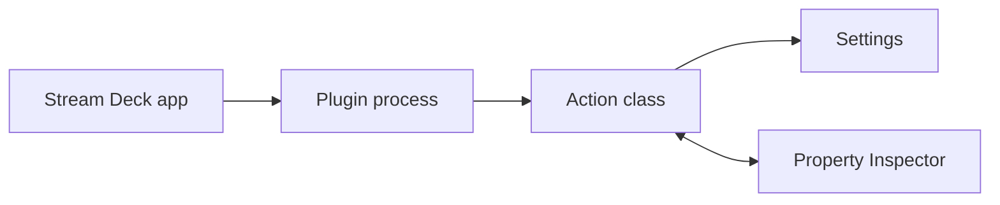

# Settings Persistence

## Overview

Stream Deck provides two types of settings:
1. **Action Settings**: Per-action instance
2. **Global Settings**: Plugin-wide

## Action Settings

Action settings are stored per action instance. They are included when users export profiles, so treat them as portable configuration rather than secure storage.

### Setting Action Settings

```typescript
import { action, KeyDownEvent, SingletonAction } from "@elgato/streamdeck";

type Settings = {
    count: number;
    name: string;
};

@action({ UUID: "com.company.plugin.action" })
class MyAction extends SingletonAction<Settings> {
    override async onKeyDown(ev: KeyDownEvent<Settings>) {
        const { count = 0 } = ev.payload.settings;
        
        await ev.action.setSettings({
            count: count + 1,
            name: "Updated"
        });
    }
}
```

### Reading Action Settings

```typescript
// From event payload (preferred)
const settings = ev.payload.settings;

// Request settings (if needed)
const settings = await ev.action.getSettings<Settings>();
```

### Settings Event

```typescript
override async onDidReceiveSettings(ev: DidReceiveSettingsEvent<Settings>) {
    // Called when settings are updated from property inspector
    const { count, name } = ev.payload.settings;
    // React to settings change
}
```

## Global Settings

Global settings are plugin-wide and are not included in profile exports. Use them for user-specific tokens or local preferences, but do not use them for private developer secrets that are shared by every install.

### Setting Global Settings

```typescript
import streamDeck from "@elgato/streamdeck";

type GlobalSettings = {
    apiKey: string;
    theme: string;
};

await streamDeck.settings.setGlobalSettings<GlobalSettings>({
    apiKey: "secret-key",
    theme: "dark"
});
```

### Reading Global Settings

```typescript
const settings = await streamDeck.settings.getGlobalSettings<GlobalSettings>();
console.log(settings.apiKey);
```

### Global Settings Event

```typescript
streamDeck.settings.onDidReceiveGlobalSettings((ev) => {
    const settings = ev.payload.settings;
    // React to global settings change
});
```

## Property Inspector Communication

### From Property Inspector (UI)

```javascript
// Using sdpi-components
const { streamDeckClient } = SDPIComponents;

// Set action settings
await streamDeckClient.setSettings({
    name: "John",
    count: 5
});

// Set global settings
await streamDeckClient.setGlobalSettings({
    apiKey: "key"
});
```

### Auto-sync with Components

```html
<!-- Automatically syncs to action settings -->
<sdpi-item label="Name">
    <sdpi-textfield setting="name"></sdpi-textfield>
</sdpi-item>

<sdpi-item label="Count">
    <sdpi-textfield setting="count" type="number"></sdpi-textfield>
</sdpi-item>
```

## Security Considerations

### Action Settings (NOT SECURE)

```typescript
// ❌ NEVER store sensitive data in action settings
await ev.action.setSettings({
    apiKey: "secret",  // BAD - exported with profiles!
    password: "pass"   // BAD - stored as plain text!
});
```

### Global Settings (USER-SPECIFIC ONLY)

```typescript
// ✅ Store user-specific tokens or user-provided API keys in global settings
await streamDeck.settings.setGlobalSettings({
    apiKey: "user-provided-key",  // Not exported with profiles
    token: "bearer"    // Not included in profiles
});
```

### Plugin Secrets (MOST SECURE FOR SHARED PRIVATE VALUES)

```typescript
// ✅ Use marketplace-managed secrets or a backend for private shared values
const secrets = await streamDeck.system.getSecrets<{ clientSecret: string }>();
```

`streamDeck.system.getSecrets()` requires Stream Deck 6.9 or higher and `SDKVersion: 3`. Use it for private shared plugin credentials instead of bundling them or saving them in global settings.

### OAuth Tokens

```typescript
// ✅ BEST: Use OAuth or user-provided credentials
// 1. Open OAuth flow
await streamDeck.system.openUrl("https://auth.service.com/oauth");

// 2. Receive token via deep-link
streamDeck.system.onDidReceiveDeepLink((ev) => {
    const token = extractToken(ev.payload.url);
    // Store in global settings
    streamDeck.settings.setGlobalSettings({ token });
});
```

## Type Safety

### Defining Settings Types

```typescript
type CounterSettings = {
    count: number;
    label?: string;
    enabled: boolean;
};

@action({ UUID: "com.company.counter" })
class Counter extends SingletonAction<CounterSettings> {
    // TypeScript now provides autocomplete and type checking
}
```

### Runtime Validation

```typescript
override async onDidReceiveSettings(ev: DidReceiveSettingsEvent<Settings>) {
    const { count, enabled } = ev.payload.settings;
    
    // Validate types at runtime
    if (typeof count !== 'number' || count < 0) {
        streamDeck.logger.warn("Invalid count value");
        return;
    }
    
    if (typeof enabled !== 'boolean') {
        streamDeck.logger.warn("Invalid enabled value");
        return;
    }
}
```

## Settings Migration

```typescript
override async onWillAppear(ev: WillAppearEvent<Settings>) {
    let settings = ev.payload.settings;
    
    // Migrate old settings format
    if (!('version' in settings)) {
        settings = {
            ...settings,
            version: 2,
            newField: "default"
        };
        await ev.action.setSettings(settings);
    }
}
```

## Default Values

```typescript
override async onKeyDown(ev: KeyDownEvent<Settings>) {
    // Use destructuring with defaults
    const {
        count = 0,
        name = "Default",
        enabled = true
    } = ev.payload.settings;
}
```

## Settings in Property Inspector

### Receiving Initial Settings

```javascript
window.connectElgatoStreamDeckSocket = async (port, uuid, event, info, actionInfo) => {
    const actionObj = JSON.parse(actionInfo);
    const settings = actionObj.payload.settings;
    
    // Initialize UI with current settings
    document.getElementById('name').value = settings.name || '';
};
```

### Listening for Settings Changes

```javascript
// Plugin sends new settings to property inspector
const { streamDeckClient } = SDPIComponents;

streamDeckClient.on('didReceiveSettings', (settings) => {
    // Update UI with new settings
    updateUI(settings);
});
```

## Persistence Guarantees

- **Action Settings**: Persisted per action instance
- **Global Settings**: Persisted per plugin
- **Automatic**: Settings saved automatically by Stream Deck
- **Cross-Session**: Persist across app restarts
- **Profile Export**: Action settings included, global settings excluded

## Changed vs Requested Events

By default, calling `ev.action.getSettings()` or `streamDeck.settings.getGlobalSettings()` can also trigger the corresponding did-receive settings event. From Stream Deck 7.1 and `@elgato/streamdeck` v2, enable message identifiers when you want did-receive handlers to run only for actual Property Inspector changes.

```typescript
streamDeck.settings.useExperimentalMessageIdentifiers = true;
await streamDeck.connect();
```

With message identifiers enabled, responses to explicit settings reads are filtered out of `onDidReceiveSettings` and `onDidReceiveGlobalSettings`.

## Best Practices

1. **Type Everything**: Use TypeScript types
2. **Validate Input**: Check at runtime
3. **Provide Defaults**: Handle missing values
4. **Secure Sensitive Data**: Use global settings or OAuth
5. **Migrate Gracefully**: Handle old versions
6. **Minimize Storage**: Only store necessary data
7. **Document Settings**: Clear property names

---

## Diagram

Core concepts sit in the runtime path between Stream Deck, the plugin process, actions, settings, and Property Inspector UI.



---

## Agent Prompt

Use this prompt with GitHub Copilot in VS Code or Claude Desktop after attaching the relevant plugin files.

```text
#file:knowledge-base/core-concepts/settings-persistence.md
Use this article as the source of truth for my Stream Deck plugin.

Explain the key points from "Settings Persistence" in practical terms. Then inspect my local plugin files for the same concept, identify any gaps or risky assumptions, and propose a spec-first, test-driven implementation plan before changing code.
```
