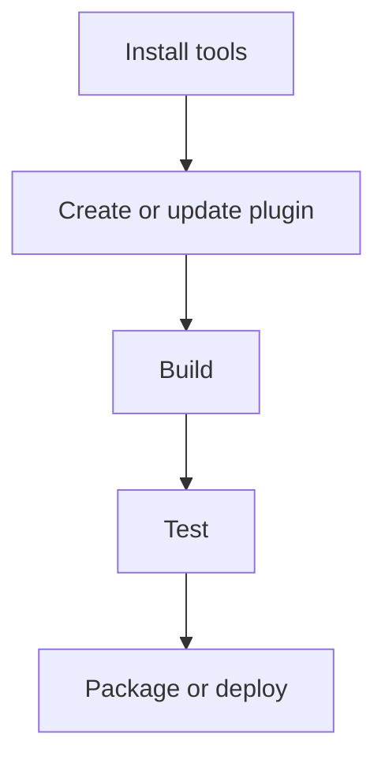

# SDK 2.1.0 Update Guide

Use this guide when creating a new Stream Deck plugin or updating an existing SDK v2 plugin to the current mandatory baseline used by this knowledge base.

## Mandatory Baseline For New Plugins

New examples, templates, and plugin projects should use:

- `@elgato/streamdeck@2.1.0` or newer
- `SDKVersion: 3`
- `Nodejs.Version: "24"`
- `Software.MinimumVersion: "7.1"` or newer
- Stream Deck CLI from `@elgato/cli@latest`
- Stream Deck 7.1 or newer for development and validation

Node.js 20 remains valid only when intentionally maintaining an older SDK v2 project with an older Stream Deck target. Do not use Node.js 20, SDK version 2, or Stream Deck 6.6 as defaults in new-plugin documentation.

## Manifest Update

```json
{
  "$schema": "https://schemas.elgato.com/streamdeck/plugins/manifest.json",
  "UUID": "com.company.plugin",
  "Name": "Plugin Name",
  "Version": "1.0.0.0",
  "CodePath": "bin/plugin.js",
  "SDKVersion": 3,
  "Software": {
    "MinimumVersion": "7.1"
  },
  "Nodejs": {
    "Version": "24",
    "Debug": "enabled"
  }
}
```

For bundled profiles, use `Readonly` in profile objects. Keep device type values aligned with the live manifest schema, including SCUF Controller at `8`, Stream Deck Neo at `9`, Stream Deck Studio at `10`, Virtual Stream Deck at `11`, Galleon 100 SD at `12`, and Stream Deck + XL at `13`.

## SDK API Updates

- Await startup with `await streamDeck.connect()`.
- Use `streamDeck.ui.action` for the action associated with the visible Property Inspector.
- Send plugin-to-PI messages with `await streamDeck.ui.sendToPropertyInspector(payload)`.
- Use `streamDeck.profiles.switchToProfile(deviceId, profile?, page?)`.
- Use `streamDeck.system.getSecrets<T>()` for marketplace-managed private shared plugin secrets.
- Use action resources through `Action.getResources()`, `Action.setResources()`, and resource events when exported profiles need bundled files.

## CLI And Validation

```bash
npm install -g @elgato/cli@latest
streamdeck -v
streamdeck validate --no-update-check com.company.plugin.sdPlugin
streamdeck pack --no-update-check com.company.plugin.sdPlugin --output dist/
streamdeck dev
streamdeck dev --disable
```

Use `.sdignore` beside `manifest.json` to exclude source maps, local-only files, test fixtures, or other files that should not ship. The CLI already ignores `.git`, `/.env*`, `*.log`, and `*.js.map` by default.

## Property Inspector Updates

- Bundle `sdpi-components.js` locally for production and offline support.
- Use SDPI Components v4 when following current docs.
- Only expect PI messages to arrive while the Property Inspector is visible.
- Do not rely on PI `beforeunload` after Chromium 122; save settings explicitly and use SDK lifecycle events.

## Security Updates

- Do not bundle private shared client secrets in plugin code.
- Treat action settings as portable profile data, not secure storage.
- Use global settings only for user-specific tokens or local preferences.
- Prefer PKCE, provider-supported public-client flows, a backend token exchange, or `streamDeck.system.getSecrets<T>()` for private values.

## Documentation Update Checklist

When updating this knowledge base or a plugin project, verify:

- New manifests use `SDKVersion: 3`, Node.js `24`, and Stream Deck `7.1` or newer.
- Device type tables match the live schema.
- PI messaging examples use `streamDeck.ui.sendToPropertyInspector()`.
- CLI examples use current `validate`, `pack`, `restart`, and `dev` commands.
- Logging guidance points to Stream Deck log files when the current CLI command surface does not provide a log command.
- Migration docs clearly label Node.js 20 and SDK version 2 as legacy compatibility notes.

## Related References

- [environment-setup.md](environment-setup.md)
- [build-and-deploy.md](build-and-deploy.md)
- [debugging-guide.md](debugging-guide.md)
- [../reference/api-reference.md](../reference/api-reference.md)
- [../reference/manifest-schema.md](../reference/manifest-schema.md)
- [../reference/cli-commands.md](../reference/cli-commands.md)
- [../reference/sdk-2-1-0-github-audit.md](../reference/sdk-2-1-0-github-audit.md)

---

## Diagram

Development workflow articles move from local setup through repeatable validation.



---

## Agent Prompt

Use this prompt with GitHub Copilot in VS Code or Claude Desktop after attaching the relevant plugin files.

```text
#file:knowledge-base/development-workflow/sdk-2-1-0-update-guide.md
Use this article as the source of truth for my Stream Deck plugin.

Explain the key points from "SDK 2.1.0 Update Guide" in practical terms. Then inspect my local plugin files for the same concept, identify any gaps or risky assumptions, and propose a spec-first, test-driven implementation plan before changing code.
```
