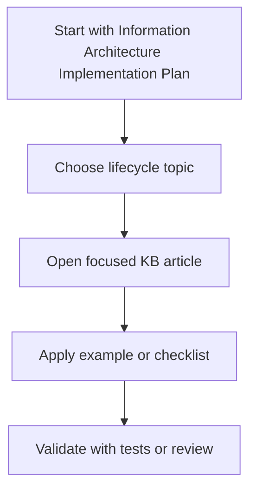

# Information Architecture Implementation Plan

This plan turns the [information architecture audit](information-architecture-audit.md) into an executable 2-3 week roadmap. It is optimized for new Stream Deck plugin developers, keeps markdown in [knowledge-base/](README.md) as the only canonical documentation source, and aggressively defers fast-changing authoritative details to official external sources.

## Planning Inputs

- Primary audience: new plugin developers.
- Secondary readers: maintainers and AI coding agents, as long as their needs do not make the beginner path harder.
- Canonical scope: strict markdown-only knowledge base.
- External-source posture: link out aggressively for official or fast-changing details.
- Delivery horizon: 2-3 weeks.
- Source audit: [information-architecture-audit.md](information-architecture-audit.md).

## Success Criteria

The IA work is complete when:

- A new developer can follow one obvious path from setup to first working plugin.
- Every KB article has a clear article type and category.
- Top-level files are limited to navigation, orientation, maintenance, and audit/plan artifacts.
- Generated site, RAG, vector, build, and storage artifacts are removed from the canonical documentation model.
- Fast-changing subjects cite external sources instead of duplicating full upstream detail.
- Oversized mixed-purpose articles are split or explicitly scheduled for split work.
- [INDEX.md](INDEX.md) is the reliable navigation hub for all maintained KB content.
- `npm test` passes after each structural change.

## Target IA

Use this lifecycle-oriented navigation model in [INDEX.md](INDEX.md):

1. Start: orientation, prerequisites, quick reference, first reading path.
2. Learn: architecture, actions, settings, communication, Stream Deck Plus fundamentals.
3. Build: setup, build/deploy, debugging, testing, localization, SDK updates.
4. Design UI: Property Inspector basics, SDPI usage patterns, advanced PI workflows.
5. Integrate and Secure: network operations, OAuth, secrets, telemetry privacy, security requirements.
6. Ship: marketplace submission, approval checklist, profile publishing, compliance checklist.
7. Reference: curated SDK/API notes, manifest notes, CLI notes, SDK source map, migration notes.
8. Examples: beginner tutorial plus focused scenario examples.
9. Troubleshoot: symptom-based fixes and diagnostic flows.
10. Maintain This KB: contribution rules, changelog, audit, implementation plan, upstream review notes.

## Article Type Contract

Add a short metadata block near the top of each maintained KB article. Keep it plain markdown so it remains friendly to editors and retrieval tools.

Recommended format:

```markdown
> **Type:** Concept | How-to | Tutorial | Reference | Template | Troubleshooting | Checklist | Example | Maintenance
> **Audience:** New plugin developers | Plugin maintainers | Marketplace-ready teams | AI agents
> **Status:** Maintained | Legacy | External-source summary
> **Source of truth:** Local KB | Official Elgato docs | SDPI docs | Provider docs | Legal counsel | Other
> **Review cadence:** SDK release | Quarterly | On upstream change | On support incident
```

Each maintained article also follows the KB quality contract:

- **Practical example:** include code, manifest JSON, HTML, shell commands, config, or another concrete artifact the reader can adapt.
- **Diagram when applicable:** include Mermaid for lifecycle, architecture, event flow, state transition, decision tree, or multi-step workflow topics.
- **Agent prompt:** include at least one prompt for GitHub Copilot or Claude that asks the agent to explain, fix, test, implement, or adapt the concept against local project files.

Recommended article sections:

```markdown
## Code Example

## Diagram

## Agent Prompt
```

Existing articles can be migrated gradually. New articles should include all applicable sections from the start.

Initial article type assignments:

| Type | Articles |
| --- | --- |
| Maintenance | [README.md](README.md), [INDEX.md](INDEX.md), [CHANGELOG.md](CHANGELOG.md), [information-architecture-audit.md](information-architecture-audit.md), this plan |
| Orientation | [GETTING_STARTED.md](GETTING_STARTED.md), [QUICK_REFERENCE.md](QUICK_REFERENCE.md) |
| Concept | [core-concepts/architecture-overview.md](core-concepts/architecture-overview.md), [core-concepts/action-development.md](core-concepts/action-development.md), [core-concepts/communication-protocol.md](core-concepts/communication-protocol.md), [core-concepts/settings-persistence.md](core-concepts/settings-persistence.md), [core-concepts/stream-deck-plus-deep-dive.md](core-concepts/stream-deck-plus-deep-dive.md) |
| How-to | [development-workflow/environment-setup.md](development-workflow/environment-setup.md), [development-workflow/build-and-deploy.md](development-workflow/build-and-deploy.md), [development-workflow/debugging-guide.md](development-workflow/debugging-guide.md), [development-workflow/testing-strategies.md](development-workflow/testing-strategies.md), [development-workflow/localization.md](development-workflow/localization.md), [advanced-topics/network-operations.md](advanced-topics/network-operations.md), [advanced-topics/oauth-implementation.md](advanced-topics/oauth-implementation.md), [advanced-topics/managing-multiple-instances.md](advanced-topics/managing-multiple-instances.md), [advanced-topics/multi-action-coordination.md](advanced-topics/multi-action-coordination.md), [advanced-topics/device-specific-development.md](advanced-topics/device-specific-development.md), [advanced-topics/performance-profiling.md](advanced-topics/performance-profiling.md), [advanced-topics/versioning-and-migrations.md](advanced-topics/versioning-and-migrations.md), [advanced-topics/advanced-property-inspector.md](advanced-topics/advanced-property-inspector.md) |
| Template | [code-templates/action-templates.md](code-templates/action-templates.md), [code-templates/common-patterns.md](code-templates/common-patterns.md), [code-templates/manifest-templates.md](code-templates/manifest-templates.md), [code-templates/property-inspector-templates.md](code-templates/property-inspector-templates.md) |
| Reference | [reference/api-reference.md](reference/api-reference.md), [reference/cli-commands.md](reference/cli-commands.md), [reference/manifest-schema.md](reference/manifest-schema.md), [reference/sdk-source-code-guide.md](reference/sdk-source-code-guide.md), [reference/sdk-v1-to-v2-migration.md](reference/sdk-v1-to-v2-migration.md), [reference/sdk-2-1-0-github-audit.md](reference/sdk-2-1-0-github-audit.md) |
| Example | [examples/basic-counter-plugin.md](examples/basic-counter-plugin.md), [examples/calendar-dial-carousel.md](examples/calendar-dial-carousel.md), [examples/real-world-plugin-examples.md](examples/real-world-plugin-examples.md) |
| Checklist | [marketplace/approval-checklist.md](marketplace/approval-checklist.md), [marketplace/submission-guide.md](marketplace/submission-guide.md), [legal/compliance-guide.md](legal/compliance-guide.md), [security-and-compliance/security-requirements.md](security-and-compliance/security-requirements.md) |
| Troubleshooting | [troubleshooting/common-issues.md](troubleshooting/common-issues.md), [troubleshooting/diagnostic-flowcharts.md](troubleshooting/diagnostic-flowcharts.md) |

## Phase 1: IA Foundation

Target duration: 2-3 days.

Goal: make the documentation model explicit before moving or rewriting content.

Tasks:

1. Update [README.md](README.md) and [INDEX.md](INDEX.md) to state that [knowledge-base/](README.md) markdown is canonical.
2. Add a short source-of-truth policy to [CONTRIBUTING.md](../CONTRIBUTING.md): local docs explain Stream Deck-specific implementation; official external docs own API, policy, provider, legal, and toolchain specifics.
3. Add the article type contract to [CONTRIBUTING.md](../CONTRIBUTING.md).
4. Reorganize [INDEX.md](INDEX.md) into the target lifecycle IA while preserving all existing links.
5. Add a `Maintain This KB` section that links to [information-architecture-audit.md](information-architecture-audit.md), this plan, [CHANGELOG.md](CHANGELOG.md), and [../CONTRIBUTING.md](../CONTRIBUTING.md).

Acceptance criteria:

- A reader can distinguish canonical KB docs from generated or derived artifacts.
- [INDEX.md](INDEX.md) reflects the target lifecycle IA.
- No files have been moved yet, so review risk stays low.
- `npm test` passes.

## Phase 2: Navigation And File Placement

Target duration: 2-4 days.

Goal: put articles where new developers expect them and remove category ambiguity.

Tasks:

1. Move [secrets-management.md](security-and-compliance/secrets-management.md) from top-level `plugin-secrets-management.md` to `security-and-compliance/secrets-management.md`.
2. Move [profile-publishing.md](marketplace/profile-publishing.md) from top-level `profile-publish.md` to `marketplace/profile-publishing.md`.
3. Move or rename [reference/sdk-2-1-0-github-audit.md](reference/sdk-2-1-0-github-audit.md) into a maintenance/source-tracking area, or keep it in reference but mark it as a maintenance audit.
4. Update all local links after moves.
5. Update [INDEX.md](INDEX.md), [README.md](README.md), and [GETTING_STARTED.md](GETTING_STARTED.md) so beginners see setup, architecture, first action, PI basics, settings, debugging, and troubleshooting in order.
6. Clarify that `doc-site/build/`, `rag-system/storage/`, and any generated consumers are non-canonical cleanup targets under the strict markdown-only policy.

Acceptance criteria:

- Top-level KB files are only orientation, navigation, maintenance, and planning docs.
- Security and marketplace articles live in their category folders.
- Beginner reading path is visible from both [GETTING_STARTED.md](GETTING_STARTED.md) and [INDEX.md](INDEX.md).
- `npm test` passes.

## Phase 3: Beginner Path Rewrite

Target duration: 3-5 days.

Goal: make the first-plugin journey coherent without forcing beginners through reference-heavy articles.

Tasks:

1. Refresh [GETTING_STARTED.md](GETTING_STARTED.md) for the SDK 2.1.0 baseline: Node.js 24+, Stream Deck 7.1+, `SDKVersion: 3`, and the expected repo use as a markdown KB.
2. Tighten [core-concepts/architecture-overview.md](core-concepts/architecture-overview.md) so it functions as the first conceptual article.
3. Tighten [core-concepts/action-development.md](core-concepts/action-development.md) around `SingletonAction`, action lifecycle, settings access, and visual feedback.
4. Keep [examples/basic-counter-plugin.md](examples/basic-counter-plugin.md) as the first complete tutorial and align its prerequisites and manifest baseline.
5. Tighten [ui-components/property-inspector-basics.md](ui-components/property-inspector-basics.md) so it introduces PI communication before deep SDPI component details.
6. Ensure [core-concepts/settings-persistence.md](core-concepts/settings-persistence.md), [development-workflow/debugging-guide.md](development-workflow/debugging-guide.md), and [troubleshooting/common-issues.md](troubleshooting/common-issues.md) form the support path after the first tutorial.

Acceptance criteria:

- A beginner can complete a basic plugin by following 6-8 linked articles.
- Reference articles are linked only when needed, not required as prerequisites.
- Repeated baseline requirements are consistent across beginner-facing docs.
- `npm test` passes.

## Phase 4: External Source Deferral

Target duration: 3-5 days.

Goal: reduce local maintenance burden for fast-changing topics while preserving Stream Deck-specific guidance.

Tasks:

1. Convert [reference/api-reference.md](reference/api-reference.md) into curated API notes with source/version stamps instead of a broad SDK mirror.
2. Convert [reference/manifest-schema.md](reference/manifest-schema.md) into a curated manifest guide that points to the live schema as source of truth.
3. Keep [reference/cli-commands.md](reference/cli-commands.md) compact and link to official CLI docs for full behavior.
4. Update [ui-components/form-components.md](ui-components/form-components.md) and [code-templates/property-inspector-templates.md](code-templates/property-inspector-templates.md) to keep local usage patterns while deferring component option lists to SDPI docs.
5. Replace provider-specific OAuth setup blocks in [advanced-topics/oauth-implementation.md](advanced-topics/oauth-implementation.md) with links to provider docs and local guidance on Stream Deck callback, secrets, token storage, PKCE, and security decisions.
6. Shorten [development-workflow/ci-cd-complete.md](development-workflow/ci-cd-complete.md) to plugin release pipeline patterns and link out for platform YAML details.
7. Replace [legal/compliance-guide.md](legal/compliance-guide.md) with a plugin compliance checklist plus explicit legal/professional-source disclaimer.

Acceptance criteria:

- Each fast-changing reference article states its source of truth.
- Local content focuses on Stream Deck-specific interpretation, examples, or checklists.
- Legal, regulatory, provider, and platform docs are not treated as locally authoritative.
- `npm test` passes.

## Phase 5: Split Oversized Articles

Target duration: 4-6 days.

Goal: make large mixed-purpose articles easier to scan, maintain, and retrieve.

Split priorities:

1. [advanced-topics/oauth-implementation.md](advanced-topics/oauth-implementation.md)
   - `oauth-overview.md`: flow choice, PKCE, redirect options, security model.
   - `oauth-callback-handling.md`: local callback/deep link handling.
   - `oauth-token-storage.md`: tokens, secrets, refresh, multi-account.
   - `oauth-testing-and-troubleshooting.md`: test scenarios and common failures.
   - Provider docs should be external links, not local replicas.

2. [examples/real-world-plugin-examples.md](examples/real-world-plugin-examples.md)
   - Keep an index article.
   - Split each scenario into one focused example: network auto-update, localization, dynamic PI data sources, Stream Deck Plus layouts, and multi-action coordination.
   - Link to the official Elgato samples repository as the source for upstream sample behavior.

3. [core-concepts/stream-deck-plus-deep-dive.md](core-concepts/stream-deck-plus-deep-dive.md)
   - Keep hardware/controller fundamentals in core concepts.
   - Move full examples to examples.
   - Move common issues to troubleshooting.
   - Keep performance-specific notes linked to [advanced-topics/performance-profiling.md](advanced-topics/performance-profiling.md).

4. [development-workflow/localization.md](development-workflow/localization.md)
   - Keep Stream Deck localization structure and manifest behavior locally.
   - Move complete localized plugin sample to examples or keep as a short linked example.
   - Link out for general i18n theory and language-specific rules.

Acceptance criteria:

- No article combines concept, full tutorial, reference, and troubleshooting unless intentionally marked as a deep dive.
- Scenario examples are individually linkable from [INDEX.md](INDEX.md).
- Oversized documents are reduced or clearly scheduled for continued split work.
- `npm test` passes.

## Phase 6: Governance Automation

Target duration: 2-3 days.

Goal: make the improved IA durable.

Tasks:

1. Extend [../scripts/validate-markdown.mjs](../scripts/validate-markdown.mjs) to warn or fail when a maintained KB file is missing from [INDEX.md](INDEX.md).
2. Add metadata validation for article type, status, source of truth, and review cadence.
3. Add a configurable warning for files above a line-count threshold, initially 700 lines.
4. Add a check for fast-changing article types that lack an external source-of-truth link.
5. Add contribution guidance for when to create, split, move, or externalize content.

Acceptance criteria:

- IA drift is caught during `npm test`.
- New articles cannot quietly bypass the index.
- Large docs and missing source-of-truth markers are visible during review.
- `npm test` passes.

## Recommended Sequencing

Week 1:

1. Phase 1: IA foundation.
2. Phase 2: navigation and file placement.
3. Start Phase 3 for beginner path consistency.

Week 2:

1. Complete Phase 3.
2. Complete Phase 4 for external-source deferral.
3. Start the OAuth and real-world examples splits from Phase 5.

Week 3, if available:

1. Complete Phase 5 split work.
2. Complete Phase 6 governance automation.
3. Run a final beginner-path walkthrough from [GETTING_STARTED.md](GETTING_STARTED.md) through the first plugin tutorial.

## First Safe Implementation Batch

The first implementation batch should avoid risky rewrites and focus on structure:

1. Update [../CONTRIBUTING.md](../CONTRIBUTING.md) with the source-of-truth policy and article type contract.
2. Rebuild [INDEX.md](INDEX.md) into the lifecycle IA while preserving all existing links.
3. Move [secrets-management.md](security-and-compliance/secrets-management.md) and [profile-publishing.md](marketplace/profile-publishing.md) into their category folders.
4. Update moved-file links in [INDEX.md](INDEX.md), [README.md](README.md), [GETTING_STARTED.md](GETTING_STARTED.md), [security-and-compliance/security-requirements.md](security-and-compliance/security-requirements.md), and marketplace docs if needed.
5. Run `npm test`.

## Risk Register

| Risk | Mitigation |
| --- | --- |
| Moving files breaks links for external consumers | Prefer one batch of moves, update all internal links, and document moved articles in [CHANGELOG.md](CHANGELOG.md). |
| Aggressive external linking makes docs feel thin | Keep Stream Deck-specific examples, checklists, and decision guidance local. |
| Beginner path becomes too narrow for maintainers | Preserve maintainer paths in [GETTING_STARTED.md](GETTING_STARTED.md) and [INDEX.md](INDEX.md), but keep them secondary. |
| Large article splits create duplicated content | Split by user intent and keep one canonical owner for each topic. |
| Metadata becomes busywork | Keep the metadata block short and enforce only fields that help navigation, review, or source ownership. |
| Official sources change URLs or behavior | Add review cadence fields and source stamps; validate links during scheduled reviews. |

## Final Review Checklist

- [ ] [INDEX.md](INDEX.md) matches the target IA.
- [ ] [GETTING_STARTED.md](GETTING_STARTED.md) has one clear beginner path.
- [ ] Top-level KB files are limited to orientation, navigation, maintenance, audit, and plan docs.
- [ ] Security, marketplace, legal, examples, and reference content sit in the right category.
- [ ] Fast-changing content has an external source of truth.
- [ ] Oversized mixed-purpose docs are split or have follow-up issues.
- [ ] Generated folders are marked non-canonical or removed from the repository.
- [ ] Article metadata is present on maintained docs.
- [ ] `npm test` passes.

---

## Diagram

Use the top-level articles as entry points, then move into focused lifecycle articles as the question becomes more specific.



---

## Agent Prompt

Use this prompt with GitHub Copilot in VS Code or Claude Desktop after attaching the relevant plugin files.

```text
#file:knowledge-base/ia-implementation-plan.md
Use this article as the source of truth for my Stream Deck plugin.

Explain the key points from "Information Architecture Implementation Plan" in practical terms. Then inspect my local plugin files for the same concept, identify any gaps or risky assumptions, and propose a spec-first, test-driven implementation plan before changing code.
```
