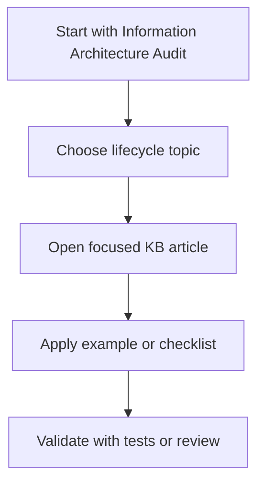

# Information Architecture Audit

This audit reviews the markdown documentation in this repository from a technical-writing and knowledge-base governance perspective. It focuses on whether the current documentation has a consistent information architecture, what IA should be built, and which topics should remain local versus defer to external sources of truth.

## Executive Summary

The repository has a partial information architecture, but it is not yet consistent enough to treat as a mature knowledge base. The strongest existing elements are the central [INDEX.md](INDEX.md), a clear folder taxonomy, and validation rules for headings, links, and file names. The weak points are mixed article types, uneven article size, top-level articles that belong in categories, broad external-domain coverage, and limited governance around what should be maintained locally.

The recommended direction is to keep the knowledge base as a practical Stream Deck plugin development companion, not as a full mirror of Elgato, SDPI, OAuth-provider, CI, legal, or regulatory documentation. Local articles should explain Stream Deck-specific decisions, implementation patterns, gotchas, and examples. Fast-changing or authoritative details should be summarized locally and linked to their source.

The implementation roadmap for this audit is maintained in [ia-implementation-plan.md](ia-implementation-plan.md).

## Current IA Assessment

Status: partially consistent.

What works:

- [INDEX.md](INDEX.md) provides a usable navigation hub.
- [README.md](README.md) explains the intended canonical markdown scope.
- The main categories are discoverable: core concepts, workflow, UI components, templates, advanced topics, reference, examples, troubleshooting, security, legal, and marketplace.
- [GETTING_STARTED.md](GETTING_STARTED.md) gives separate paths for new and existing plugin developers.
- [../scripts/validate-markdown.mjs](../scripts/validate-markdown.mjs) prevents several structural failures.

What is inconsistent:

- Article types are mixed inside categories. For example, `advanced-topics` contains concept guides, implementation how-tos, security-adjacent content, and large provider-specific references.
- Several top-level KB files are category content: [secrets-management.md](security-and-compliance/secrets-management.md) belongs under security, and [profile-publishing.md](marketplace/profile-publishing.md) belongs under marketplace.
- Some documents are too large to serve one user intent. The main examples article, OAuth guide, Stream Deck Plus deep dive, API reference, and localization guide combine tutorial, reference, and example content.
- Some local references duplicate upstream material that should be authoritative elsewhere, especially SDK API, manifest schema, SDPI components, OAuth provider setup, marketplace submission, CI tooling, and legal/regulatory requirements.
- Generated or runtime-oriented repository folders such as `doc-site/build/` and `rag-system/storage/` conflict with the root README's stated preference for markdown-only canonical content. They can exist as build artifacts or generated consumers, but the IA should explicitly mark them as non-canonical and keep them out of the navigation model.

## Recommended IA Model

Use a task-based IA with explicit article types. The folder name should answer "where am I in the plugin lifecycle?" while the article type should answer "how should I read this?"

Recommended top-level KB sections:

- Start: orientation, prerequisites, reading paths, quick reference.
- Learn: core concepts such as architecture, actions, settings, communication, and Stream Deck Plus fundamentals.
- Build: local setup, project creation, build, deployment, debugging, testing, localization, CI.
- Design UI: Property Inspector basics, SDPI component patterns, advanced PI workflows.
- Integrate and Secure: network operations, OAuth patterns, secrets, security requirements, telemetry privacy.
- Ship: marketplace submission, profiles, approval checklist, compliance checklist.
- Reference: Stream Deck-specific API notes, manifest notes, CLI notes, SDK migration notes, source-code map.
- Examples: one complete beginner tutorial plus focused scenario examples.
- Troubleshoot: symptom-based fixes and diagnostic flows.
- Maintain This KB: changelog, audits, contribution rules, source-of-truth tracking.

Recommended article types:

- Concept: explains mental models and system behavior.
- How-to: solves a specific task.
- Tutorial: teaches through a complete end-to-end example.
- Reference: compact lookup material, ideally with a source/version stamp.
- Template: copy-ready code or manifest patterns.
- Troubleshooting: symptom, cause, fix, prevention.
- Checklist: review or release readiness.
- Example: complete or focused implementation sample.
- Maintenance: repo governance, audit history, changelog.

## Build Plan

1. Define a content contract.
   Add required article metadata or a documented header block: `type`, `audience`, `status`, `lastReviewed`, `sourceOfTruth`, and `reviewCadence`. Keep it lightweight enough for markdown readers and agent ingestion. Extend the contract with article quality markers: a practical example, a diagram when applicable, and an AI agent prompt for GitHub Copilot or Claude.

2. Rework navigation around lifecycle tasks.
   Keep [INDEX.md](INDEX.md) as the global hub, but add short category hub pages or category descriptions that list recommended reading order, common tasks, and canonical articles.

3. Move misplaced top-level articles.
   Move [secrets-management.md](security-and-compliance/secrets-management.md) to `security-and-compliance/secrets-management.md`. Move [profile-publishing.md](marketplace/profile-publishing.md) to `marketplace/profile-publishing.md`. Keep [CHANGELOG.md](CHANGELOG.md), [GETTING_STARTED.md](GETTING_STARTED.md), [QUICK_REFERENCE.md](QUICK_REFERENCE.md), [README.md](README.md), and this audit at the top level.

4. Split large mixed-purpose articles.
   Split documents over roughly 700 lines when they contain multiple intents. Prioritize [advanced-topics/oauth-implementation.md](advanced-topics/oauth-implementation.md), [core-concepts/stream-deck-plus-deep-dive.md](core-concepts/stream-deck-plus-deep-dive.md), [examples/real-world-plugin-examples.md](examples/real-world-plugin-examples.md), [reference/api-reference.md](reference/api-reference.md), and [development-workflow/localization.md](development-workflow/localization.md).

5. Replace external-domain duplication with local summaries and source links.
   Keep Stream Deck-specific decisions and code locally. Link out for provider dashboards, OAuth provider quirks, SDPI component option lists, CI platform syntax, legal/regulatory requirements, and marketplace policy changes.

6. Add governance checks.
   Extend [../scripts/validate-markdown.mjs](../scripts/validate-markdown.mjs) to warn when a KB file is not linked from [INDEX.md](INDEX.md), lacks the article metadata, exceeds a size threshold, has no source-of-truth marker for fast-changing reference content, or lacks the required quality markers (`Code Example`, applicable `Diagram`, and `Agent Prompt`).

7. Establish review cadence.
   Review core concepts and examples on SDK releases. Review marketplace, security, OAuth, legal, and SDPI references quarterly or whenever upstream docs change. Review troubleshooting after each meaningful support incident.

## Local Versus External Source Rules

Keep content in this KB when it is:

- Stream Deck-specific implementation guidance.
- Local best practice based on SDK 2.1.0, Node.js 24+, and Stream Deck 7.1+ assumptions.
- A tested pattern or template that developers can reuse directly.
- A troubleshooting path that connects several sources into one actionable fix.
- A curated example that demonstrates plugin architecture, PI communication, settings, dials, packaging, or marketplace behavior.

Reference outside sources when the topic is:

- Official SDK API contracts, manifest schemas, CLI behavior, marketplace policies, and Elgato sample repositories.
- SDPI component API details and release-specific component behavior.
- OAuth provider configuration, scopes, redirect requirements, dashboards, and token behavior.
- GitHub Actions, GitLab, Azure DevOps, Jenkins, Node.js, TypeScript, bundler, and test-runner syntax.
- Legal, privacy, accessibility, export-control, GDPR, CCPA, license, and trademark rules.
- Third-party analytics service capabilities, pricing, hosting, or compliance claims.

## Article Disposition Matrix

| Article | Disposition | Notes |
| --- | --- | --- |
| [CHANGELOG.md](CHANGELOG.md) | Keep local | Maintenance history belongs in the KB. |
| [GETTING_STARTED.md](GETTING_STARTED.md) | Keep local | Strong entry point; align Node.js prerequisite wording with the newer Node.js 24 baseline used elsewhere. |
| [INDEX.md](INDEX.md) | Keep local | Main IA hub; rebuild around lifecycle sections after article moves. |
| [QUICK_REFERENCE.md](QUICK_REFERENCE.md) | Keep local | Useful agent/developer lookup; keep compact and link to deeper docs. |
| [README.md](README.md) | Keep local | Canonical scope statement; clarify how generated folders are treated. |
| [advanced-topics/advanced-property-inspector.md](advanced-topics/advanced-property-inspector.md) | Keep, split later | Stream Deck-specific PI workflows belong locally; link out for SDPI component API details. |
| [advanced-topics/analytics-and-telemetry.md](advanced-topics/analytics-and-telemetry.md) | Keep summary, cite external | Keep opt-in and plugin privacy pattern guidance; link out for GDPR, CCPA, PostHog, Plausible, and legal specifics. |
| [advanced-topics/device-specific-development.md](advanced-topics/device-specific-development.md) | Keep local | Hardware adaptation guidance is core KB value; link to official device/version references where possible. |
| [advanced-topics/managing-multiple-instances.md](advanced-topics/managing-multiple-instances.md) | Keep local | Practical Stream Deck state pattern. |
| [advanced-topics/multi-action-coordination.md](advanced-topics/multi-action-coordination.md) | Keep local | Practical coordination pattern; good candidate for example cross-links. |
| [advanced-topics/network-operations.md](advanced-topics/network-operations.md) | Keep local pattern guide, cite external | Keep plugin-safe fetch, retry, cache, WebSocket, and offline patterns; link out for HTTP/WebSocket protocol details and service-specific APIs. |
| [advanced-topics/oauth-implementation.md](advanced-topics/oauth-implementation.md) | Split and externalize provider details | Keep Stream Deck OAuth architecture, secrets, PKCE, callback handling, and token storage; reference provider docs for Google, Spotify, Twitch, GitHub, and Discord setup. |
| [advanced-topics/performance-profiling.md](advanced-topics/performance-profiling.md) | Keep local pattern guide, cite external | Keep Stream Deck rendering and action-performance guidance; link out for Node.js profiling and browser DevTools details. |
| [advanced-topics/versioning-and-migrations.md](advanced-topics/versioning-and-migrations.md) | Keep local | Settings migration and plugin versioning patterns belong locally; link to Keep a Changelog and semantic versioning. |
| [code-templates/action-templates.md](code-templates/action-templates.md) | Keep local | Copy-ready Stream Deck action templates are high-value KB content. |
| [code-templates/common-patterns.md](code-templates/common-patterns.md) | Keep local | Useful reusable patterns; keep examples Stream Deck-aware. |
| [code-templates/manifest-templates.md](code-templates/manifest-templates.md) | Keep local, cite schema | Keep curated templates; official schema remains source of truth. |
| [code-templates/property-inspector-templates.md](code-templates/property-inspector-templates.md) | Keep local, cite SDPI docs | Keep Stream Deck PI templates; SDPI component details should stay external. |
| [core-concepts/action-development.md](core-concepts/action-development.md) | Keep local | Core concept/how-to hybrid; consider adding article type and source stamp. |
| [core-concepts/architecture-overview.md](core-concepts/architecture-overview.md) | Keep local | Foundational concept article. |
| [core-concepts/communication-protocol.md](core-concepts/communication-protocol.md) | Keep local, cite official API | Keep mental model and message flow; official SDK/event contracts should be source of truth. |
| [core-concepts/settings-persistence.md](core-concepts/settings-persistence.md) | Keep local | Strong local value for action/global settings and secrets decisions. |
| [core-concepts/stream-deck-plus-deep-dive.md](core-concepts/stream-deck-plus-deep-dive.md) | Split | Keep fundamentals locally; move complete example and troubleshooting into examples/troubleshooting or dedicated child articles. |
| [development-workflow/build-and-deploy.md](development-workflow/build-and-deploy.md) | Keep local, cite CLI docs | Keep Stream Deck build/package/link workflow; CLI command semantics should point to official docs. |
| [development-workflow/ci-cd-complete.md](development-workflow/ci-cd-complete.md) | Keep short pattern guide, externalize platform syntax | Keep release-pipeline shape for plugins; link out for GitHub Actions, GitLab, Azure DevOps, and Jenkins details. |
| [development-workflow/debugging-guide.md](development-workflow/debugging-guide.md) | Keep local | Debug ports, logging, PI inspection, and plugin-specific failures belong locally. |
| [development-workflow/environment-setup.md](development-workflow/environment-setup.md) | Keep local, externalize tool install details | Keep Stream Deck setup sequence; link out for Node.js, nvm, VS Code, and CLI installation details. |
| [development-workflow/localization.md](development-workflow/localization.md) | Keep, split later | Keep Stream Deck localization structure; externalize general i18n theory and language coverage. |
| [development-workflow/sdk-2-1-0-update-guide.md](development-workflow/sdk-2-1-0-update-guide.md) | Keep local | Important baseline and migration alert. Review on each SDK release. |
| [development-workflow/testing-strategies.md](development-workflow/testing-strategies.md) | Keep local, cite test-runner docs | Keep SDK mocking and manual test matrix; externalize Vitest/Jest/coverage specifics. |
| [examples/basic-counter-plugin.md](examples/basic-counter-plugin.md) | Keep local | Best starter tutorial. |
| [examples/calendar-dial-carousel.md](examples/calendar-dial-carousel.md) | Keep local | Focused Stream Deck Plus UI example. |
| [examples/real-world-plugin-examples.md](examples/real-world-plugin-examples.md) | Split | Keep examples locally, but split into one article per scenario and link to official sample repository. |
| [legal/compliance-guide.md](legal/compliance-guide.md) | Replace with checklist plus external references | Do not maintain legal/regulatory explanations as authoritative KB content. Keep plugin-oriented prompts and link to legal counsel or official sources. |
| [marketplace/approval-checklist.md](marketplace/approval-checklist.md) | Keep local checklist, cite official policy | Useful readiness checklist; official marketplace rules remain source of truth. |
| [marketplace/submission-guide.md](marketplace/submission-guide.md) | Keep short workflow, cite official console/docs | Marketplace steps change; keep local preparation guidance and link to official submission docs. |
| [secrets-management.md](security-and-compliance/secrets-management.md) | Moved under security | Keep content locally; it is highly Stream Deck-specific and should sit beside security requirements |
| [profile-publishing.md](marketplace/profile-publishing.md) | Moved under marketplace | Keep local if profile publishing is a KB-supported workflow; link to official profile/marketplace docs. |
| [reference/api-reference.md](reference/api-reference.md) | Convert to curated API notes | Avoid mirroring the full SDK API. Keep deltas, examples, local gotchas, and source/version stamps. |
| [reference/cli-commands.md](reference/cli-commands.md) | Keep compact, cite official CLI docs | Good local lookup; validate against official docs on SDK releases. |
| [reference/manifest-schema.md](reference/manifest-schema.md) | Keep curated schema guide, cite live schema | Do not duplicate every schema detail unless generated or reviewed. |
| [reference/sdk-2-1-0-github-audit.md](reference/sdk-2-1-0-github-audit.md) | Move to maintenance/reference audit area | Keep as source-tracking evidence; future audits should follow the same format. |
| [reference/sdk-source-code-guide.md](reference/sdk-source-code-guide.md) | Keep local source map, cite GitHub | Useful curated navigation; update on SDK repo changes. |
| [reference/sdk-v1-to-v2-migration.md](reference/sdk-v1-to-v2-migration.md) | Keep local | Migration guidance is high-value, but mark as legacy-oriented and review less frequently. |
| [security-and-compliance/security-requirements.md](security-and-compliance/security-requirements.md) | Keep local checklist, cite standards | Keep secure plugin practices; externalize general security standards. |
| [troubleshooting/common-issues.md](troubleshooting/common-issues.md) | Keep local | Symptom-driven support content belongs in KB. |
| [troubleshooting/diagnostic-flowcharts.md](troubleshooting/diagnostic-flowcharts.md) | Keep local | Good task-oriented troubleshooting entry point. |
| [ui-components/form-components.md](ui-components/form-components.md) | Keep local summary, cite SDPI docs | Keep usage patterns and support matrix; SDPI component reference remains external. |
| [ui-components/property-inspector-basics.md](ui-components/property-inspector-basics.md) | Keep local | Core PI setup and Stream Deck communication guidance belongs locally. |

## Priority Remediation Backlog

1. Move [secrets-management.md](security-and-compliance/secrets-management.md) and [profile-publishing.md](marketplace/profile-publishing.md) into their category folders, then update all links.
2. Split [advanced-topics/oauth-implementation.md](advanced-topics/oauth-implementation.md) into Stream Deck OAuth architecture, token/secrets handling, callback implementation, testing/troubleshooting, and provider links.
3. Split [examples/real-world-plugin-examples.md](examples/real-world-plugin-examples.md) into focused examples and keep a scenario index.
4. Convert [reference/api-reference.md](reference/api-reference.md), [reference/manifest-schema.md](reference/manifest-schema.md), and [reference/cli-commands.md](reference/cli-commands.md) into curated references with explicit upstream source stamps.
5. Replace [legal/compliance-guide.md](legal/compliance-guide.md) with a plugin compliance checklist and external source list.
6. Add article metadata and validation warnings for source-of-truth, review cadence, and oversized mixed-purpose files.
7. Clarify the status of generated/non-canonical folders in the root [../README.md](../README.md) or move them outside the canonical documentation path.

---

## Code Example

Use this article contract when auditing or rewriting maintained KB pages.

```markdown
> **Type:** How-to
> **Audience:** New plugin developers
> **Status:** Maintained
> **Source of truth:** Local KB; Official Elgato docs
> **Review cadence:** SDK release

## Code Example
## Diagram
## Agent Prompt
```

---

## Diagram

Use the top-level articles as entry points, then move into focused lifecycle articles as the question becomes more specific.



---

## Agent Prompt

Use this prompt with GitHub Copilot in VS Code or Claude Desktop after attaching the relevant plugin files.

```text
#file:knowledge-base/information-architecture-audit.md
Use this article as the source of truth for my Stream Deck plugin.

Explain the key points from "Information Architecture Audit" in practical terms. Then inspect my local plugin files for the same concept, identify any gaps or risky assumptions, and propose a spec-first, test-driven implementation plan before changing code.
```
