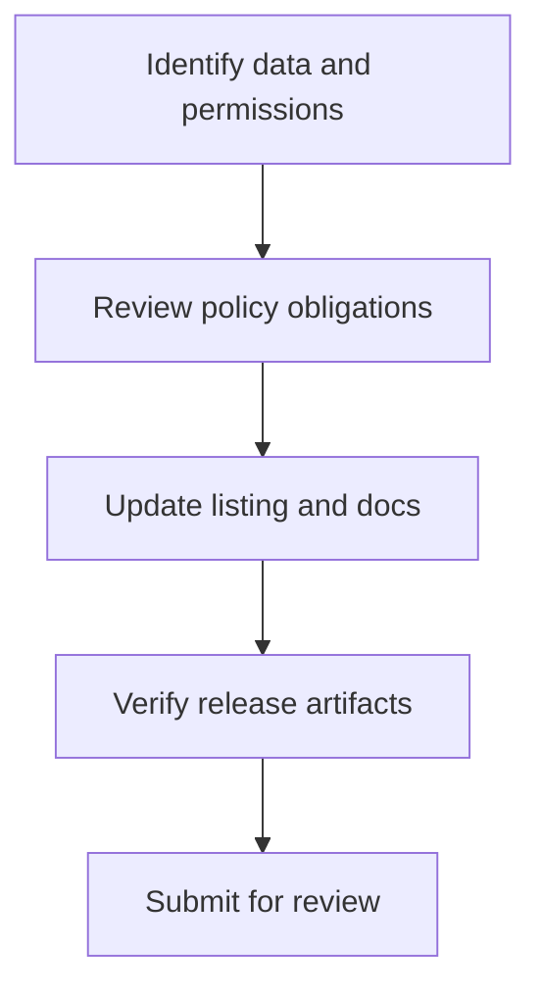

# Legal and Compliance Guide

> **Status**: 🚧 Documentation in progress

## Overview

Legal requirements and compliance considerations for Stream Deck plugin developers.

## Terms of Service

**Coming soon**: Developer terms of service summary

## Privacy Requirements

### Data Collection

**Coming soon**: What data you can collect

### Privacy Policy

**Coming soon**: Privacy policy requirements

### User Consent

**Coming soon**: Obtaining user consent

## Data Protection

### GDPR (EU)

**Coming soon**: GDPR compliance checklist

- Right to access
- Right to deletion
- Data portability
- Breach notification

### CCPA (California)

**Coming soon**: CCPA compliance requirements

### Other Jurisdictions

**Coming soon**: International data protection laws

## Intellectual Property

### Trademarks

**Coming soon**: Trademark usage guidelines

### Copyrights

**Coming soon**: Copyright considerations

### Third-Party Assets

**Coming soon**: Using third-party content legally

## Open Source Licensing

### Popular Licenses

**Coming soon**: Understanding open-source licenses

- MIT
- Apache 2.0
- GPL
- BSD

### License Compatibility

**Coming soon**: Combining different licenses

### Attribution Requirements

**Coming soon**: Proper attribution practices

## Content Guidelines

### Prohibited Content

**Coming soon**: What content is not allowed

### User-Generated Content

**Coming soon**: Handling user content

## Liability and Disclaimers

**Coming soon**: Protecting yourself legally

## Accessibility Requirements

**Coming soon**: Accessibility compliance

## Export Control

**Coming soon**: International distribution considerations

## Best Practices

**Coming soon**: Legal compliance checklist

## Resources

**Coming soon**: Legal resources for developers

---

**Disclaimer**: This guide is for informational purposes only and does not constitute legal advice. Consult with a legal professional for specific guidance.

---

## Code Example

Keep compliance evidence close to the release checklist so reviewers can verify it before marketplace submission.

```markdown
- [ ] Privacy policy URL is present in marketplace metadata.
- [ ] Data collection is described in plain language.
- [ ] No credentials, tokens, or personal data are written to plugin logs.
- [ ] Third-party API terms have been reviewed for the plugin use case.
```

---

## Diagram

Compliance work should happen before submission, not after a marketplace rejection.



---

## Agent Prompt

Use this prompt with GitHub Copilot in VS Code or Claude Desktop after attaching the relevant plugin files.

```text
#file:knowledge-base/legal/compliance-guide.md
Use this article as a review checklist for my Stream Deck plugin.

Explain the key points from "Legal and Compliance Guide" in practical terms. Then inspect my local plugin files for the same concept, identify any gaps or risky assumptions, and propose a spec-first, test-driven implementation plan before changing code.
```
