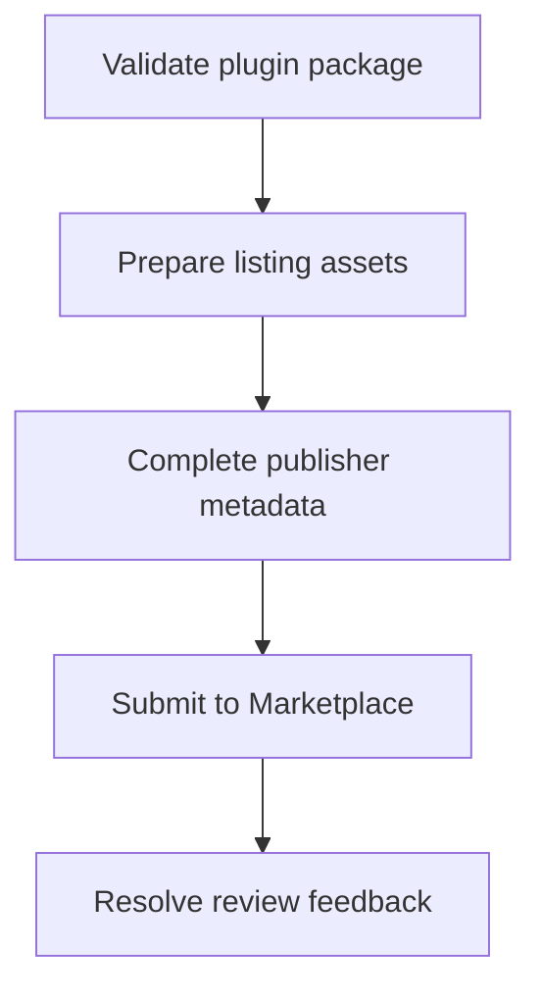

# Marketplace Approval Checklist

> **Status**: 🚧 Documentation in progress

## Overview

Use this checklist to ensure your plugin meets all Marketplace requirements before submission.

## Technical Requirements

### Functionality
- [ ] Plugin installs correctly
- [ ] All actions work as described
- [ ] No crashes or errors during normal use
- [ ] Proper error handling implemented
- [ ] Settings persist correctly
- [ ] Property inspector functions properly

### Compatibility
- [ ] Tested on Windows 10/11
- [ ] Tested on macOS 10.15+
- [ ] Works on all supported Stream Deck devices
- [ ] Compatible with minimum Stream Deck software version

### Performance
- [ ] Plugin starts quickly (<3 seconds)
- [ ] Actions respond immediately (<100ms)
- [ ] No memory leaks
- [ ] CPU usage is minimal
- [ ] Network requests are optimized

### Security
- [ ] No hardcoded credentials
- [ ] Secure credential storage
- [ ] Input validation implemented
- [ ] No code injection vulnerabilities
- [ ] HTTPS for all external requests

## Asset Requirements

### Images
- [ ] Plugin icon (72x72, 144x144)
- [ ] Plugin icon (512x512 for marketplace)
- [ ] Category icon provided
- [ ] All action icons at correct sizes
- [ ] @2x variants for all images

### Documentation
- [ ] README with clear instructions
- [ ] Setup guide included
- [ ] Troubleshooting section
- [ ] License information
- [ ] Privacy policy (if applicable)

### Metadata
- [ ] Accurate plugin name
- [ ] Clear description
- [ ] Appropriate category
- [ ] Relevant tags
- [ ] Version number follows semver

## Code Quality

**Coming soon**: Code quality standards

## User Experience

**Coming soon**: UX requirements

## Legal & Compliance

**Coming soon**: Legal requirements

## Pre-Submission Testing

**Coming soon**: Final testing procedures

## Submission Package

**Coming soon**: What to include in submission

---

**Note**: This checklist is based on best practices. Official requirements may vary.

---

## Code Example

Use a release checklist entry that maps each marketplace requirement to an owned artifact.

```markdown
| Requirement | Artifact | Owner | Status |
|---|---|---|---|
| Manifest validates | com.example.plugin.sdPlugin/manifest.json | Developer | Ready |
| Icons exported | imgs/actions/timer/action.png | Designer | Ready |
| Privacy policy linked | Marketplace listing | Publisher | Ready |
```

---

## Diagram

Marketplace preparation turns local plugin artifacts into review-ready submission materials.



---

## Agent Prompt

Use this prompt with GitHub Copilot in VS Code or Claude Desktop after attaching the relevant plugin files.

```text
#file:knowledge-base/marketplace/approval-checklist.md
Use this article as a review checklist for my Stream Deck plugin.

Explain the key points from "Marketplace Approval Checklist" in practical terms. Then inspect my local plugin files for the same concept, identify any gaps or risky assumptions, and propose a spec-first, test-driven implementation plan before changing code.
```
