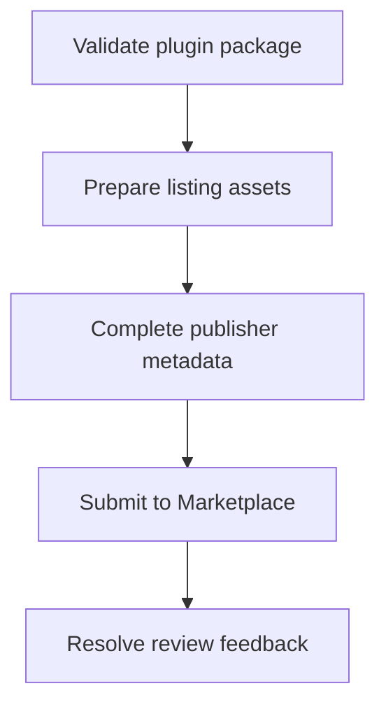

# Marketplace Submission Guide

> **Status**: 🚧 Documentation in progress

## Overview

This guide covers the complete process of submitting your Stream Deck plugin to the Elgato Marketplace.

## Prerequisites

Before submitting your plugin, ensure:
- [ ] Plugin is fully tested on both Windows and macOS
- [ ] All required assets are prepared
- [ ] manifest.json is validated
- [ ] Plugin follows all security requirements
- [ ] Documentation is complete

## Submission Process

### Step 1: Prepare Your Plugin

**Coming soon**: Detailed preparation checklist

### Step 2: Create Required Assets

**Coming soon**: Asset specifications and requirements

### Step 3: Submit to Maker Console

**Coming soon**: Step-by-step submission walkthrough

### Step 4: Review Process

**Coming soon**: What to expect during review

### Step 5: Post-Approval

**Coming soon**: After your plugin is approved

## Required Assets

### Plugin Icons

**Coming soon**: Icon size and format requirements

### Screenshots

**Coming soon**: Screenshot guidelines

### Marketing Materials

**Coming soon**: Descriptions, tags, and SEO

## Submission Checklist

**Coming soon**: Complete pre-submission checklist

## Review Timeline

**Coming soon**: Expected approval timeframes

## Common Rejection Reasons

**Coming soon**: How to avoid common issues

## Resubmission Process

**Coming soon**: How to address feedback and resubmit

## Best Practices

**Coming soon**: Tips for successful submissions

## Resources

- [Marketplace Maker Console](https://console.elgato.com)
- [Official Documentation](https://docs.elgato.com/streamdeck/sdk)

---

**Contributing**: If you have experience with marketplace submission, please contribute to this guide.

---

## Code Example

Before submission, verify that the manifest exposes a marketplace-ready version and minimum Stream Deck version.

```json
{
  "Name": "Focus Timer",
  "Version": "1.0.0",
  "SDKVersion": 3,
  "Software": {
    "MinimumVersion": "7.1"
  },
  "Nodejs": {
    "Version": "24"
  }
}
```

---

## Diagram

Marketplace preparation turns local plugin artifacts into review-ready submission materials.



---

## Agent Prompt

Use this prompt with GitHub Copilot in VS Code or Claude Desktop after attaching the relevant plugin files.

```text
#file:knowledge-base/marketplace/submission-guide.md
Use this article as a review checklist for my Stream Deck plugin.

Explain the key points from "Marketplace Submission Guide" in practical terms. Then inspect my local plugin files for the same concept, identify any gaps or risky assumptions, and propose a spec-first, test-driven implementation plan before changing code.
```
