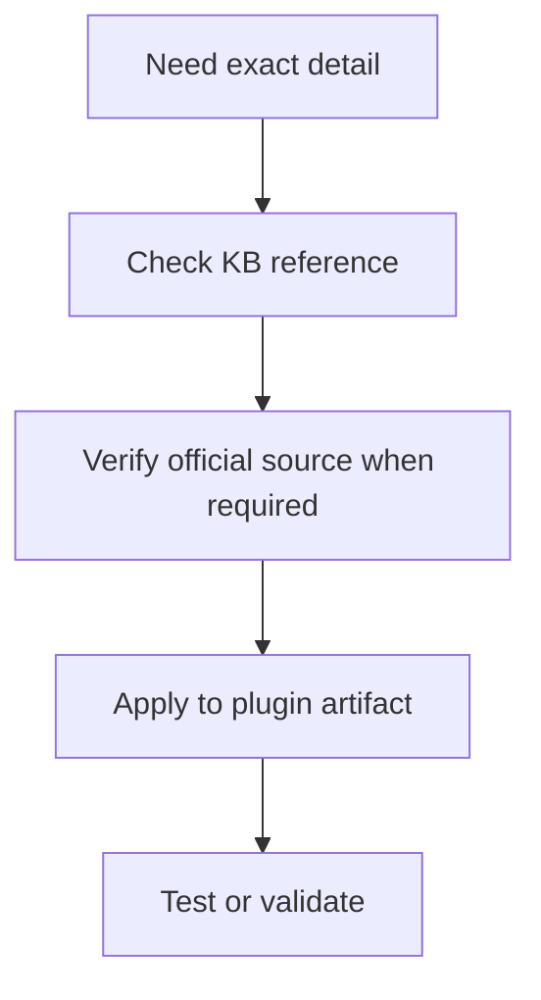

# SDK 2.1.0 GitHub Audit

This audit compares the local knowledge base against the official `elgatosf/streamdeck` repository, the published `@elgato/streamdeck` package, and the live docs at `https://docs.elgato.com/streamdeck/sdk`.

## Upstream Checked

- Repository: `https://github.com/elgatosf/streamdeck`
- Upstream commit: `f69a86cafdd0b0a7b98f80eca49bab8c41112a45`
- Published package: `@elgato/streamdeck@2.1.0`
- Package engine: Node.js `>=20.5.1`
- Official README authoring requirement: Node.js 24 or higher, Stream Deck 7.1 or higher
- Schema package used by SDK: `@elgato/schemas@0.4.14`
- Live docs checked: SDK getting started, changelog, manifest, resources, settings, UI, plugin environment, distribution, deep-linking, app monitoring, system, and CLI command pages

## Latest Upstream Changes That Affect The KB

| Area | Upstream behavior in SDK 2.1.0 | KB impact |
|------|--------------------------------|-----------|
| Repository layout | Source is in a monorepo under `packages/plugin/src`, with schemas and utilities consumed as packages. | Old `src/` root descriptions were stale. |
| Runtime guidance | Official README says new Node.js plugins require Node.js 24+ and Stream Deck 7.1+. The npm package still declares `engines.node >=20.5.1`. | Authoring docs should recommend Node.js 24 and Stream Deck 7.1, while migration notes can mention Node.js 20 as a legacy v2 baseline. |
| Manifest schema | `SDKVersion` accepts `2 | 3`; SDK version 3 is recommended. `Nodejs.Version` accepts `20 | 24`; `Software.MinimumVersion` supports version-specific shapes through 7.1+. | Manifest examples that hard-code SDK 2, Node 20, or Stream Deck 6.6 are not current for new plugins. |
| Root SDK object | `streamDeck` exposes `actions`, `devices`, `i18n`, `info`, `logger`, `profiles`, `settings`, `system`, `ui`, and `connect(): Promise<void>`. | API reference was missing `i18n` and `info`, and treated `connect()` like a fire-and-forget call. |
| Action resources | `Action.getResources()`, `Action.setResources()`, `actions.onDidReceiveResources()`, and `SingletonAction.onDidReceiveResources()` are available from Stream Deck 7.1. | API reference did not document exportable action resources. |
| Settings identifiers | `streamDeck.settings.useExperimentalMessageIdentifiers` is available from Stream Deck 7.1. It lets settings fetches use request identifiers and avoids emitting did-receive events for request responses. | Settings docs should mention the cache/request behavior before recommending repeated `getSettings()` calls. |
| Property Inspector UI | `streamDeck.ui.action` tracks the action for the visible Property Inspector. Sending to the PI is `streamDeck.ui.sendToPropertyInspector(payload)`. | Older PI-current examples are stale and should use the UI service instead. |
| Profiles | `switchToProfile(deviceId, profile?, page?)` is the current signature. The optional page requires Stream Deck 6.5+. | API reference had the first two parameters reversed. |
| System APIs | Current public APIs include monitored app launch/terminate events, deep links, wake events, `openUrl`, and `getSecrets()`. Secrets require Stream Deck 6.9 and `SDKVersion: 3`. | API and secrets docs should prefer `getSecrets()` for marketplace-managed secrets. |
| Device APIs | Device service includes `onDeviceDidChange()` from Stream Deck 7.0. Device type enum now includes Stream Deck Studio, Virtual Stream Deck, Galleon 100 SD, and Stream Deck + XL. | Device-specific docs and enum tables need updates. |
| Action methods | Key actions use `setImage(image?, options?)`, `setTitle(title?, options?)`, `setState()`, and `showOk()`. Dial actions use `setFeedback()`, `setFeedbackLayout()`, `setImage()`, `setTitle()`, and `setTriggerDescription()`. | Older target-argument examples should use options objects for key image/title calls. |
| Events | Current action handlers include `onTitleParametersDidChange()` and `onDidReceiveResources()`. | Lifecycle/event tables were incomplete. |
| Live manifest docs | The live schema URL lists Stream Deck minimum versions through `"7.4"`, `Nodejs.Version` values `"20" | "24"`, and the schema URL `https://schemas.elgato.com/streamdeck/plugins/manifest.json`. | Manifest reference should identify the live schema URL, not only the npm schema package. |
| Live CLI docs | `streamdeck` has alias `sd`; `validate` and `pack` support `--force-update-check` and `--no-update-check`; `pack` supports `--dry-run`, `--output`, `--version`, and `.sdignore`. | CLI/build docs should include CI-safe options and packaging ignore behavior. |
| Distribution docs | DRM requires SDK v2+ for Node.js plugins, immutable packaged files, no runtime manifest reads, root `UUID`, `SDKVersion: 3`, and Stream Deck 6.9+. | Build/deploy docs should call out DRM readiness constraints. |
| UI docs | SDPI Components v4 is the current doc target; local bundling is recommended for production and offline support. | API/UI references should avoid old v3 CDN examples. |
| Deep links | Stream Deck 7.0 supports passive deep links with `streamdeck=hidden`; Elgato provides an OAuth2 redirect proxy for providers that reject custom schemes. | OAuth/deep-link docs should document active vs passive behavior and the proxy URL. |

## Local Files Updated For This Audit

- [api-reference.md](api-reference.md) now documents the SDK 2.1.0 public surface, corrected signatures, resource APIs, current UI API, and device enum values.
- [manifest-schema.md](manifest-schema.md) now calls out SDK version 3, Node.js 24, Stream Deck 7.1, root `UUID`, `SupportURL`, `SupportedInKeyLogicActions`, `StackColor`, and current device types.
- [sdk-source-code-guide.md](sdk-source-code-guide.md) now describes the upstream monorepo layout under `packages/plugin/src`.
- [sdk-v1-to-v2-migration.md](sdk-v1-to-v2-migration.md) now distinguishes legacy SDK v2 Node.js 20 guidance from current SDK 2.1.0 Node.js 24 authoring guidance.
- [environment-setup.md](../development-workflow/environment-setup.md) now recommends Node.js 24 and Stream Deck 7.1 for new plugin development.
- [sdk-2-1-0-update-guide.md](../development-workflow/sdk-2-1-0-update-guide.md) now documents the mandatory new-plugin and SDK update baseline.
- [secrets-management.md](../security-and-compliance/secrets-management.md) now prefers `streamDeck.system.getSecrets()` for private shared credentials.
- [cli-commands.md](cli-commands.md) now reflects current CLI command options, alias usage, update-check flags, and `.sdignore` packaging behavior.
- [build-and-deploy.md](../development-workflow/build-and-deploy.md) now includes CLI packaging options and DRM readiness notes.
- [settings-persistence.md](../core-concepts/settings-persistence.md) now distinguishes action settings, global user settings, and plugin secrets, and documents message identifiers.
- [oauth-implementation.md](../advanced-topics/oauth-implementation.md) now includes deep-link callback guidance, passive deep links, and the OAuth2 redirect proxy.

## Follow-Up Candidates

The mandatory new-plugin baseline, current device type values, and central PI messaging examples have been updated. Remaining lower-risk follow-ups are broad example reviews: older advanced examples should be checked opportunistically for action-specific PI sends or intentionally legacy SDK v2 compatibility notes.

---

## Code Example

Use package metadata and source links together when re-checking the SDK baseline.

```bash
npm view @elgato/streamdeck version
npm view @elgato/streamdeck dist-tags --json
```

---

## Diagram

Reference articles help you look up the local pattern, verify authoritative details, and apply them in code.



---

## Agent Prompt

Use this prompt with GitHub Copilot in VS Code or Claude Desktop after attaching the relevant plugin files.

```text
#file:knowledge-base/reference/sdk-2-1-0-github-audit.md
Use this reference article to check my Stream Deck plugin implementation.

Explain the key points from "SDK 2.1.0 GitHub Audit" in practical terms. Then inspect my local plugin files for the same concept, identify any gaps or risky assumptions, and propose a spec-first, test-driven implementation plan before changing code.
```
