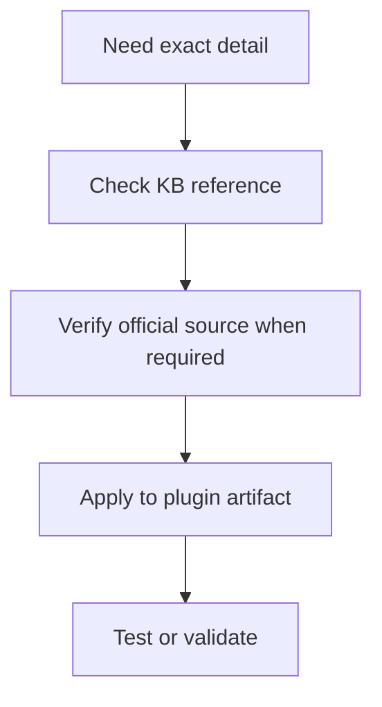

# SDK v1 to v2 Migration Guide

## Overview

The Stream Deck SDK v2 (`@elgato/streamdeck`) is a complete rewrite of the developer experience. Where v1 required manually managing WebSocket connections and JSON message parsing in plain JavaScript, v2 provides a TypeScript-first, class-based API that handles all protocol details automatically.

This guide explains the conceptual differences and shows side-by-side code examples for migrating a v1 plugin to v2.

---

## High-Level Comparison

| Aspect | SDK v1 (Legacy) | SDK v2 (`@elgato/streamdeck`) |
|--------|----------------|-------------------------------|
| Language | JavaScript | TypeScript (recommended) |
| Connection | Manual `WebSocket` + `connectElgatoStreamDeckSocket` | `streamDeck.connect()` |
| Actions | Free functions + `if/switch` on UUID | Classes extending `SingletonAction` |
| Event handling | `websocket.onmessage` → parse JSON manually | Typed override methods: `onKeyDown`, etc. |
| Settings | Manual `getSettings` / `setSettings` JSON messages | `ev.action.setSettings()`, `getSettings()` |
| Logging | `console.log` → appears in SD logs | `streamDeck.logger.info()` with levels |
| Property Inspector | `connectElgatoStreamDeckSocket` + `sendToPlugin` | `sdpi-components` library + `setSettings` auto-sync |
| Type safety | None | Full TypeScript generics on events and settings |
| Manifest | `manifest.json` with `"CodePath"` | `manifest.json` with `"CodePath"` (compatible) |
| Node.js requirement | Any (typically Node 12+) | Node.js 20+ for early SDK v2 projects; Node.js 24+ recommended for new SDK 2.1.0 projects |

---

## Installation

```bash
# Remove v1 dependencies
npm uninstall streamdeck-client-nodejs

# Install v2 SDK and CLI
npm install @elgato/streamdeck
npm install --save-dev @elgato/cli typescript tsx
```

### Updated `package.json` scripts

```json
{
    "scripts": {
        "build": "tsc",
        "watch": "tsc --watch",
        "dev": "streamdeck dev"
    }
}
```

---

## Entry Point

### v1
```javascript
// app.js
const WebSocket = require('ws');

function connectElgatoStreamDeckSocket(port, uuid, registerEvent, info) {
    const ws = new WebSocket(`ws://127.0.0.1:${port}`);

    ws.onopen = () => {
        ws.send(JSON.stringify({
            event: registerEvent,
            uuid: uuid
        }));
    };

    ws.onmessage = (evt) => {
        const data = JSON.parse(evt.data);
        handleEvent(data, ws);
    };
}

function handleEvent(data, ws) {
    switch (data.event) {
        case 'keyDown':
            handleKeyDown(data, ws);
            break;
        case 'willAppear':
            handleWillAppear(data, ws);
            break;
        // ... many more cases
    }
}
```

### v2
```typescript
// src/plugin.ts
import streamDeck from "@elgato/streamdeck";
import { CounterAction } from "./actions/counter";

streamDeck.actions.registerAction(new CounterAction());
streamDeck.connect(); // Handles WebSocket, registration, and all routing
```

---

## Action Handling

### v1
```javascript
function handleKeyDown(data, ws) {
    const uuid = data.context;
    const actionId = data.action;
    const settings = data.payload.settings;

    if (actionId === 'com.example.plugin.counter') {
        const count = (settings.count || 0) + 1;
        // Must manually send setSettings
        ws.send(JSON.stringify({
            event: 'setSettings',
            context: uuid,
            payload: { count }
        }));
        // Must manually send setTitle
        ws.send(JSON.stringify({
            event: 'setTitle',
            context: uuid,
            payload: {
                title: String(count),
                target: 0
            }
        }));
    }
}
```

### v2
```typescript
// src/actions/counter.ts
import { action, KeyDownEvent, SingletonAction, WillAppearEvent } from "@elgato/streamdeck";

type Settings = { count: number };

@action({ UUID: "com.example.plugin.counter" })
export class CounterAction extends SingletonAction<Settings> {
    override async onWillAppear(ev: WillAppearEvent<Settings>): Promise<void> {
        const { count = 0 } = ev.payload.settings;
        await ev.action.setTitle(String(count));
    }

    override async onKeyDown(ev: KeyDownEvent<Settings>): Promise<void> {
        const count = (ev.payload.settings.count ?? 0) + 1;
        await ev.action.setSettings({ count });
        await ev.action.setTitle(String(count));
    }
}
```

---

## Settings

### v1
```javascript
// Read settings
function getSettings(ws, context) {
    ws.send(JSON.stringify({
        event: 'getSettings',
        context: context
    }));
}
// Then handle 'didReceiveSettings' event to get the value

// Write settings
function setSettings(ws, context, payload) {
    ws.send(JSON.stringify({
        event: 'setSettings',
        context: context,
        payload: payload
    }));
}
```

### v2
```typescript
// Read — directly from the event payload
const settings = ev.payload.settings; // typed as your Settings type

// Or fetch explicitly
const settings = await ev.action.getSettings<Settings>();

// Write
await ev.action.setSettings({ count: 5, enabled: true });

// Global settings
await streamDeck.settings.setGlobalSettings({ apiKey: "abc" });
const global = await streamDeck.settings.getGlobalSettings<GlobalSettings>();
```

---

## Global Settings

### v1
```javascript
// Set global settings
ws.send(JSON.stringify({
    event: 'setGlobalSettings',
    context: pluginUUID,
    payload: { theme: 'dark' }
}));

// Listen for global settings
if (data.event === 'didReceiveGlobalSettings') {
    const globalSettings = data.payload.settings;
}
```

### v2
```typescript
// Set
await streamDeck.settings.setGlobalSettings({ theme: "dark" });

// Get
const settings = await streamDeck.settings.getGlobalSettings<{ theme: string }>();

// React to changes
streamDeck.settings.onDidReceiveGlobalSettings((ev) => {
    applyTheme(ev.payload.settings.theme);
});
```

---

## Logging

### v1
```javascript
// v1 used console.log; output went to Stream Deck log file
console.log('Action triggered');
console.error('Something went wrong:', error);
```

### v2
```typescript
// v2 provides levelled logging
streamDeck.logger.trace("Verbose detail");
streamDeck.logger.debug("Debug info");
streamDeck.logger.info("Action triggered");
streamDeck.logger.warn("Possible issue");
streamDeck.logger.error("Something went wrong:", error);

// Create a scoped logger for a module
const logger = streamDeck.logger.createScope("CounterAction");
logger.info("Counter incremented");
```

---

## Opening URLs

### v1
```javascript
ws.send(JSON.stringify({
    event: 'openUrl',
    payload: { url: 'https://example.com' }
}));
```

### v2
```typescript
await streamDeck.system.openUrl("https://example.com");
```

---

## Property Inspector Communication

### v1
```javascript
// Plugin → PI
ws.send(JSON.stringify({
    event: 'sendToPropertyInspector',
    context: actionContext,
    action: actionId,
    payload: { status: 'connected' }
}));

// PI → Plugin
websocket.send(JSON.stringify({
    event: 'sendToPlugin',
    context: actionContext,
    action: actionId,
    payload: { command: 'refresh' }
}));
```

### v2
```typescript
// Plugin → PI
await streamDeck.ui.sendToPropertyInspector({ status: "connected" });

// Plugin: listen for PI messages
override async onSendToPlugin(ev: SendToPluginEvent<Command, Settings>): Promise<void> {
    if (ev.payload.command === "refresh") {
        await this.refresh(ev.action);
    }
}

// PI: listen for plugin messages (using sdpi-components)
streamDeckClient.on("sendToPropertyInspector", (data) => {
    updateStatus(data.status);
});

// PI: send to plugin
streamDeckClient.send({ command: "refresh" });
```

---

## Device Events

### v1
```javascript
if (data.event === 'deviceDidConnect') {
    const deviceId = data.device;
    const deviceInfo = data.deviceInfo;
    console.log('Connected:', deviceInfo.name);
}
```

### v2
```typescript
streamDeck.devices.onDeviceDidConnect((ev) => {
    streamDeck.logger.info(`Connected: ${ev.device.name} (${ev.device.id})`);
    streamDeck.logger.info(`Size: ${ev.device.size.columns}x${ev.device.size.rows}`);
});

streamDeck.devices.onDeviceDidDisconnect((ev) => {
    streamDeck.logger.info(`Disconnected: ${ev.device.id}`);
});
```

---

## Deep Linking

### v1
```javascript
if (data.event === 'applicationDidLaunch') {
    // No deep-link support in v1
}
```

### v2
```typescript
streamDeck.system.onDidReceiveDeepLink((ev) => {
    // e.g. streamdeck://plugins/message/com.example.plugin?action=open&id=123
    const url = new URL(ev.payload.url);
    const action = url.searchParams.get("action");
    handleDeepLink(action, url.searchParams);
});
```

---

## Showing Alerts

### v1
```javascript
ws.send(JSON.stringify({
    event: 'showAlert',
    context: actionContext
}));

ws.send(JSON.stringify({
    event: 'showOk',
    context: actionContext
}));
```

### v2
```typescript
await ev.action.showAlert(); // Show ⚠️ indicator
await ev.action.showOk();    // Show ✓ indicator
```

---

## Manifest Compatibility

The `manifest.json` format is broadly compatible between v1 and v2. Key differences:

| Field | v1 | v2 |
|-------|-----|-----|
| `CodePath` | Points to `.js` file | Points to `.js` file (compiled from TS) |
| `Nodejs.Version` | Typically `"12"` | Use `"24"` for new SDK 2.1.0 projects; `"20"` is still valid for earlier SDK v2 baselines |
| `NodeJS.Debug` | Not standard | Supported: `"enabled"`, `"break"`, CLI args |
| `Actions[].Controllers` | Optional | Specify `"Keypad"` / `"Encoder"` for v2 |
| `Actions[].Encoder` | Not supported | New in v2 for Stream Deck + dials |

### v1 Manifest
```json
{
    "Name": "My Plugin",
    "Version": "1.0.0",
    "Author": "Me",
    "Actions": [{
        "Name": "Counter",
        "UUID": "com.example.plugin.counter",
        "Icon": "images/action",
        "States": [{ "Image": "images/action" }]
    }],
    "CodePath": "app.js",
    "Category": "My Plugin",
    "CategoryIcon": "images/category"
}
```

### v2 Manifest
```json
{
    "Name": "My Plugin",
    "Version": "1.0.0.0",
    "Author": "Me",
    "Actions": [{
        "Name": "Counter",
        "UUID": "com.example.plugin.counter",
        "Icon": "images/action",
        "Controllers": ["Keypad"],
        "States": [{ "Image": "images/action" }]
    }],
    "CodePath": "bin/plugin.js",
    "Category": "My Plugin",
    "CategoryIcon": "images/category",
    "UUID": "com.example.plugin",
    "SDKVersion": 3,
    "Software": {
        "MinimumVersion": "7.1"
    },
    "Nodejs": {
        "Version": "24",
        "Debug": "enabled"
    }
}
```

---

## TypeScript Configuration

Add a `tsconfig.json` for v2:

```json
{
    "compilerOptions": {
        "target": "ES2022",
        "module": "Node16",
        "moduleResolution": "Node16",
        "lib": ["ES2022"],
        "outDir": "bin",
        "rootDir": "src",
        "strict": true,
        "experimentalDecorators": true,
        "emitDecoratorMetadata": false,
        "declaration": false,
        "sourceMap": true
    },
    "include": ["src/**/*"],
    "exclude": ["node_modules"]
}
```

---

## Migration Checklist

- [ ] Update `package.json`: remove old SDK, add `@elgato/streamdeck`
- [ ] Add TypeScript + `tsconfig.json`
- [ ] Update `Nodejs.Version` to `"24"` for new SDK 2.1.0 projects, or `"20"` if intentionally targeting an older SDK v2 baseline
- [ ] Update `CodePath` to point to compiled JS output (e.g., `bin/plugin.js`)
- [ ] Replace `connectElgatoStreamDeckSocket` with `streamDeck.connect()`
- [ ] Convert action handlers to `SingletonAction` subclasses
- [ ] Replace manual WebSocket `.send(JSON.stringify(...))` with SDK methods
- [ ] Replace `console.log` with `streamDeck.logger.*`
- [ ] Replace `openUrl` WS message with `streamDeck.system.openUrl()`
- [ ] Replace manual settings messages with `ev.action.setSettings()` / `getSettings()`
- [ ] Update Property Inspector to use `sdpi-components` if not already
- [ ] Replace `sendToPropertyInspector` WS message with `streamDeck.ui.sendToPropertyInspector()` when the Property Inspector is visible
- [ ] Add types for your settings objects
- [ ] Test on Node.js 24 for new SDK 2.1.0 projects

---

**Related Documentation**:
- [Action Development](../core-concepts/action-development.md)
- [API Reference](./api-reference.md)
- [Getting Started](../GETTING_STARTED.md)

---

## Diagram

Reference articles help you look up the local pattern, verify authoritative details, and apply them in code.



---

## Agent Prompt

Use this prompt with GitHub Copilot in VS Code or Claude Desktop after attaching the relevant plugin files.

```text
#file:knowledge-base/reference/sdk-v1-to-v2-migration.md
Use this reference article to check my Stream Deck plugin implementation.

Explain the key points from "SDK v1 to v2 Migration Guide" in practical terms. Then inspect my local plugin files for the same concept, identify any gaps or risky assumptions, and propose a spec-first, test-driven implementation plan before changing code.
```
