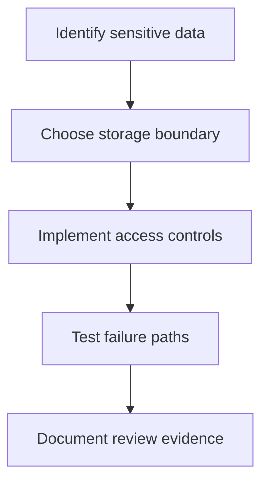

# Managing Secrets in Stream Deck Plugins

## The Problem with .env Files

When developing Stream Deck plugins that require API credentials (OAuth client IDs/secrets, API keys, etc.), developers often use `.env` files during development. However, **`.env` files cannot be deployed with your plugin** because:

1. **Not Packaged**: The `.env` file is in your workspace root, not in the `.sdPlugin` folder that gets packaged
2. **Security Risk**: Secrets should never be committed to version control
3. **User-Specific**: Each installation would need its own `.env` file, which is not practical for end users

## Preferred Solution: Stream Deck Secrets

SDK 2.1.0 exposes `streamDeck.system.getSecrets<T>()` for marketplace-managed plugin secrets. This requires Stream Deck 6.9 or higher and `SDKVersion: 3` in `manifest.json`.

```json
{
  "SDKVersion": 3,
  "Software": {
    "MinimumVersion": "7.1"
  }
}
```

```typescript
import streamDeck from "@elgato/streamdeck";

type PluginSecrets = {
  clientId: string;
  clientSecret: string;
};

const secrets = await streamDeck.system.getSecrets<PluginSecrets>();
```

Use this for shared OAuth client secrets, API credentials, and other values that should not live in the plugin bundle.

## Public OAuth Client IDs

Some OAuth providers treat desktop apps as public clients and only require a client ID in the shipped app. A public client ID can be bundled when the provider's security model expects it, but client secrets should use marketplace-managed secrets or a backend token exchange service.

### Example: OAuth Credentials

```typescript
export class AuthService {
  // Public OAuth client ID registered for this app
  private readonly clientId = "your-client-id-here";
  
  private readonly redirectUri = "http://localhost:8888/callback";
  private readonly authUrl = "https://oauth.provider.com/authorize";
  private readonly tokenUrl = "https://oauth.provider.com/token";
}
```

### Why This Is Safe

- **OAuth Security Model**: Public desktop clients can expose client IDs, but secrets still need protected storage or server-side exchange.
- **Standard Practice**: This is how many desktop OAuth apps work when using PKCE.
- **No User Data Exposure**: The credentials only allow your app to request authorization; they don't grant access to any user data without user consent

## Development vs Production Workflow

### During Development

Use `.env` for easy testing:

```typescript
// Development: Read from environment
private get clientId(): string {
  return process.env.CLIENT_ID || "";
}
```

### Before Deployment

1. **Remove .env loading code** completely:
```typescript
// ❌ Remove this
import dotenv from 'dotenv';
dotenv.config();

// ❌ Remove this
const envFile = readFileSync('.env', 'utf-8');
```

2. **Use marketplace-managed secrets or a backend** for private credentials. If the provider uses public clients, only bundle the public client ID:
```typescript
// OK for public-client OAuth flows
private readonly clientId = "abc123xyz";
```

3. **Update .gitignore** to prevent accidental commits:
```gitignore
# Environment files (contains secrets - DO NOT COMMIT)
.env
.env.local
.env.*.local
```

## Alternative: User-Provided Credentials

If you want **each user to provide their own API credentials** (less common), you need to:

1. **Add Property Inspector UI** to collect credentials:
```json
{
  "PropertyInspectorPath": "ui/settings.html"
}
```

2. **Store securely** using Stream Deck's settings:
```typescript
import { streamDeck } from "@elgato/streamdeck";

// Store
await streamDeck.settings.setGlobalSettings({
  clientId: userProvidedId,
  clientSecret: userProvidedSecret
});

// Retrieve
const settings = await streamDeck.settings.getGlobalSettings();
```

3. **Use keytar** for extra sensitive data:
```typescript
import keytar from 'keytar';

await keytar.setPassword('MyPlugin', 'api-key', userApiKey);
const apiKey = await keytar.getPassword('MyPlugin', 'api-key');
```

## Common Pitfalls

### ❌ DON'T: Try to package .env files
```javascript
// This won't work - .env is not in the .sdPlugin folder
fs.readFileSync('.env')
```

### ❌ DON'T: Load from process.env in production
```typescript
// This won't work - deployed plugins don't have .env files
const secret = process.env.API_SECRET;
```

### ❌ DON'T: Commit secrets to Git
```bash
# Never do this!
git add .env
git commit -m "Add config"
```

### ✅ DO: Use managed secrets for private shared credentials
```typescript
const secrets = await streamDeck.system.getSecrets<{ apiKey: string }>();
```

### ✅ DO: Use .gitignore
```gitignore
.env
.env.local
```

### ✅ DO: Document in README
```markdown
## Development Setup
1. Copy `.env.example` to `.env`
2. Fill in your OAuth credentials
```

## Build Process Best Practices

1. **Remove dotenv dependency** before deployment:
```json
{
  "dependencies": {
    "@elgato/streamdeck": "^2.1.0"
    // ❌ Remove: "dotenv": "^16.0.0"
  }
}
```

2. **Clean build scripts**:
```json
{
  "scripts": {
    "build": "rollup -c && npm run postbuild",
    "postbuild": "cd *.sdPlugin && npm install --omit=dev"
  }
}
```

3. **Verify deployment build**:
- Check that plugin.js doesn't reference `.env`
- Confirm private credentials are not hardcoded in the bundle
- Confirm managed secrets are available through `streamDeck.system.getSecrets()` when using `SDKVersion: 3`
- Test without `.env` file present

## Summary

**For most Stream Deck plugins with OAuth/API integrations:**

1. ✅ Use `.env` during **development only**
2. ✅ Use `streamDeck.system.getSecrets()` or a backend service for private shared credentials
3. ✅ **Remove** all `.env` loading code from production
4. ✅ Add `.env` to `.gitignore`
5. ✅ Document development setup in README

**This approach is:**
- ✅ Secure (keeps private shared credentials out of the bundle)
- ✅ Simple (no configuration needed by users)  
- ✅ Standard (used by major desktop apps)
- ✅ Reliable (works in deployed environment)

---

## Diagram

Security guidance follows the path from data identification to safe storage, runtime controls, and review evidence.



---

## Agent Prompt

Use this prompt with GitHub Copilot in VS Code or Claude Desktop after attaching the relevant plugin files.

```text
#file:knowledge-base/security-and-compliance/secrets-management.md
Use this article as a review checklist for my Stream Deck plugin.

Explain the key points from "Managing Secrets in Stream Deck Plugins" in practical terms. Then inspect my local plugin files for the same concept, identify any gaps or risky assumptions, and propose a spec-first, test-driven implementation plan before changing code.
```
