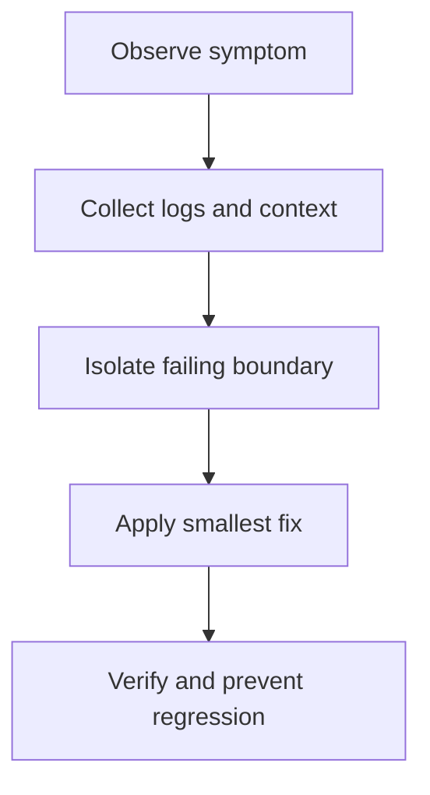

# Common Issues and Solutions

## Plugin Not Appearing in Stream Deck

**Symptoms**: Plugin doesn't show up after installation

**Solutions**:
1. Verify Stream Deck software is running
2. Restart Stream Deck application
3. Check plugin is in the correct folder:
   - macOS: `~/Library/Application Support/com.elgato.StreamDeck/Plugins/<UUID>.sdPlugin`
   - Windows: `%appdata%\Elgato\StreamDeck\Plugins\<UUID>.sdPlugin`
4. Check `manifest.json` for syntax errors: `node -e "JSON.parse(require('fs').readFileSync('manifest.json','utf8'))"`
5. Verify `CodePath` points to a file that actually exists
6. Check Node.js version matches `"Nodejs.Version"` in manifest
7. Check the plugin log file in the Stream Deck log directory

---

## WebSocket Connection Failed

**Symptoms**: Plugin starts but receives no events; logs show connection errors

**Solutions**:
1. Ensure `streamDeck.connect()` is called after all `registerAction()` calls
2. Check that no action is registered twice (duplicate UUID)
3. Verify no firewall is blocking localhost connections
4. Look for unhandled exceptions before `streamDeck.connect()` that abort startup
5. Check the plugin log file for the exact error

---

## Property Inspector Not Showing

**Symptoms**: Clicking the action in Stream Deck shows no configuration panel

**Solutions**:
1. Check `PropertyInspectorPath` in `manifest.json` exists relative to plugin root
2. Verify the HTML file has `<script src="...sdpi-components..."></script>` loaded
3. Open `http://localhost:23654/` in Chrome to inspect the PI directly
4. Check browser console for JS errors (accessible via Chrome DevTools at the above URL)
5. Verify the `sdpi-components` library version is compatible with your SDK version

---

## Settings Not Persisting After Restart

**Symptoms**: Settings reset to defaults every time the plugin or Stream Deck restarts

**Solutions**:
1. Ensure you call `await ev.action.setSettings(settings)` — not just updating a local variable
2. Check that the settings object is JSON-serializable (no circular references, no `undefined` values that need to persist)
3. Look for unhandled Promise rejections from `setSettings()` — add `try/catch`
4. Verify `onDidReceiveSettings` is being called and you're applying the received settings

---

## Action Not Updating (Title / Image Unchanged)

**Symptoms**: Calling `setTitle()` or `setImage()` has no visible effect

**Solutions**:
1. Check you're `await`-ing the call — `setTitle` returns a Promise
2. Verify the action context (`ev.action`) is not stale — use the action from the event parameter
3. Check rate limiting: Stream Deck enforces a limit of ~10 updates/second per action
4. Verify the `target` parameter — `Target.SoftwareOnly` won't update the device LCD
5. For `setImage`, check the base64 string is valid PNG data (no `data:image/...;base64,` prefix needed if using raw base64)

---

## Build / TypeScript Compilation Errors

**Symptoms**: `npm run build` or `tsc` fails

**Solutions**:
1. Run `npm install` to ensure all dependencies are installed
2. Check `tsconfig.json` has `"experimentalDecorators": true` (required for `@action`)
3. Verify TypeScript version is 5.x: `npx tsc --version`
4. Clear and reinstall: `rm -rf node_modules && npm install`
5. Check `"module"` and `"moduleResolution"` in `tsconfig.json` — use `"Node16"` for SDK v2

---

## Plugin Crashes / Repeatedly Restarts

**Symptoms**: Plugin logs show it restarting; actions briefly appear then disappear

**Solutions**:
1. Check the plugin log file for the error stack trace
2. Add `try/catch` to all async event handlers:
    ```typescript
    override async onKeyDown(ev: KeyDownEvent<Settings>): Promise<void> {
        try {
            await this.doWork(ev);
        } catch (err) {
            streamDeck.logger.error("onKeyDown failed:", err);
        }
    }
    ```
3. Handle unhandled promise rejections:
    ```typescript
    process.on("unhandledRejection", (reason) => {
        streamDeck.logger.error("Unhandled rejection:", reason);
    });
    ```
4. Check for `process.exit()` calls that shouldn't be there
5. Verify `streamDeck.connect()` is called — without it the process may exit immediately

---

## Actions Appear Stale on Profile Switch

**Symptoms**: After switching profiles and back, keys show old titles or images

**Solutions**:
1. Use `onWillAppear` to re-render the action every time it becomes visible:
    ```typescript
    override async onWillAppear(ev: WillAppearEvent<Settings>): Promise<void> {
        await this.render(ev.action, ev.payload.settings);
    }
    ```
2. Don't rely on in-memory state alone — always re-read from `ev.payload.settings`

---

## Memory Usage Growing Over Time

**Symptoms**: Plugin memory increases steadily and never decreases

**Common causes**:
1. **Timer not cleared in `onWillDisappear`**:
    ```typescript
    private timer?: NodeJS.Timeout;
    override onWillAppear(ev): void { this.timer = setInterval(..., 5000); }
    override onWillDisappear(_ev): void { clearInterval(this.timer); }
    ```
2. **Event listener registered repeatedly**:
    ```typescript
    // Check whether listener is already registered before adding
    override onWillAppear(ev): void {
        someEmitter.removeListener("event", this.handler); // remove first
        someEmitter.on("event", this.handler);
    }
    ```
3. **Unbounded cache or array**:
    Use an LRU cache or set a maximum size.
4. Check heap usage periodically: `process.memoryUsage().heapUsed`

---

## `setImage` Is Slow / Laggy

**Symptoms**: Key images update slowly; animations are choppy

**Solutions**:
1. **Throttle updates** — `setImage` is expensive (base64-encodes a PNG and sends over WebSocket); limit to ≤ 4 updates/sec
2. **Reuse canvas** — create a canvas once and clear/redraw rather than creating a new one each frame
3. **Cache rendered images** — if the same value renders the same image, skip the redraw:
    ```typescript
    let lastRendered: string | undefined;
    async function updateIcon(action, value: string) {
        if (value === lastRendered) return;
        lastRendered = value;
        await action.setImage(renderImage(value));
    }
    ```
4. **Use SVG for simple icons** — SVG string manipulation is faster than canvas operations

---

## Dial Actions Not Working (Stream Deck +)

**Symptoms**: Dial rotation or press events not received

**Solutions**:
1. Verify manifest includes `"Controllers": ["Encoder"]` for that action
2. Add an `"Encoder"` section to the action in `manifest.json`:
    ```json
    "Encoder": { "layout": "$B1" }
    ```
3. Override `onDialRotate` (not `onKeyDown`) for rotation events
4. Check device type — dial events only fire on Stream Deck +

---

## Deep Links Not Received

**Symptoms**: `onDidReceiveDeepLink` never fires when opening a deep link

**Solutions**:
1. Deep links require Stream Deck 6.4 or later
2. Format: `streamdeck://plugins/message/<plugin-UUID>?key=value`
3. The plugin must already be running (Stream Deck must have loaded it)
4. On macOS, you may need to register the URL scheme — this is handled automatically if you use `streamDeck.system.onDidReceiveDeepLink()`

---

## Property Inspector Not Receiving Messages from Plugin

**Symptoms**: `streamDeckClient.on("sendToPropertyInspector", ...)` never fires

**Solutions**:
1. Confirm you're calling `await streamDeck.ui.sendToPropertyInspector(payload)` from the plugin
2. Check the PI is open — messages are only delivered while the PI is visible
3. Use `onPropertyInspectorDidAppear` to know when the PI is ready:
    ```typescript
    override async onPropertyInspectorDidAppear(ev): Promise<void> {
        await streamDeck.ui.sendToPropertyInspector({ type: "init", data: this.getState() });
    }
    ```

---

## Global Settings Not Shared Between Actions

**Symptoms**: Setting a global setting in one action doesn't appear in another

**Solutions**:
1. Use `streamDeck.settings.setGlobalSettings()` — not `ev.action.setSettings()`
2. Subscribe to `streamDeck.settings.onDidReceiveGlobalSettings()` in each action that needs to react
3. On first load, explicitly fetch: `await streamDeck.settings.getGlobalSettings()`

---

## Button Opens Wrong Item (Previous/Stale Target)

**Symptoms**: Action title/image shows item A, but pressing the key opens item B (often the previous or just-ended item)

**Typical Root Cause**:
1. Render path (`updateDisplay`) and interaction path (`onKeyDown`/`onTouchTap`) use different selection logic
2. Press handler ignores offset/index settings used by display
3. Fallback logic (`getCurrent`/`getNext`) diverges from the rendered list
4. Multi-source data (cached list vs direct getter) is not aligned

**Fix Pattern**:
1. Extract one selector function (e.g. `resolveTarget(settings, data)`) and call it from both render and press paths
2. Use the same data source and filters (offset, all-day exclusion, include-all-calendars) for both paths
3. Read live settings before periodic updates and press handling when stale closures are possible
4. Add debug logs with selected item ID + offset in both render and interaction paths
5. Add regression test: "displayed target ID equals opened target ID"

**Quick Verification**:
1. Create back-to-back events and set offset = 0/1/2
2. Confirm visible title and opened URL always map to the same event ID
3. Repeat across boundary times (meeting just ended / next just started)

---

## Node.js Version Mismatch

**Symptoms**: Plugin fails to start with syntax errors or module errors

**Solutions**:
1. Check Node.js version: `node --version`
2. New SDK 2.1.0 plugins should use **Node.js 24+**
3. Update `"Nodejs": { "Version": "24" }` in `manifest.json`
4. Use nvm to switch versions: `nvm use 24`

---

## Locating Log Files

| Platform | Path |
|----------|------|
| macOS | `~/Library/Logs/ElgatoStreamDeck/<UUID>/plugin.log` |
| Windows | `%appdata%\Elgato\StreamDeck\logs\<UUID>\plugin.log` |

Inspect directly:
```bash
# Windows
%appdata%\Elgato\StreamDeck\logs\<UUID>\plugin.log

# macOS
~/Library/Logs/ElgatoStreamDeck/<UUID>/plugin.log
```

---

## Debug Mode Not Attaching

**Symptoms**: VS Code debugger connects but breakpoints don't hit

**Solutions**:
1. Set `"Debug": "break"` in manifest to pause execution at startup (waits for debugger)
2. Ensure `.vscode/launch.json` target port matches (default: 9229)
3. Restart plugin after changing `Debug` mode — manifest changes require reinstall or restart
4. Check that `sourceMap: true` is set in `tsconfig.json`
5. Try `--inspect-brk` instead of `--inspect` for reliable attach timing

---

**Related Documentation**:
- [Debugging Guide](../development-workflow/debugging-guide.md)
- [Environment Setup](../development-workflow/environment-setup.md)
- [API Reference](../reference/api-reference.md)

---

## Diagram

Troubleshooting starts with the symptom, narrows the failing boundary, and ends with a verified fix.



---

## Agent Prompt

Use this prompt with GitHub Copilot in VS Code or Claude Desktop after attaching the relevant plugin files.

```text
#file:knowledge-base/troubleshooting/common-issues.md
Use this article as the source of truth for my Stream Deck plugin.

Explain the key points from "Common Issues and Solutions" in practical terms. Then inspect my local plugin files for the same concept, identify any gaps or risky assumptions, and propose a spec-first, test-driven implementation plan before changing code.
```
