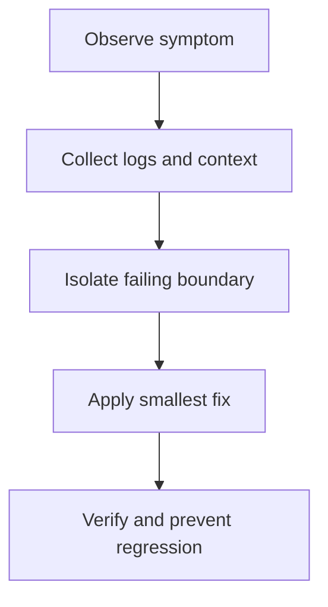

# Diagnostic Flowcharts

Use these decision paths when a Stream Deck plugin fails during installation, startup, runtime interaction, or Property Inspector configuration.

## Plugin Not Appearing

```text
Plugin not visible in Stream Deck?
|
+- Is the plugin installed in the correct Plugins directory?
|  +- No: reinstall or copy the .sdPlugin folder to the correct location.
|  +- Yes
|
+- Is manifest.json valid JSON and complete?
|  +- No: validate JSON and required fields.
|  +- Yes
|
+- Does CodePath point to an existing executable or script?
|  +- No: rebuild or correct CodePath.
|  +- Yes
|
+- Do Stream Deck logs show startup errors?
|  +- Yes: fix the first stack trace, then restart Stream Deck.
|  +- No: restart Stream Deck and confirm the plugin UUID is unique.
```

## Plugin Starts But Receives No Events

```text
No action events received?
|
+- Is streamDeck.connect() called after registerAction() calls?
|  +- No: call connect after all actions are registered.
|  +- Yes
|
+- Does every @action UUID match manifest.json exactly?
|  +- No: align UUIDs.
|  +- Yes
|
+- Is the action visible on a profile page?
|  +- No: add the action to a profile and test again.
|  +- Yes
|
+- Are there unhandled exceptions before connect()?
|  +- Yes: wrap startup and event code with logging.
|  +- No: inspect Stream Deck logs for WebSocket or runtime errors.
```

## Property Inspector Not Loading

```text
Property Inspector blank or missing?
|
+- Is PropertyInspectorPath correct relative to plugin root?
|  +- No: fix the manifest path.
|  +- Yes
|
+- Does the HTML file load sdpi-components or equivalent PI client code?
|  +- No: add the PI client script.
|  +- Yes
|
+- Does http://localhost:23654/ show JavaScript errors?
|  +- Yes: fix the first console error.
|  +- No: verify the selected action has a PI path and restart Stream Deck.
```

## Button Opens The Wrong Item

```text
Displayed target differs from opened target?
|
+- Do render and press paths call the same selector function?
|  +- No: extract one resolveTarget(settings, data) helper.
|  +- Yes
|
+- Does the press handler use the same offset/filter settings as render?
|  +- No: pass the same settings into both paths.
|  +- Yes
|
+- Are render data and press data from the same source snapshot?
|  +- No: align cache/list access.
|  +- Yes
|
+- Add logs for displayed ID and opened ID, then test offset 0/1/2 across boundary times.
```

## Settings Not Persisting

```text
Settings reset after restart?
|
+- Is setSettings() or setGlobalSettings() awaited?
|  +- No: await the Promise and catch errors.
|  +- Yes
|
+- Is the settings object JSON-serializable?
|  +- No: remove functions, circular references, and unsupported values.
|  +- Yes
|
+- Are defaults overwriting stored values on willAppear?
|  +- Yes: merge defaults with received settings instead of replacing them.
|  +- No: inspect didReceiveSettings events and logs.
```

## Memory Or Performance Problems

```text
Memory or CPU grows over time?
|
+- Are intervals/timeouts created in onWillAppear?
|  +- Yes: clear them in onWillDisappear.
|  +- No
|
+- Are event listeners registered repeatedly?
|  +- Yes: unsubscribe or remove listeners when the action disappears.
|  +- No
|
+- Are setImage calls frequent?
|  +- Yes: throttle updates and cache rendered images.
|  +- No
|
+- Are caches unbounded?
|  +- Yes: add size limits or TTLs.
|  +- No: profile with Node/Chrome tools and inspect logs.
```

## Essential Commands

```bash
streamdeck validate com.company.plugin.sdPlugin
streamdeck restart com.company.plugin
```

For logs, inspect the plugin log file directly:

- Windows: `%appdata%\Elgato\StreamDeck\logs\<UUID>\plugin.log`
- macOS: `~/Library/Logs/ElgatoStreamDeck/<UUID>/plugin.log`

## Related Documentation

- [Common Issues](common-issues.md)
- [Debugging Guide](../development-workflow/debugging-guide.md)
- [Performance Profiling](../advanced-topics/performance-profiling.md)
- [Action Development](../core-concepts/action-development.md)

---

## Diagram

Troubleshooting starts with the symptom, narrows the failing boundary, and ends with a verified fix.



---

## Agent Prompt

Use this prompt with GitHub Copilot in VS Code or Claude Desktop after attaching the relevant plugin files.

```text
#file:knowledge-base/troubleshooting/diagnostic-flowcharts.md
Use this article as the source of truth for my Stream Deck plugin.

Explain the key points from "Diagnostic Flowcharts" in practical terms. Then inspect my local plugin files for the same concept, identify any gaps or risky assumptions, and propose a spec-first, test-driven implementation plan before changing code.
```
