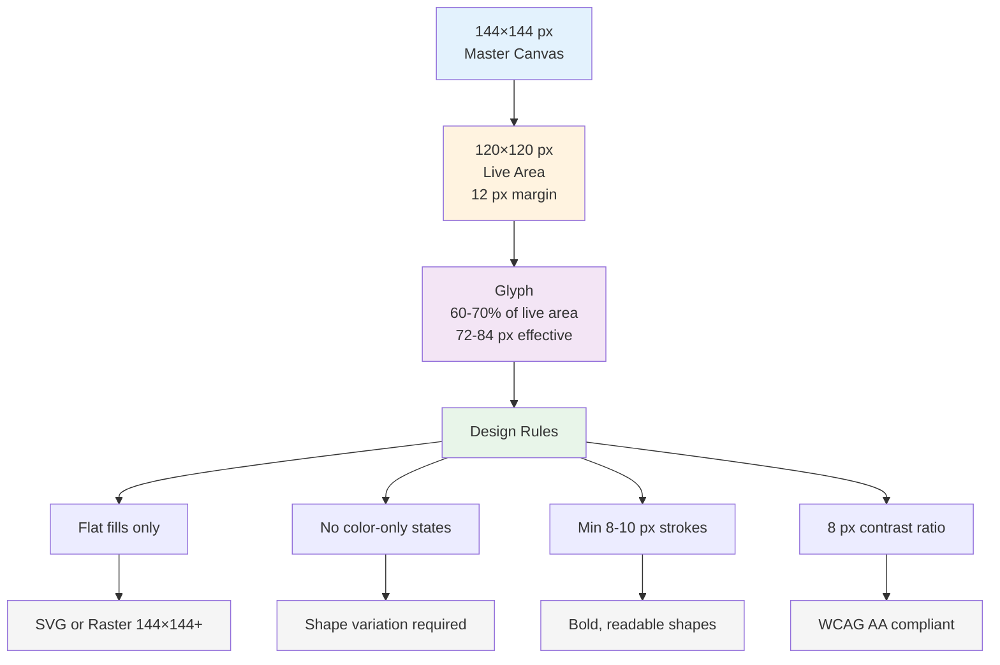

# Icon Design Specification for Stream Deck

Stream Deck icons are seen at glance on physical buttons in real-time environments. This specification ensures icons are legible, accessible, and consistent with platform conventions. The most common mistake when designing (or generating) icons is making the glyph too small. These rules prevent that and other issues that compromise usability.

---

## Canvas and Safe Area

Every Stream Deck icon is designed on a **144×144 px master canvas**. This is the hi-DPI baseline. Stream Deck renders icons at 72×72 px effective display size, so designing at 2× ensures crisp rendering and future-proof scalability.

Within the canvas:

- **Live area**: 120×120 px, centered (12 px padding on all sides)
- **Nothing visually important** should be placed within the 12 px margin
- **Glyph fill target**: 60 to 70 percent of the live area
  - In absolute terms: the main icon shape should span roughly 72 to 84 px
  - Glyphs smaller than 60% appear lost and unreadable
  - Glyphs larger than 70% look cramped and dominant

## Format and Structure

### SVG (preferred)

SVG is the recommended icon format. A well-constructed Stream Deck icon SVG:

- Has a rounded-corner background rectangle
- Contains one to three path or shape elements for the glyph
- Uses flat fills only: **no gradients, no drop shadows, no blur filters, no strokes on background**
- Has no `<text>` elements unless the concept requires a text label (e.g., "REC")
- Stays under approximately 50 lines
- Includes explicit `width` and `height` attributes (144×144)

### Raster (PNG/JPG) – acceptable, not preferred

If using raster graphics:

- Minimum resolution: 144×144 px
- Solid background color, no transparency
- Sharp edges, no anti-aliasing artifacts
- Limited color palette (2–3 colors maximum)

---

## Visual Style Rules

### Color and contrast

- **Background**: Use a solid, neutral fill. Recommended: `#1a1a1a` (dark) or `#f5f5f5` (light)
- **Glyph**: Use a contrasting fill. Recommended: `#ffffff` or `#f0f0f0` (on dark), `#1a1a1a` (on light)
- **Accent color** (optional): `#00adef` (Elgato blue) or a single brand color per plugin
- **Maximum color count**: 2 active colors per icon (background + glyph, with 1 optional accent)
- **Contrast ratio**: Minimum 4.5:1 between background and glyph (WCAG AA standard)

### Shape and complexity

- Use **bold, filled silhouettes** as the primary element
- Minimum stroke width: 8 to 10 px at 144 px canvas size (this prevents thin, fragile-looking lines)
- Maximum visual complexity: 2 to 3 distinct elements per icon
- Avoid ornamental details that render poorly at small display sizes

### Accessibility

- **Never use color as the only difference** between states
  - Example: A red muted mic and white active mic will be indistinguishable to users with color vision deficiency
  - Instead, add a shape change: diagonal slash for muted, check mark or filled circle for active
- **Test in grayscale** to verify state variants remain distinct
- Avoid thin lines (< 8 px) and tiny text (never use text unless essential)

---

## State Design Patterns

Most Stream Deck actions have at least two states. Use these visual patterns for consistency:

| State change | Visual treatment | Example |
|---|---|---|
| Active → muted/off | Diagonal slash (/) through glyph | Microphone active vs. muted |
| Inactive → active | Outlined glyph vs. filled glyph | Volume bar: outlined at 0, filled to level |
| Recording/live | Solid circular badge (top-right corner, ~20 px diameter) | Video record button, active stream indicator |
| Locked → unlocked | Shackle (closed) vs. shackle (open) | Lock/unlock controls |
| Ready → busy/loading | Static icon vs. rotating/animated icon | Download, sync, or processing states |
| Enabled → disabled | Greyed-out or desaturated icon | Feature toggles |

**Design rule**: State variants must be visually distinct by shape or pattern, not color alone.

---

## SVG Base Template

Use this as a starting point for Stream Deck icons:

```svg
<svg xmlns="http://www.w3.org/2000/svg" viewBox="0 0 144 144" width="144" height="144">
  <!-- Background (rounded corners, dark theme) -->
  <rect width="144" height="144" rx="16" fill="#1a1a1a"/>

  <!-- Glyph group: keep all elements within 12–132 px range (120×120 live area) -->
  <!-- Center point for reference: cx=72, cy=72 -->
  <!-- Fill target: 60–70% of 120 px = 72–84 px effective width/height -->

  <!-- Example: simple circle glyph -->
  <circle cx="72" cy="72" r="36" fill="#ffffff"/>

</svg>
```

For **light theme**, swap colors:
- Background: `#f5f5f5`
- Glyph: `#1a1a1a`
- Accent (if any): `#00adef` (same blue)

---

## Code Example

A minimal but complete microphone icon (muted and active states):

```svg
<!-- Muted state: mic with diagonal slash -->
<svg xmlns="http://www.w3.org/2000/svg" viewBox="0 0 144 144" width="144" height="144">
  <rect width="144" height="144" rx="16" fill="#1a1a1a"/>
  <!-- Microphone capsule (muted = outline only) -->
  <ellipse cx="72" cy="52" rx="16" ry="24" fill="none" stroke="#ffffff" stroke-width="9"/>
  <!-- Mic shaft -->
  <rect x="64" y="73" width="16" height="20" fill="#ffffff"/>
  <!-- Stand base -->
  <ellipse cx="72" cy="97" rx="20" ry="8" fill="#ffffff"/>
  <!-- Diagonal slash through entire icon -->
  <line x1="35" y1="35" x2="109" y2="109" stroke="#ff4444" stroke-width="10" stroke-linecap="round"/>
</svg>
```

```svg
<!-- Active state: mic filled -->
<svg xmlns="http://www.w3.org/2000/svg" viewBox="0 0 144 144" width="144" height="144">
  <rect width="144" height="144" rx="16" fill="#1a1a1a"/>
  <!-- Microphone capsule (active = filled) -->
  <ellipse cx="72" cy="52" rx="16" ry="24" fill="#ffffff"/>
  <!-- Mic shaft -->
  <rect x="64" y="73" width="16" height="20" fill="#ffffff"/>
  <!-- Stand base -->
  <ellipse cx="72" cy="97" rx="20" ry="8" fill="#ffffff"/>
</svg>
```

---

## Icon Checklist Before Export

Before exporting icons for production:

- [ ] Master canvas is exactly 144×144 px
- [ ] Glyph is contained within 12–132 px (live area)
- [ ] Glyph fill is 60–70% of live area (roughly 72–84 px)
- [ ] Background is a solid fill with rounded corners (`rx="16"` for SVG)
- [ ] Glyph and background have ≥ 4.5:1 contrast ratio
- [ ] All state variants are distinct in grayscale
- [ ] No gradients, shadows, or blur filters
- [ ] Minimum stroke width is 8–10 px (no thin lines)
- [ ] SVG is under 50 lines (if applicable)
- [ ] Icon is tested at 72×72 px display size in the Stream Deck UI

---

## Diagram



---

## Agent Prompt

When using Claude Code or GitHub Copilot to generate Stream Deck icons:

**For Claude Code:**
```
Generate SVG icons for Stream Deck actions following these constraints:
- Canvas: 144×144 px with viewBox="0 0 144 144"
- Live area: 120×120 px centered (12 px padding)
- Glyph fill: 60–70% of live area (roughly 72–84 px)
- Background: solid fill #1a1a1a (dark) with rx="16" rounded corners
- Glyph: #ffffff or #f0f0f0
- Style: flat fills only, no gradients or shadows
- State variants: differ by shape, never by color alone
- Minimum stroke width: 8–10 px
- Keep under 50 lines per SVG

Provide separate SVG files for each state variant (e.g., muted vs. active).
```

**For GitHub Copilot:**
Use the `/doc` command to document icon requirements, then add to `.github/copilot-instructions.md`:
```markdown
## Icon Design Rules
- Master canvas: 144×144 px
- Live area: 120×120 px (12 px margin)
- Glyph fill: 60–70% of live area
- SVG format: flat fills, no effects
- State variants: shape-based, not color-based
- Minimum stroke: 8–10 px
- Contrast ratio: ≥ 4.5:1
```

Then reference this file in every icon generation session:
```
/doc Icon design specification: Generate SVG icons per the rules in knowledge-base/ui-components/icon-design-specification.md
```
